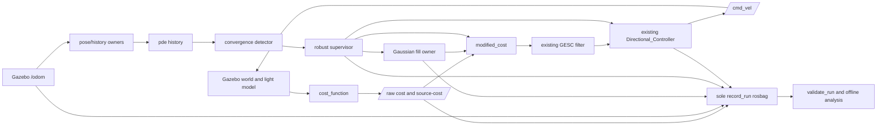
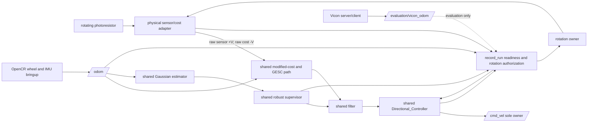

# GESC + Robust Gaussian V1 Final Project Report

## 1. Document identity and V1 evidence boundary

This is the repository-native content and audit companion for the canonical
typeset [V1 report PDF](FINAL_PROJECT_REPORT_V1.pdf). Its authoritative
typesetting source is [FINAL_PROJECT_REPORT_V1.tex](FINAL_PROJECT_REPORT_V1.tex).
The three synchronized representations form the thesis-facing closeout report
for the
`DSIM_GESC_Gaussian_Codex_Implementation_Package` effort on branch
`feature/gesc-gaussian-robustness-v1`. It was prepared on 2026-08-12 against
parent/base HEAD `e3dd0ef5cfa5a79ee8bed3017bf844f4f269add7`. After the
documentation gates passed, the user authorized one closeout commit with the
exact subject `docs(phase10): close GESC Gaussian V1 report and evidence`.
Because a commit cannot embed its own object ID without changing that ID, the
authoritative V1 boundary is the commit containing this report set with that
exact subject; resolve it with
`git log -1 --format=%H -- docs/codex/gesc_gaussian/FINAL_PROJECT_REPORT_V1.pdf`.
The future V2 branch must
start from that containing commit, not from `e3dd0ef` alone.

This report covers the repository implementation, package requirements,
source material, Phases 00-10, simulation evidence through terminal v8.12,
physical snapshot integration and eight retained attempts, tests, artifacts,
limitations, and reproducibility boundaries. Its machine-checkable companion
is [the Phase 10 coverage matrix](validation/phase_10_report_coverage.tsv).
The exact validation commands and outcomes are in
[the Phase 10 documentation validation](validation/phase_10_documentation_validation.md).

V1 is a frozen evidence record. It may be cited, reproduced within its stated
scope, or used as a baseline, but its failed and partial results must not be
rewritten when later work improves the algorithm. The intended future branch
name is `feature/gesc-gaussian-robustness-v2`; no V2 branch, implementation, or
result exists in this report.

### Claim vocabulary

| Term | Meaning in this report |
|---|---|
| Implemented | Present in the cited current source owner. It does not imply empirical success. |
| Software gate passed | The cited build, focused test, static, or infrastructure criterion passed. |
| Behavioral pass | The predeclared behavioral observations for that one run or scope passed. |
| Formal pass | Every selected predicate in that exact versioned contract passed. |
| Selected demonstration | Evidence for a named fixed layout/profile; not an unbiased robustness population. |
| Partial | Useful behavior or infrastructure occurred, but the complete declared result did not pass. |
| Failed | A declared gate missed. The result remains evidence and is not relabeled. |
| Withheld/not run | Execution stopped under a declared early-stop rule; no outcome is inferred. |
| Broad readiness | The entire predeclared simulation- or physical-ready gate passed. V1 achieved neither. |

The source-of-truth order used here is current source/tests/resolved interfaces
and launch graph; Git state/history; completed handoffs; approved Plans; live
status/checkpoints; Phase 00 audits and the Phase 00-05 bridge; package
specifications; then raw transcripts or experimental memory. Historical
documents describe their date-specific state. A later dated amendment may
supersede a stale “current” sentence without altering the original file.

## 2. Executive summary and final conclusions

V1 built a complete, observable, opt-in GESC + Gaussian research stack while
preserving legacy ESC behavior. The stack includes six robust typed messages,
an explicit eight-state supervisor, synchronized basin estimation, adaptive
anisotropic Gaussian fills, revision-aware merging, pure and assisted escape,
bounded recentering, a sole rosbag recorder and validator, deterministic
scenario execution, offline analysis, simulation validation contracts, and a
selected physical two-light workflow using the same algorithm implementation.

The strongest supported simulation results are narrow and useful:

- v8.10 primary fixed two-source `1:4` layout: `11/11` formal passes;
- v8.11 secondary fixed two-source `1:4` layout: `6/6` formal passes;
- v8.12 visible interior-anchor probe: all `14/14` selected predicates passed;
- the first varied v8.12 matrix case completed the intended science but passed
  `13/14` formal predicates because exit alignment was `0.735563`, below the
  frozen `0.80` threshold; the other three matrix cases were withheld.

Those results did **not** pass the broad Phase 08 robustness gate. Earlier v1,
v2, v3/V3A-D, V4, V5, V6, Phase 08.7, and v8-v8.9 failures remain material:
they show activation gaps, route/topology errors, evidence defects, recovery
nonrepeatability, and sensitivity across starts/seeds. No simulation-ready tag
exists.

The strongest physical result is the eighth retained run. It completed local
convergence and nine-second classification, created one Gaussian fill,
performed repulsive plus assisted escape, returned to `SEARCH`, and reacquired
a stronger-light signal. Onboard `/odom` integrated `7.797691 m`; five later
rotation-scale voltage peaks had median `1.9013 V`, `4.37` times the local
candidate estimate of about `0.435 V`. The operator stopped before a second
convergence confirmation or `GOAL_HOLD`. Completeness was `61/62`; the only
failure was a retained cross-topic shutdown-ordering false negative involving
one in-flight rotation status. This is first physical two-basin behavioral
success, **not** complete second-extremum acceptance and not broad physical
readiness.

The decision-useful V1 conclusion is therefore:

> The project demonstrated that one shared GESC + adaptive Gaussian pipeline
> can detect and fill an undesired light basin, escape it, and progress toward
> a stronger source in selected simulation layouts and one retained physical
> trial. V1 did not demonstrate robustness over the declared broad simulation
> envelope, arbitrary layouts/intensities, or a complete second-extremum
> physical run.

The appropriate next step is a separately planned V2 study with new versioned
evidence, not retroactive tuning or gate changes in V1.

## 3. Research motivation and supplied source material

The project began with a GESC controller plus Gaussian local-minimum escape
whose physical demonstration could orbit repeatedly, leave a basin slowly, or
create residual minima. Dr. Nili’s direct requirements were to focus on GESC
+ Gaussian robustness, treat raw cost, Gaussian repulsion, and affine
assistance as independently switchable, test extensively in Gazebo, cover
different depths/strengths/source counts/close minima, and avoid presenting
many repeated circles as success. Light remained the implemented field;
reflective acoustic fields were future motivation only.

Patrick’s data discussion required the input and output of each software block,
switching times, modes, Gaussian parameters, commands, and timestamps to be
published as ROS data and retained in rosbag2. Console text was explicitly not
enough. His whiteboards motivated—but did not mandate—the basin-scale fill,
soft association, and switchable cost interpretation.

The supplied material is indexed in
[the source-material README](../../../DSIM_GESC_Gaussian_Codex_Implementation_Package/source_material/README.md)
and includes:

- `meeting_dr_nili_audio.m4a`, an automatic extracted transcript, and the raw
  transcript document;
- `meeting_patrick_data_collection_raw.txt`;
- [the Gaussian-escape whiteboard](../../../DSIM_GESC_Gaussian_Codex_Implementation_Package/source_material/whiteboard_gaussian_escape.jpg);
- [the switchable-cost/recenter whiteboard](../../../DSIM_GESC_Gaussian_Codex_Implementation_Package/source_material/whiteboard_switchable_cost_recenter.jpeg); and
- [consolidated meeting decisions](../../../DSIM_GESC_Gaussian_Codex_Implementation_Package/source_material/CONSOLIDATED_MEETING_DECISIONS.md).

Automatic transcripts may contain recognition errors. This report uses the
consolidated decisions for attribution and labels kernel estimation,
quadratic fitting, fill escalation, exact state sequencing, and recenter
mechanics as adopted engineering hypotheses rather than direct quotations or
immutable meeting mandates.

## 4. Requirements, assumptions, and decision traceability

The fixed invariants were: preserve the raw minimization sign and units;
autonomous escape with bounded safe motion; avoid known minima; classify the
goal using evidence unavailable to neither simulator nor physical controller;
record complete structured data; switch cost components independently;
preserve selectable legacy behavior; and keep simulation/physical algorithm
semantics shared.

The implemented cost contract is

\[
J_{\mathrm{aug}}(x,t)=
w_s(t)J_{\mathrm{raw}}(x)+
w_g(t)\sum_i F_i(x)+
w_a(t)J_{\mathrm{affine}}(x).
\]

The physical adapter records sensor voltage `+V` and exposes minimization cost
`-V`; the simulator retains its model-relative cost. The sensor continues to
be sampled and logged while `w_s=0`. Ground-truth source geometry, declared
roles, Vicon, and evaluator topology never enter the controller.

### Policy and amendments

| Boundary | V1 treatment |
|---|---|
| Level A contradiction | Stop for objective, sign/unit, ownership, parity, safety, evidence-integrity, physical-authorization, or overlapping-user-change conflicts. |
| Level B correction | Allow a bounded, tested correction that preserves the objective and gates; record the failed evidence and exact amendment. |
| Level C failure | Close that fixed experiment version honestly, retain every result, and require a separately planned next version. |
| Legacy behavior | `algorithm_profile=legacy` remains the direct-launch default; robust behavior is opt-in. |
| Broad Phase 08 gate | Failed and never converted into a selected-demonstration claim. |
| Phase 09 amendment | Allowed selected-scenario source integration and later explicitly authorized motion without a broad readiness tag. |
| V2 | Future branch and new evidence only; V1 files and outcomes remain immutable. |

The main bounded corrections included ROS launch DOUBLE typing and signal-safe
shutdown (Phase 04), recorder/parameter/readiness sequencing (Phases 05-08),
real Gazebo contact/delay evidence (07.5), scenario/evaluator contracts and
runner faults (Phase 08), and physical clock/startup/executor/rotation races
(Phase 09). Each correction received new versioned evidence; none changed an
already-observed failure into a pass.

## 5. Repository baseline and final architecture

Phase 00 found three canonical simulation packages:

- `ros_esc`: existing algorithm, cost, filter, controller, Gaussian,
  recording, scenario, validation, and analysis owners;
- `ros_esc_interfaces`: the only custom ROS interface package; and
- `turtlebot3_rotating_sensor`: Gazebo model, launch graph, worlds, and
  wrappers.

The physical source is a read-only snapshot at
`/home/mattb/physical_TB3_files_snapshot/pi/ros2_ws/src`, containing
`ros_esc`, `ros_esc_interfaces`, and `turtlebot3_vehicle_nodes`. Phase 09
extended the same algorithm owners and added only hardware/evaluation/launch
adapters. The current local snapshot has 347 regular files; the retained M8L
inventory has 435 rows including directories. Phase 10 did not access the live
Pi filesystem.

### Simulation graph



`gazebo.launch.xml` is the single central launch. Cost owners are mutually
exclusive, the robust supervisor is the sole robust state owner, and
`custom_controller` remains the sole `/cmd_vel` owner. The supervisor supplies
weights, authorization, and bounded supervisory contribution; it does not
create a second velocity publisher.

### Selected physical graph



Wheel/IMU-backed `/odom` is the sole algorithm pose. Vicon publishes
`nav_msgs/msg/Odometry` on `/gesc_gaussian/evaluation/vicon_odom` for passive
evaluation and cannot gate or stop motion. The selected open field has no
autonomous obstacle or wall avoidance. Arrival and run end are manual
operator `Ctrl+C`; `GOAL_HOLD` is not a physical process terminator.

### Legacy and robust selection

Direct Gazebo and physical launch files default to `legacy` and disabled PDE/
robust extensions. The selected wrappers explicitly choose
`robust_gaussian_v1`, PDE extensions, typed observability, and recording
readiness. Legacy arrays, topics, wrappers, configs, and historical Heavy-Ball
examples remain present. Heavy-Ball is archive/reproduction context, not the
active GESC + Gaussian V1 method.

## 6. GESC and robust Gaussian mathematics

### 6.1 Cost and sign contract

The controller is formulated around minimization. For channel `c`, the
observable cost pipeline is

\[
J_{\mathrm{aug},c}(x,t)=w_s(t)J_{\mathrm{raw},c}(x,t)
+w_g(t)J_{\mathrm{fill},c}(x,t)
+w_a(t)J_{\mathrm{affine},c}(x,t).
\]

`modified_cost_node` is the sole composer. It never changes the meaning of the
raw term. In simulation, `J_raw` has the units and scale of the selected light
model. On the physical robot, `photoresistor_node` records
`raw_sensor_value=+V` and publishes `raw_cost=-V`; therefore a stronger light
is a lower raw cost. `source_score` is a separate classification quantity and
was deliberately invalid/NaN in the final physical profile because physical
source-score calibration was inert. Raw voltage and `-V` cost remained valid.

The state-dependent weights are fixed by
[`state_machine.py`](../../../ros2_ws/src/ros_esc/ros_esc/supervisor_node/state_machine.py):

| State | `w_s` | `w_g` | `w_a` | Interpretation |
|---|---:|---:|---:|---|
| `SEARCH` | 1 | 1 | 0 | Follow the raw field while retaining fills. |
| `VERIFY_EXTREMUM` | 1 | 1 | 0 | Hold the same objective while classifying a candidate. |
| `DESIGN_OR_MERGE_FILL` | 0 | 1 | 0 | Remove raw attraction while the fill is made authoritative. |
| `ESCAPE_REPULSE` | 0 | 1 | 0 | Leave under Gaussian repulsion. |
| `ESCAPE_ASSIST` | 0 | 1 | 1 | Add the bounded affine escape direction. |
| `RECENTER` | 0 | 1 | 0 | Supervisor owns bounded return motion; raw attraction stays off. |
| `GOAL_HOLD` | 0 | 1 | 0 | Zero-motion terminal algorithm state. |
| `FAILSAFE` | 0 | 0 | 0 | Zero all objective components and command motion to zero. |

The affine contribution implemented in
[`modified_cost_script.py`](../../../ros2_ws/src/ros_esc/ros_esc/modified_cost_node/modified_cost_script.py)
is

\[
J_{\mathrm{affine}}(x,t)=-s\,b(t)^\mathsf{T}(x-x_a),
\qquad b(t)=b_0e^{-\lambda(t-t_a)},
\]

where `s=affine_direction_sign`, `x_a` is the fill/approach anchor, and `b_0`
comes from PDE history or the odometry fallback. V1 selected `s=+1`, gain
`0.50`, decay `5e-7`, and maximum age `35 s`. A stale/degenerate direction is
invalid rather than silently reused.

### 6.2 GESC path

The existing GESC owners were extended, not replaced. The rotating sensor and
pose owners feed `cost_function_node`/the physical adapter and `pde_history`;
`modified_cost_node` emits the selected objective; `filter_node` performs the
existing demodulation/filter dynamics; and `controller_node` converts the
filtered estimate plus any supervisor contribution into the sole `/cmd_vel`.
`GescDiagnostics` records filter input/output, state before/derivative/after,
and dither phase/amplitude/frequency. `ControlDiagnostics` records unsaturated
GESC, supervisor, combined, final, saturation, limit, and gain values.

This separation matters empirically. A roughly three-second rotating-sensor
cycle can produce bounded phase-locked command ripple; it is not by itself an
escape event. State and event messages, rather than visual motion alone,
identify convergence, fill creation, escape, and goal classification.

### 6.3 Basin estimator

[`gaussian_fill_script.py`](../../../ros2_ws/src/ros_esc/ros_esc/gaussian_fill_node/gaussian_fill_script.py)
synchronizes pose and source cost within `sample_sync_tolerance_sec`, rejects
nonfinite, stale, implausibly fast, and MAD-outlier samples, and retains a
bounded window. Let accepted samples be `(x_k,J_k)`, normalized costs be
`\widetilde J_k`, position bandwidth be `h`, and cost temperature be `T_J`.
The stable joint spatial/cost kernel is

\[
q_k=\exp\!\left(-\frac{\lVert x_k-\mu\rVert^2}{2h^2}
-\frac{\widetilde J_k}{T_J}\right),\qquad
\bar q_k=\frac{q_k}{\sum_jq_j},
\]

\[
\mu=\sum_k\bar q_kx_k,\qquad
\Sigma=\sum_k\bar q_k(x_k-\mu)(x_k-\mu)^\mathsf{T}.
\]

Mean-shift iterations refine the center; covariance eigenvalues are clipped to
the configured finite interval. The implementation also fits a regularized
local quadratic

\[
\hat J(x)=c+g^\mathsf{T}(x-\mu)
+\tfrac12(x-\mu)^\mathsf{T}H(x-\mu)
\]

with ridge `quadratic_ridge_lambda`. Excess condition number, insufficient
samples, shallow basin depth, nonpositive curvature, or invalid geometry lowers
confidence or rejects the design. Candidate-informed mode carries the
pretrigger raw-cost distribution into amplitude design; evaluator topology and
ground truth are not inputs.

### 6.4 Adaptive fill design and validation

For fill `i`, V1 uses an anisotropic positive cost lift

\[
F_i(x)=A_i\exp\!\left[-\tfrac12
(x-\mu_i)^\mathsf{T}\Sigma_i^{-1}(x-\mu_i)\right].
\]

The covariance is scaled, then its principal widths are clipped between the
sigma floor and ceiling. Amplitude combines measured basin depth and local
curvature, then is clipped. Selected v8.12 used covariance scale `2.5`, sigma
range `0.50–1.25 m`, depth scale `1.5`, amplitude maximum `6.25` cost units,
and candidate-informed scale `1.25`.

Before publication, a finite grid over the support checks that the augmented
surface no longer retains the prohibited local minimum. A failing design may
increase amplitude by `1.5` and width by `1.25`, up to five escalations; a
still-invalid design produces `FILL_DESIGN_FAILED`, not a nominal fill. The
reported support and exit geometry are

\[
r_{\mathrm{support}}=k_s\sigma_{\max},\qquad
r_{\mathrm{exit}}=k_e\sigma_{\max},
\]

with selected `k_s=3.0` and `k_e=2.70`. The supervisor requires radial exit
and a one-second hold before declaring the basin left.

### 6.5 Association, merge, revision, and confidence

New candidates are compared with active fills using bandwidth/radius and a
soft association probability. `minimum_merge_probability=0.60` is the soft
merge gate; geometric hard-overlap protection prevents two active fills from
silently representing the same basin. A merge creates a new revision and
marks the previous representation superseded. Fill identity (`fill_id`),
cluster identity, revision, active/superseded flags, fit residual, condition
number, sample count, confidence, and escalation count are published in
`GaussianFill`. This makes update history reconstructable from the bag.

The low-confidence threshold is `0.60`. Low confidence is observable and can
block unsafe assumptions; it is not converted into false precision. Numeric
safeguards include finite checks, positive-duration and nonnegative-range
validation, eigenvalue clipping, a `1e-9` grid-minimum tolerance, bounded
sample buffers, explicit validity flags, and zero-output fallbacks.

## 7. Hybrid state machine and safety behavior

The supervisor owns one eight-state machine. The message constants and Python
enum intentionally match.

```mermaid
stateDiagram-v2
    [*] --> SEARCH: profile ready and data fresh
    SEARCH --> VERIFY_EXTREMUM: qualified convergence candidate
    VERIFY_EXTREMUM --> GOAL_HOLD: target candidate confirmed
    VERIFY_EXTREMUM --> DESIGN_OR_MERGE_FILL: undesired candidate confirmed
    VERIFY_EXTREMUM --> SEARCH: candidate rejected or epoch reset
    DESIGN_OR_MERGE_FILL --> ESCAPE_REPULSE: fill created or revised
    DESIGN_OR_MERGE_FILL --> FAILSAFE: design timeout/failure
    ESCAPE_REPULSE --> ESCAPE_ASSIST: radial progress stalls and assist allowed
    ESCAPE_REPULSE --> SEARCH: exit held; recenter disabled
    ESCAPE_REPULSE --> RECENTER: exit held; recenter enabled
    ESCAPE_ASSIST --> SEARCH: exit held; recenter disabled
    ESCAPE_ASSIST --> RECENTER: exit held; recenter enabled
    RECENTER --> SEARCH: target and dwell satisfied
    SEARCH --> FAILSAFE: stale/invalid data or safety timeout
    VERIFY_EXTREMUM --> FAILSAFE: unrecoverable timeout
    ESCAPE_REPULSE --> FAILSAFE: escape timeout
    ESCAPE_ASSIST --> FAILSAFE: escape timeout
    RECENTER --> FAILSAFE: recenter timeout
    GOAL_HOLD --> GOAL_HOLD: zero command; process continues
    FAILSAFE --> FAILSAFE: zero command
```



| State | Required behavior | Principal exit/timeout |
|---|---|---|
| `SEARCH` | Raw+fill objective, observe convergence, reset stale search epochs where selected. | Qualified candidate; stale/invalid input; external stop. |
| `VERIFY_EXTREMUM` | Hold candidate evidence for complete rotations; compare counted candidates or calibrated score. | Goal, undesired candidate, rejection, or `12 s` verification timeout. |
| `DESIGN_OR_MERGE_FILL` | Freeze raw attraction, request one design/merge, await an attributable fill event. | Valid fill or `5 s` design timeout/failure. |
| `ESCAPE_REPULSE` | Use active fill only; measure radius/progress and maintain controller ownership. | Exit+`1 s` hold, stall, or selected `35 s` limit. |
| `ESCAPE_ASSIST` | Add bounded affine/supervisor-owned assist when selected and repulsion stalls. | Exit+hold or escape timeout. |
| `RECENTER` | Bounded supervisor motion to a safe target while avoiding fill support and walls. | Position+dwell or `30 s` timeout. Disabled in selected v8.12/physical profile. |
| `GOAL_HOLD` | Publish zero-motion state after goal evidence. | Manual/external shutdown; it does not terminate recording. |
| `FAILSAFE` | Set weights and command to zero; publish attributable failure. | Explicit process shutdown/restart only. |

Selected counted-candidate classification assumes exactly two sources and one
fillable local candidate. It gathers three full `3 s` rotations per candidate
and retains six rotations of pretrigger evidence; median/MAD statistics rank
the second candidate against the first. This is an experimental contract, not
general unknown-source inference.

Safety is layered:

1. Startup requires the selected profile, compatible PDE/controller owners,
   fresh pose/sensor/state, and—on physical runs—recorder readiness.
2. Stale pose, sensor, state, command, recorder heartbeat, or rotation lease
   leads to a bounded zero/failsafe path.
3. Only `controller_node` publishes `/cmd_vel`; the supervisor contributes to
   that owner rather than publishing a competing command.
4. `zero_command_on_shutdown=True` and the managed recorder revoke readiness
   and rotation, publish stop, wait for stable base/rotation zero, then stop
   target and bag.
5. The selected physical environment is open field and has no autonomous
   obstacle avoidance. A human operator remains responsible for the e-stop,
   clearance, and manual `Ctrl+C`.

## 8. ROS 2 implementation reference

### 8.1 Runtime owners and entry points

| Owner | Responsibility | Installed entry point(s) |
|---|---|---|
| `cost_function_node` / physical `photoresistor_node` | Raw sensor and raw-cost source; exactly one active cost owner. | `cost_function_node`; vehicle `photoresistor_node` |
| `pde_history_node`, `pde_cost_history_node` | Pose/cost history used by GESC and affine direction. | same names |
| `convergence_detector_node` | Qualified candidate and confirmation events. | `convergence_detector_node` |
| `gaussian_fill_node` | Sample synchronization, basin estimation, design, validation, registry. | `gaussian_fill_node` |
| `modified_cost_node` | Weighted raw+Gaussian+affine composition. | `modified_cost_node` |
| `filter_node` | Existing GESC demodulation/filter dynamics. | `filter_node` |
| `supervisor_node` | Sole robust state, weights, fill requests, escape/recenter policy. | `supervisor_node` |
| `controller_node` | Sole final command and `/cmd_vel` publisher. | `controller_node` |
| `record_run` / `validate_run` | Sole managed recorder and sole completeness validator. | `record_run`, `validate_run` |
| `run_scenario` / `validate_robustness` | Simulation-only deterministic orchestration and gate evaluation. | `run_scenario`, `validate_robustness` |
| bag analysis | Synchronized tables, CSVs, plots, run/matrix summaries. | `analyze_run`, `summarize_matrix` |
| physical base/Vicon/rotation adapters | No-lidar base `/odom`, passive Vicon odometry, recorder-authorized sensor rotation. | vehicle bringup, `odometry_node`, `phase09_rotation_node` |

The canonical simulation launch is
[`gazebo.launch.xml`](../../../ros2_ws/src/turtlebot3_rotating_sensor/launch/gazebo.launch.xml).
It has compatibility defaults `algorithm_profile=legacy`,
`use_pde_extensions=False`, and `enable_observability=False`; a scenario or
wrapper must opt into `robust_gaussian_v1`. The selected physical launch is
`turtlebot3_vehicle_nodes/launch/gesc_gaussian_two_source.launch.xml` in the
read-only snapshot, called by
`gesc_gaussian_two_source_voltage.bash`. Direct physical defaults are likewise
legacy/inert; the wrapper supplies the robust profile.

### 8.2 Typed messages

Six robust messages were added; five pre-existing stamped/timekeeper messages
remain byte-compatible.

| Message | Complete semantic payload |
|---|---|
| `AlgorithmState` | Current/previous enum and names, transition reason, run/profile, elapsed time, active fill/escape geometry, radial progress, stall, safe direction, recenter target, weights, failsafe, validity/source timestamps. |
| `AlgorithmEvent` | Typed configuration/capability/state/convergence/fill/goal/escape/recenter/timeout/failsafe events, state, fill ID, reason/detail, named numeric values, validity/source timestamps. |
| `GaussianFill` | Frame, fill/cluster/revision, center, amplitude, covariance, principal widths/orientation, support/exit radii, confidence, samples, residual/condition/escalations, active/superseded and validity. |
| `CostBreakdown` | Source mode/name/channels; raw and filtered sensor; raw cost; source score; Gaussian, affine, and augmented costs; three weights and validity flags. |
| `GescDiagnostics` | Filter input/output/state derivative path plus dither phase, amplitude, frequency and validity. |
| `ControlDiagnostics` | GESC, supervisor, combined, and final six-axis commands; saturation, limits, `k_vx`, `k_wz`, validity. |
| Legacy set | `StampedFloat64`, `StampedFloat64MultiArray`, `StampedString`, `StampedTransformMultiArray`, and `Timekeeper` remain available for old consumers. |

### 8.3 Canonical topics and role boundaries

| Topic | Type/role | Owner/boundary |
|---|---|---|
| `/odom` | `nav_msgs/Odometry`; algorithm pose | Gazebo/base only; sole physical control pose. |
| `/cmd_vel` | final base command | `controller_node` only. |
| `/gesc_gaussian/source_cost` | algorithm source-cost stream | active simulation/physical cost owner. |
| `/gesc_gaussian/cost_breakdown` | `CostBreakdown` | cost/modified-cost observability. |
| `/gesc_gaussian/gesc_diagnostics` | `GescDiagnostics` | filter owner. |
| `/gesc_gaussian/control_diagnostics` | `ControlDiagnostics` | controller owner. |
| `/gesc_gaussian/convergence_status` | legacy-compatible convergence status | detector owner. |
| `/gesc_gaussian/fill_requests` | attributable fill request | supervisor to fill owner. |
| `/gesc_gaussian/gaussian_fills` | `GaussianFill` | fill registry owner. |
| `/gesc_gaussian/algorithm_state` | `AlgorithmState` | supervisor owner. |
| `/gesc_gaussian/algorithm_events` | `AlgorithmEvent` | attributable publishers; state semantics owned by supervisor. |
| `/gesc_gaussian/supervisor_command` | bounded contribution | supervisor to sole controller. |
| `/gesc_gaussian/recording_ready` | managed-run heartbeat | `record_run`. |
| `/gesc_gaussian/stop_requested` | managed stop | `record_run`/operator shutdown path. |
| `/gesc_gaussian/rotation_authorized` | physical rotation lease | `record_run` only. |
| `/gesc_gaussian/evaluation/vicon_odom` | `nav_msgs/Odometry`; passive evaluation | `odometry_node`; never a controller input or motion gate. |
| simulation delayed/contact topics | disturbance/evaluation support | scenario support only; default off. |

QoS details that affect evidence are installed with the recorder manifest and
[`qos_overrides.yaml`](../../../ros2_ws/src/ros_esc/ros_esc/experiment_recording/qos_overrides.yaml).
The bag is the authority: console logs and derived CSVs cannot replace a
required typed topic.

## 9. Complete parameter reference

This section distinguishes node defaults, direct-launch compatibility
defaults, and selected experiment overrides. Numeric constraints are enforced
in their cited owner; durations and scales are finite and normally positive,
counts are integer/nonnegative or positive as stated, probabilities are in
`[0,1]`, covariance/sigma values are positive, and topic/profile strings must
resolve. The exhaustive launch forwarding surface remains in the canonical
XML; the tables below cover every parameter that changes the documented robust
algorithm, evidence, or selected physical behavior.

### 9.1 Convergence defaults and selected V1 values

| Parameter | Node/direct default | Selected v8.12 and physical | Unit/constraint |
|---|---:|---:|---|
| `k_periods` | 20 | inherited | periods; positive int |
| `threshold` / launch `convergence_threshold` | `0.1` / `0.2` | launch-selected model value | cost/filter scale; positive |
| `decay_rate` | 0.15 | inherited | positive |
| `n_buffer`, `omega` | 2000, 5.0 | inherited | samples, rad/s; positive |
| `min_fill_periods` | 1.0 / launch 2.0 | 2.0 | periods; positive |
| `convergence_count_start` | 3 | inherited | positive int |
| `reset_counter_after_event` | true | true | bool |
| `convergence_confirmation_policy` | `crossing_count` | `qualified_dwell` | enum |
| `convergence_confirmation_dwell_sec` | 6.0 | 6.0 | s; positive |
| `convergence_confirmation_exit_threshold_scale` | 1.5 | 1.5 | positive |
| `state_gating_enabled` | false | true | bool |
| `minimum_path_length_m` | 0.0 | 0.20 | m; nonnegative |
| `maximum_path_efficiency` | 1.0 | 0.50 | ratio; `[0,1]` |

### 9.2 Gaussian estimator, designer, and registry

| Parameter family | Current defaults | Selected override | Units/constraints |
|---|---|---|---|
| Legacy compatibility | `escape_policy=conditional_gaussian_fill`; `amplitude=5.0`; `min_sigma=0.10`; `max_sigma=5.0`; `min_points=50`; `use_recent_fraction=1.0`; `max_fills=1`; cooldown/min fill distances `0`; `center_source=event_mean`; max fit-center distance `0.75`; fit amplitude `[0.15,10]`; offset bound `10` | max fills 1 | Legacy path only unless forwarded; finite bounds. |
| Synchronization | pose `/odom`; channel 0; tolerance `0.05`; maximum speed `0.20`; outlier MAD `3.5`; max samples `4000`; window `8.0`; minimum samples `40`; max age `12.0` | minimum samples 40 | m, s, m/s, count; positive/nonnegative. |
| Center/covariance | mean-shift iterations `5`; tolerance `0.005`; kernel bandwidth `0.25`; cost temperature `0.05`; covariance eigenvalues `[0.0025,0.25]` | inherited | m, normalized cost, m²; ordered positive limits. |
| Quadratic/depth | ridge `1e-6`; max condition `1e8`; center/shoulder percentiles `10/80`; inner Mahalanobis radius `1.0`; minimum basin depth `0.02` | inherited | finite; percentiles `[0,100]`. |
| Width | covariance scale `2.5`; sigma floor/ceiling `0.15/1.25` | `2.5`; `0.50/1.25` | scale, m; positive and ordered. |
| Amplitude | depth scale `1.5`; curvature scale `1.2`; min/max `0.10/3.00` | depth `1.5`; max `6.25`; candidate scale `1.25` | cost units; finite nonnegative. |
| Residual validation | grid `41`; support sigma `3.0`; max escalations `5`; amplitude/width factors `1.5/1.25`; tolerance `1e-9` | inherited | positive odd grid/count/scales. |
| Geometry | support sigma `3.0`; exit sigma `2.5` | exit `2.70` | sigma multipliers; positive. |
| Association | merge bandwidth `0.50`; radius scale `2.0`; minimum probability `0.60`; low-confidence `0.60` | inherited | m, scale, probabilities. |
| Redesign/candidate | retain samples false; candidate-informed false; scale `1.0` | true; true; `1.25` | bool/positive. |

### 9.3 Supervisor and selected robust profile

| Family | Direct/current default | Selected v8.12 and physical | Constraint/unit |
|---|---|---|---|
| Profile/rate/start | `robust_gaussian_v1` node; direct launch `legacy`; publish 20 Hz; startup 5 s | robust; 20 Hz; physical startup 100 s | valid profile, positive Hz/s |
| Goal evidence | score 0.95; rotation 3 s ×2; goal hold 3 s | same | calibrated ratio or counted contract; positive durations/count |
| Candidate evidence | `absolute_source_score`; known sources 0; rotation 3 s ×2; pretrigger 0; MAD 3; informed false | `counted_candidates`; 2; 3 s ×3; pretrigger 6; MAD 3; informed true | counted mode requires sources≥2 and fills=sources−1 |
| Verification/design | convergence hold 2 s; undesired hold 3 s; verify 12 s; design 5 s | same | s; positive |
| Escape | max 20 s; exit hold 1 s; stall 3 s; min radial progress 0.05 m; approach history 3 s | max 35 s; exit 1 s; stall 3 s; 0.05 m; history 0.5 s | finite positive/nonnegative |
| Open-field features | assist, approach continuity, interior anchor, active-fill transit, supervisor assist all false; interior min displacement 0.50 m | all five true; 0.50 m | bool; positive m |
| Recenter | after escape true; bounds true; max 30 s; target clearance 0.05 m; tolerance 0.25 m; hold 1 s; gains 0.50/1.50; caps 0.10 m/s, 0.40 rad/s; rotate threshold π/3 | after escape false; bounds false; other values inert | finite; positive where used |
| Bounds/directions | room `[-2,2]×[-2,2]` m; center `(0,0)`; wall margin 0.35 m; lookahead 0.50 m; candidate step π/4; fill margin 0.10 m; adaptive lookahead false | bounds disabled; fill margin 0.10 m | m/rad/bool |
| Post-recovery | guidance/recoverable navigation/progress/source handoff/continuity/resume false; retries/refresh 0; window 12 s; min path 0.60 m; max displacement 0.20 m; reversal dot −0.90; bypass 0.10 m | disabled | experimental defaults; dot in `[-1,1]` |
| Freshness/watchdog | pose/sensor/state/command/recording-ready stale limits 0.50 s; watchdog 20 Hz; zero on shutdown true | same | positive s/Hz; bool |
| Topics | `/odom`, source cost, convergence, fill request, supervisor command/stop, state/events/fills, recording ready | same; Vicon separate | resolvable ROS names |

### 9.4 Modified-cost, controller, physical, recorder, and tools

| Owner/family | Defaults | Selected value or use | Unit/constraint |
|---|---|---|---|
| Modified cost | all channels true; direction LPF 0.90; min step `1e-4`; affine enabled; gain 0.5; decay `5e-7`; min norm `1e-4`; max age 30 s; sign 1; PDE history true; exclusion factor 3; `outside_to_anchor` | gain 0.50; decay `5e-7`; max age 35 s; sign 1 | finite; LPF `[0,.999]`; s/m as named |
| Selected controller | config-owned | `Directional_Controller`; `k_vx=1.0`; `k_wz=5.0`; wheel radius 0.033 m; separation 0.158 m; max 70 RPM; caps 0.05 m/s and 0.30 rad/s physical | finite hardware limits |
| Physical time/pose/evaluation | direct wall time; `/odom`; Vicon disabled | `use_sim_time=false`; `/odom`; passive Vicon enabled on evaluation topic | strict role separation |
| Physical cost | calibration optional/inert | sensor `+V`, cost `−V`, source score invalid | volts |
| `record_run` | mode required; metadata required; root `~/Experiments/GESC-Gaussian/runs`; installed manifest; sqlite3; duration 0; preflight 45 s; ready 15 s; zero 3 s; target exit 15 s; post-zero 0.5 s; ready 10 Hz | physical wrapper supplies metadata/root/target; manual duration | positive time/rate; sqlite3 authority |
| `validate_run` | one run-directory positional argument | post-run/offline validation | readable finalized run |
| `run_scenario` | scenario YAML; required operator; optional repeated case IDs, root, summary, GUI, dry-run | versioned Phase 08 YAML | finite serial scenario contract |
| `analyze_run` | run directory; optional output, channel, sync tolerance | one retained run | valid bag/topic/channel |
| `summarize_matrix` | one or more inputs; required output directory | compatible versioned summaries only | never pool incompatible gates |

Simulation light position/intensity, start pose, bounds, disturbance, and
acceptance values are case-owned in versioned scenario YAML rather than global
algorithm defaults. The v8.12 visible case used two sources, relative inputs
`533.333...` and `1600`, start `(0,0,0)`, local source
`(0.883883,0.883883)`, global source `(3.5,3.5)`, and seed `20001`. Relative
Gazebo lumen inputs are model parameters, not calibrated physical lux.

## 10. Implementation chronology: Phases 00–10

The project advanced through evidence-gated phases. The commit column is a
navigation boundary, not a claim that every later amendment was present at the
first hash. Each linked handoff resolves the exact files, commands, skips, and
dirty-state receipt.

| Phase | Objective and implemented outcome | Verification/result | Commit boundary and handoff |
|---|---|---|---|
| 00 | Read-only repository, owner, interface, test, and risk audit. No runtime change. | Baseline collected 885 tests: 875 inherited failures, 1 skip, no collection errors. | baseline `e0c693e`; [handoff](handoffs/phase_00_handoff.md) |
| 01 | Added six typed observability messages and instrumented existing cost/filter/controller/fill owners without changing outputs. | 16 focused passed; global 901 with unchanged 875 failures/1 skip. | `6eaab86`–`2ba43f3`; [handoff](handoffs/phase_01_handoff.md) |
| 02 | Added opt-in eight-state supervisor, switchable component weights, stale/failsafe zero, and compatibility profile selection. | 44 focused passed; global 929/875 failures/1 skip. | `000f001`–`8cf93f5`; [handoff](handoffs/phase_02_handoff.md) |
| 03 | Added synchronized basin estimation, adaptive anisotropic design, residual validation, association/merge revisions, and typed fill lifecycle. | 65 focused passed; global 950/875 failures/1 skip. | `8717bf5`–`8789693`; [handoff](handoffs/phase_03_handoff.md) |
| 04 | Added repulsive exit geometry, assisted escape, bounded recenter, supervisor contribution, and command safety. A visible smoke exposed launch DOUBLE typing and SIGINT defects; both were repaired and the failed evidence retained. | 93 focused and visible startup/SIGINT passed; global 978/875 failures/1 skip. | `b0e024d`–`2e40388`; [handoff](handoffs/phase_04_handoff.md) |
| 05 | Unified metadata-rich sqlite3 recording, topic manifest, readiness gate, final-zero ordering, and sole validator. | 113 focused passed/1 skipped; a 19-topic bag, final zero, provenance, and validation passed; global 999/875 failures/2 skips. | `3982eb9`–`a7df8cf`; [handoff](handoffs/phase_05_handoff.md) |
| 05.5 | Consolidated Phase 00–05 knowledge and hardened Plan/status/checkpoint/handoff recovery. No runtime change. | Phase 05 accepted run and totals revalidated. | `7cc9ace`; [handoff](handoffs/phase_05_5_handoff.md) |
| 06 | Added deterministic YAML scenario schema/runner, seeded Gazebo execution, cleanup, and acceptance evaluation. | 143 focused/2 skips plus one recorded E2E pass; robust and legacy recording/cleanup 2/2; two short-run ground-truth misses were nonpredicates; global 1027/872 failures/3 skips. | `b84518a`–`8c6191d`; [handoff](handoffs/phase_06_handoff.md) |
| 07 | Added bag-authoritative synchronization, metric tables, plots, failure analysis, CSV compatibility export, and matrix summaries. | 153 focused/2 skips plus 10 new tests; one complete and one partial bag; 22 CSV and 16 PNG products; global 1037/872 failures/3 skips. | `80d5c6a`; [handoff](handoffs/phase_07_handoff.md) |
| 07.5 | Qualified deterministic contacts, noise, sensor delay, and pose delay as Phase 08 prerequisites. | 162 focused/2 skips; five probes complete; global 1031/856 inherited failures/3 skips. No robustness claim. | `2a74001`; [handoff](handoffs/phase_07_5_handoff.md) |
| 08 | Executed versioned simulation development, corrections, selected reproductions, and frozen gates. Many genuine and infrastructure failures were retained. | Broad readiness failed. Scoped maxima were v8.10 primary 11/11, v8.11 secondary 6/6, and v8.12 visible 14/14; v8.12 varied case 13/14 and three withheld. | terminal receipts through `c04c222`; [08.8 handoff](handoffs/phase_08_8_handoff.md) |
| 09 | Backed up and reconciled a physical source snapshot; ported shared owners/interfaces; added hardware/evaluation/readiness/rotation adapters; repaired seven observed commissioning faults; retained eight numbered trials. | Host/static/check-only gates passed at their scopes. Eighth run was first physical two-basin behavioral success but stopped before second confirmation/goal and passed 61/62 completeness. No broad physical-ready result. | terminal V1 HEAD `e3dd0ef`; [handoff](handoffs/phase_09_handoff.md) |
| 10 | Audited every package/phase/result artifact; wrote this master report, coverage proof, current navigation, validation record, checkpoint, and handoff. Documentation only. | Acceptance is the Phase 10 documentation gate, not a runtime/robustness rerun. | parent `e3dd0ef`; closeout is the commit containing this report with the authorized subject above. |

There were no Phase 00–07 live status/checkpoint files because that durable
policy was introduced later; the absence is a historical workflow gap, not an
unrecorded runtime implementation. Their Plans, handoffs, bridge, tests, and
Git receipts remain the controlling evidence.

## 11. Simulation scenarios, methods, and complete V1 results

### 11.1 Method and denominator rules

`run_scenario` validates schema, resolves a frozen profile, creates a unique
run ID, invokes the sole recorder around the canonical Gazebo graph, enforces
finite wall/run/shutdown budgets, validates the finalized run, evaluates only
the case's declared predicates, and writes a scenario summary. Seeds, source
geometry/intensity, start pose, disturbances, algorithm overrides, and exact
success predicates live in the versioned YAML. GUI probes were visible; suites
were bounded and generally headless. Failed, contaminated, infrastructure-
invalid, early-stopped, and withheld cases remain in their declared
denominators.

Development probes answer a local diagnostic question. Selected reproduction
sets measure a known-success population. Prospective fixed-layout repeats
measure only that layout/version. Formal pass means all predicates in that
version; scientific/behavioral pass can coexist with an evaluator/evidence
false negative but is never relabeled formal. Results from versions that
changed controller, evaluator, topology, or evidence contracts are not pooled.

### 11.2 Phase 08 v1–v6

| Version/probe | Executed result | Failure/correction boundary | Primary evidence |
|---|---|---|---|
| v1 training | 81/81 ran; C0–C5/C7/C8 infrastructure-eligible, C6 ineligible; every candidate had 0 end-to-end successes and 0 escapes. C8 was chosen only by lowest median path `13.2286087344 m`. | Selection was not behavioral success. | [parameter selection](validation/phase_08_parameter_selection.json) |
| v1 holdout | 12/12 ran: controller goal 0/12, ground truth 5/12, failsafe 2/12, collision 0, timeout 0. | Activation timing unreachable and goal verification orientation-dependent/instantaneous. | [failure closeout](validation/phase_08_v1_failure_closeout.md) |
| v1 pass 1 | Planned 519; stopped at 203 retained directories: 200 recording-complete, 3 failed; current root has 320 bags. | No `pass_1.json`; passes 2–3 never began. Immutable failed version. | [failure closeout](validation/phase_08_v1_failure_closeout.md) |
| v2 activation | 10/10 ran; complete lifecycle 1/10, recording/analysis 3/10, cleanup 10/10, goal 1/10, valid no-collision 9/10, seven typed fills, one escape. | Six stale-source fill timestamps plus missing publisher snapshot/lifecycle evidence. Gate 2 failed; 30 tuning, 20 holdout, 50 validation, 10 repeats withheld. | [validation](validation/phase_08_v2_validation_report.md), [failure](validation/phase_08_v2_failure_report.md) |
| 08.1 high-goal | Reached `SEARCH→VERIFY_EXTREMUM→GOAL_HOLD`. | Diagnostic activation only. | [activation contract](validation/phase_08_1_activation_contract.md) |
| 08.1 fill | Fill about 0.09 s, repulsive escape 8.714 s, then recenter orbit and 30 s failsafe. | Activation subclaim passed; full diagnostic failed. | [activation contract](validation/phase_08_1_activation_contract.md) |
| 08.2 recenter | Seed 8304: one fill, escape 7.532641327 s, recenter 8.610255022 s, returned SEARCH, no collision/failsafe/evidence defect. | Sealed recenter-only success; not v3 acceptance/readiness. | [handoff](handoffs/phase_08_2_handoff.md) |
| v3A | One GUI seed 9301; recording/cleanup passed. | 105 non-ground contacts came from an accidentally enabled positive-control obstacle at the robot pose; contaminated; nine withheld. | [failure](validation/phase_08_v3a_failure_report.md) |
| v3B | Seed 9301 infrastructure/safety and controller/ground-truth goals passed; final distance 0.039083 m. | Full fill/escape/recenter occurred where direct/no-recovery was required: genuine behavioral miss; nine withheld. | [failure](validation/phase_08_v3b_failure_report.md) |
| v3C | Required seed 9302 failed before Gazebo. | Incorrect executor/context caused `AttributeError: __enter__`; no behavioral run. | [prelaunch failure](validation/phase_08_v3c_prelaunch_failure_report.md) |
| v3D | v3B carried plus one new GUI 9302; robot moved through second fill/failsafe; bag had 400,131 messages. | Recorder SIGINT invalidated context before readiness-false/final-zero/finalization; infrastructure-invalid; eight withheld. | [failure](validation/phase_08_v3d_failure_report.md) |
| v4 | Three Gazebo executions; corrected r2b seed 10601 was sole eligible `1/120`, directly reached goal at 0.096979 m with recording/cleanup/final-zero/no collision. | Required fill/escape/recenter never occurred. Earlier run lost finalization; r2 packaging ran no Gazebo. Later stages withheld. | [validation](validation/phase_08_v4_validation_report.md), [erratum](validation/phase_08_v4_terminal_report_erratum.md) |
| v5/v5b | No valid behavioral Gazebo result. | Recovery-lineage prelaunch and stale-shell recorder defects; superseded by v5c. | [v5 report](validation/phase_08_v5_validation_report.md) |
| v5c | Eight visible seeds; recording/cleanup 8/8; four completed a lifecycle/goal path. | Declared blocker encounter 0/8; fill-to-blocker `1.2624–1.5782 m`, required ≤0.35 m. Wrong basin; 112/120 withheld. | [validation](validation/phase_08_v5_validation_report.md) |
| v6 sweep | H25 primary/full pass; H50 stall/reject/failsafe; H70 local treated as goal/no fill; H85 primary pass then reject/failsafe. | H25 ratio selected for repeats only. | [validation](validation/phase_08_v6_validation_report.md) |
| v6 repeats | Three H25: one full pass; two later rejection/failsafe. | Full repeatability 1/3, required 2/3; first recovery 2/3. | [validation](validation/phase_08_v6_validation_report.md) |

### 11.3 Phase 08.7 correction probes and reproduction

| Milestone | Exact result | Status/limitation | Evidence |
|---|---|---|---|
| M1 | Historical immutability/no-Gazebo qualification passed. | Infrastructure only. | [JSON](validation/phase_08_7_m1_historical_immutability.json) |
| M2 | Visible 18001 Stage A/fill passed; Stage B best 2.204118 m, required ≤0.35 m. | Failed; later reject/failsafe. | [report](validation/phase_08_7_m2_geometry_probe_report.md) |
| M2.1 | Infrastructure passed; SEARCH for 360 s, no convergence/fill. | Failed; efficiency cap 0.35 overconstrained. A prior shell `set -u` error was not an attempt. | [report](validation/phase_08_7_m2_1_correction_probe_report.md) |
| M2.2 | Detector/fill plus direct, assisted, recenter, SEARCH recovery occurred. | Formal Stage A false due direct-only reporter; monitor never armed; 0.60 m geometry too strict before failsafe/contact. | [report](validation/phase_08_7_m2_2_efficiency_correction_probe_report.md) |
| M2.3 | 18001 passed development contract; Stage B 1.199192 m under 1.20 m. | One development probe only. | [report](validation/phase_08_7_m2_3_assisted_recovery_stop_probe_report.md) |
| M3 | Five positions, infrastructure 5/5, combined 1/5. | One pass; one 39/40 sample miss; wall collision; wrong local; recenter timeout. Required 5/5 failed. | [report](validation/phase_08_7_m3_spatial_suite_report.md) |
| M4 | 18201 behavior passed, Stage B 1.199229 m. | Formal failure solely from merged `/joint_states` publishers' 225 ms timestamp regression; suite withheld. | [report](validation/phase_08_7_m4_visible_probe_report.md) |
| M4.1 | Timestamp correction verified. | 18207 Stage B failed at 2.399676 m after post-recovery looping; suite withheld. | [report](validation/phase_08_7_m4_1_visible_probe_report.md) |
| M4.2 | 18208 behavior passed, Stage B 1.198171 m. | Completeness 47/48: two supervisor configuration events lacked attribution; suite withheld. | [report](validation/phase_08_7_m4_2_visible_probe_report.md) |
| M4.3 visible | 18308 full pass. | Authorized suite only. | [visible report](validation/phase_08_7_m4_3_visible_probe_report.md) |
| M4.3 suite | Eight ran; infrastructure 8/8, Stage A 7/8, formal 6/8. | r1.0 unsafe direction; r1.5/22.5 wrong departure. Optional three-light withheld. | [suite](validation/phase_08_7_m4_3_two_light_suite_report.md) |
| M4.4 visible | 18408 assisted path passed, Stage B 1.198640 m. | Authorized corrected suite only. | [suite/report](validation/phase_08_7_m4_4_two_light_suite_report.md) |
| M4.4 suite | Eight: formal 5/8; behavior 5/7 eligible; one infrastructure-invalid. | Controller load failure, exact-reversal miss, and fixed-horizon budget defect. | [suite](validation/phase_08_7_m4_4_two_light_suite_report.md) |
| M4.5 | 18508 Stage A/one fill passed. | Stage B 3.628273 m; reversal threshold −0.90 missed observed −0.841. | [report](validation/phase_08_7_m4_5_visible_probe_report.md) |
| M4.6 | Threshold −0.80 armed. | Tangent made zero source progress; premature clearance release; Stage B 2.617347 m. | [report](validation/phase_08_7_m4_6_visible_probe_report.md) |
| M4.7 | Stage A passed. | Stage B 2.744859 m; direction truly opposed motion so new corridor correctly did not arm. | [report](validation/phase_08_7_m4_7_visible_probe_report.md) |
| M4.8 | 17 evidence-selected historical successes rerun: formal 13/17, behavioral 14/17, Stage A+fill 16/17, Stage B 14/17, recording 16/17; safety/final-zero/cleanup/sqlite 17/17. | Retrospective selected set; three behavioral disagreements, one console-clean miss; all 16 recoveries direct, no assist. | [report](validation/phase_08_7_m4_8_success_reproduction_report.md), [manifest](validation/phase_08_7_m4_8_success_reproduction_manifest.json) |

### 11.4 Phase 08.8 v8.0–v8.12

| Version | Executed result | Formal/scientific boundary | Evidence |
|---|---|---|---|
| v8.0 | Visible 18801 complete, first unknown candidate and one fill. | 0/1: failed departure, returned/revisited; later gates withheld. | [report](validation/phase_08_8_primary_probe.md) |
| v8.1 | 18901 assisted recovery and global arrival, 0.155548 m. | 0/1: correct second candidate rejected by post-confirmation-only evidence slice. | [report](validation/phase_08_8_m3_1_primary_probe.md) |
| v8.2 | Visible 19001 formal pass; repeat 19011 ran. | Formal 1/2: 19011 Stage B 3.180001 m from weak/inconsistent fill; seeds 19012–19020 withheld. | [probe](validation/phase_08_8_m3_2_primary_probe.md), [repeats](validation/phase_08_8_m4_primary_repeats.md) |
| v8.3 | Visible 19101 and repeats 19111–19114 passed. | 5/6: 19115 wrong escape alignment and Stage B 5.167727 m; remaining withheld. | [repeats](validation/phase_08_8_m4_2_primary_repeats.md) |
| v8.4 | Visible 19201 and 19211 passed. | 2/3: 19212 revalidator reversed selected direction; Stage B 4.679383 m; remaining withheld. | [repeats](validation/phase_08_8_m4_4_primary_repeats.md) |
| v8.5 | Visible 19301 and repeats 19311–19315 passed. | 6/7: 19316 command interaction reversed actual exit; Stage B 2.149315 m; remaining withheld. | [repeats](validation/phase_08_8_m4_6_primary_repeats.md) |
| v8.6 | Visible correction passed; 19411 scientifically reached global at 0.123614 m. | Formal 1/2, scientific 2/2; 19411 was 12/14 due one cross-topic transition sample and external echo cleanup contamination; remaining withheld. | [repeats](validation/phase_08_8_m4_7_primary_repeats.md) |
| v8.7 | Visible and 19511–19513 passed; 19514 reached global at 0.112068 m. | Formal 4/5; 19514 was 13/14 from evaluator assist-entry false negative; remaining withheld. | [repeats](validation/phase_08_8_m4_8_primary_repeats.md) |
| v8.8 | Visible and 19611–19615 passed; 19616 scientifically passed direct, final 0.104056 m. | Formal 6/7; fixed assist-only evaluator rejected valid direct route; remaining withheld. | [repeats](validation/phase_08_8_m4_9_primary_repeats.md) |
| v8.9 | 19701 dispatched; no Gazebo, bag, or plots. | Pre-Gazebo failure: installed runner's `/tmp` cwd made recorder Git lookup fail. No repeats. | [report](validation/phase_08_8_m4_10_primary_probe.md) |
| v8.10 primary | Visible 19801 plus 19811–19820 all passed. | **11/11 formal**, fixed primary layout only. | [probe](validation/phase_08_8_m4_11_primary_probe.md), [repeats](validation/phase_08_8_m4_11_primary_repeats.md) |
| v8.10 secondary | 19851 scientifically complete direct route, final 0.105549 m. | Formal 10/14 and 0/1 because evaluator used declared lamp at 0.60 m rather than aggregate basin at 0.75 m. Repeats withheld. | [report](validation/phase_08_8_m4_11_secondary_probe.md) |
| v8.11 secondary | Evaluator-only topology correction; visible 19901 and repeats 19911–19915 all passed. | **6/6 formal**, five direct and one assisted; exact layout only. | [visible](validation/phase_08_8_m8_3_v8_11_secondary_visible_probe.md), [repeats](validation/phase_08_8_m8_3_v8_11_secondary_repeats.md) |
| v8.11 matrix | Only seed 19931 ran. | 0/1 formal/science: immediate failsafe because pre-fill odometry did not exceed exit radius; three seeds withheld. | [report](validation/phase_08_8_m8_4_v8_11_broad_matrix.md) |
| v8.12 visible | New default-off `interior_farthest`; seed 20001, assisted, final 0.1167065 m. | **14/14 formal**; one selected visible case only. | [report](validation/phase_08_8_m8_8_v8_12_visible_probe.md) |
| v8.12 matrix | Only 20031 ran; direct scientific path, one fill, final 0.127721 m. | **13/14 formal**, 1/1 science: exit alignment 0.735563 <0.80. Seeds 20032–20034 withheld; no v8.13. | [report](validation/phase_08_8_m8_9_v8_12_broad_matrix.md) |
| Optional three-light | 0 executions. | Not run; prerequisites never authorized it. | [final report](validation/phase_08_8_final_report.md) |

### 11.5 Retained simulation products

The 56 current Phase 08 run roots under
`/home/mattb/Experiments/GESC-Gaussian/runs` contain 459 sqlite3 bag files,
456 `scenario_result.yaml` files, and 1,903 PNGs. These are current local
counts, not an acceptance denominator. The terminal selected roots include:

- `/home/mattb/Experiments/GESC-Gaussian/runs/phase08_8_10_primary_repeats`;
- `/home/mattb/Experiments/GESC-Gaussian/runs/phase08_8_11_secondary_repeats`;
- `/home/mattb/Experiments/GESC-Gaussian/runs/phase08_8_12_interior_anchor_probe`;
- `/home/mattb/Experiments/GESC-Gaussian/runs/phase08_8_12_broad_matrix`; and
- `/home/mattb/Experiments/GESC-Gaussian/runs/phase08_v7_success_reproduction_1`.

Selected terminal summaries and plot roots verified locally during the Phase
10 audit are:

- v8.10 primary visible:
  `/home/mattb/Experiments/GESC-Gaussian/runs/phase08_8_10_primary_probe/phase08_v8_10_primary_visible_probe_summary.yaml`;
- v8.10 primary repeats:
  `/home/mattb/Experiments/GESC-Gaussian/runs/phase08_8_10_primary_repeats/phase08_v8_10_primary_repeats_summary.yaml`;
- v8.10 secondary:
  `/home/mattb/Experiments/GESC-Gaussian/runs/phase08_8_10_secondary_probe/phase08_v8_10_secondary_visible_probe_summary.yaml`;
- v8.11 secondary visible:
  `/home/mattb/Experiments/GESC-Gaussian/runs/phase08_8_11_secondary_probe/scenario_summaries/20260731T210056130307Z_phase08_v8_11_secondary_visible_probe.yaml`;
- v8.11 secondary repeats:
  `/home/mattb/Experiments/GESC-Gaussian/runs/phase08_8_11_secondary_repeats/scenario_summaries/20260731T211244723799Z_phase08_v8_11_secondary_repeats.yaml`;
- v8.11 matrix:
  `/home/mattb/Experiments/GESC-Gaussian/runs/phase08_8_11_broad_matrix/scenario_summaries/20260731T215507749994Z_phase08_v8_11_broad_matrix.yaml`;
- v8.12 visible summary:
  `/home/mattb/Experiments/GESC-Gaussian/runs/phase08_8_12_interior_anchor_probe/scenario_summaries/20260731T231350696332Z_phase08_v8_12_interior_anchor_visible_probe.yaml`;
- v8.12 visible plots:
  `/home/mattb/Experiments/GESC-Gaussian/runs/phase08_8_12_interior_anchor_probe/2026-07-31/20260731T231351648763Z_simulation_phase08_v8_12_interior_anchor_visible_probe-v8_12_interior_anchor_r1p25_a45_rati_439a8eac/analysis/phase07/plots`;
- v8.12 matrix summary:
  `/home/mattb/Experiments/GESC-Gaussian/runs/phase08_8_12_broad_matrix/scenario_summaries/20260731T233137289914Z_phase08_v8_12_broad_matrix.yaml`; and
- v8.12 matrix plots:
  `/home/mattb/Experiments/GESC-Gaussian/runs/phase08_8_12_broad_matrix/2026-07-31/20260731T233137972843Z_simulation_phase08_v8_12_broad_matrix-v8_12_matrix_r1p25_a45_ratio1to3_20031-robust_gaussia_6efe976a/analysis/phase07/plots`.

Each analyzed Phase 08.8 run normally retains nine standard plots:
`trajectory_sources_fills.png`, `candidate_ranking.png`, `cost.png`,
`components.png`, `state_events.png`, `weights.png`,
`command_saturation.png`, `radial_escape.png`, and `gaussian_history.png`.
Availability of a plot is evidence-product completeness, not behavioral pass.

The terminal outcome is unambiguous: no version completed the required
70-unique-run denominator, no simulation-ready tag exists, and the selected
version/layout denominators above must remain separate.

## 12. Physical integration, commissioning, and complete V1 results

### 12.1 Snapshot, parity, and operator architecture

Phase 09 first created a recoverable snapshot backup and SHA-256 inventory,
classified the intended shared/adapted/physical-only files, ported the six
typed interfaces and shared algorithm owners, added physical adapters without
forking the algorithm, and qualified legacy assets. Transfers were bounded,
manifested, and rollback-backed. Source/Pi parity was a prerequisite, never a
claim of hardware readiness.

The current local snapshot contains 347 regular files, zero symlinks, and zero
cache directories. The final M8L inventory convention has 435 rows: those 347
files plus 88 directory rows including the root. Relative to M0, 41 files were
added, 19 modified, zero deleted, and 287 unchanged. The final retained M8L
receipt is under
`/home/mattb/physical_TB3_files_snapshot/phase09_backups/20260805T002822-0700_m8l_rotation_initialization_rearm/`.
The tracked 345-file/432-row M8B manifests are historical, not the final M8L
inventory.

The selected no-lidar TurtleBot3 base owns wheel/IMU `/odom`; the photoresistor
adapter emits `+V` sensing and `-V` minimization cost; shared GESC/Gaussian
owners consume `/odom`; `controller_node` alone owns `/cmd_vel`; Vicon is
passive evidence; `record_run` alone owns readiness, rotation authorization,
recording, validation sequencing, and final zero; and
`phase09_rotation_node` accepts only that recorder authorization.

### 12.2 M0–M8L integration chronology

Per-command test counts overlap and are not summed.

| Milestone | Result and selected verification | Evidence |
|---|---|---|
| M0 | Baseline 306 files/389 inventory rows/0 symlinks; 390-entry archive; backup/hash/inventory passed. | [backup receipt](validation/phase_09_snapshot_backup_receipt.md) |
| M1 | 52 source rows classified; 51 unique transfer paths; identical parser excluded. | [shared manifest](validation/phase_09_shared_source_manifest.tsv) |
| M2 | Six interfaces plus 18 shared runtime files; 27 paths byte-identical. Two-package build, shared 300, observability 13 (2 deselected), legacy 34 passed. | [static qualification](validation/phase_09_static_qualification.md) |
| M3 | Adapter/compatibility layer. Accepted checks: Bash 27, launch 6, assets 40, installed focused 69, three-package build 12.6 s. | [legacy compatibility](validation/phase_09_legacy_compatibility.md) |
| M4 | Physical recorder/readiness/final-zero integrated. Physical 36; combined 84 passed/1 skipped; build 13.4 s. | [handoff](handoffs/phase_09_handoff.md) |
| M5 | Selected schema/profile and inert preflight: focused 76; Bash 27; primary/secondary inert preflights exited 2 as expected. | [status](status/phase_09_status.md) |
| M6 | Broad host gate: focused 76, shared 272, observability 13/2 deselected, recording 70/1 skipped, legacy 34, Bash 27, show-args 6, interfaces 6, build 13.3 s. Non-gating style still had 917 failures including 873 Q000. | [status](status/phase_09_status.md) |
| M7/M7.1 | Transfer seal 339/425, 51-path recovery pass; reseal Phase09 93, shared 272, recording 70/1 skip, observability 13/2 deselected, legacy 34, show-args 6, legacy hashes, build 13.1 s. | [Pi transfer receipt](validation/phase_09_pi_transfer_receipt.md) |
| M8A | Direct snapshot qualification: 93 direct, parity/launch 44, Bash 27; 339/425 parity. No on-Pi build/check-only. | [handoff](handoffs/phase_09_handoff.md) |
| M8B | Expanded snapshot 345/432; focused 309, shared 272, recording 70/1 skip, observability 13/2 deselected, legacy 34, parsing 11 XML/7 YAML/68 JSON, critical 111, hash groups 40/40 and 68/68, build 13.0 s. | [status](status/phase_09_status.md) |
| M8C | Simplified operator contract 342/430; focused 196; ros_esc 153/3 deselected; vehicle 71/3 deselected; Bash 27; Python 9; structured parses; build 12.6 s. | [handoff amendment](handoffs/phase_09_handoff.md) |
| M8D | Legacy CSV export 343/431; source and installed 209; package subsets; build 12.6 s. | [status](status/phase_09_status.md) |
| M8E | Real-Pi underlay/build/no-lidar repair 345/433; host 22, installed/device 233, vehicle 74, helper lint pass, host build 15.1 s; operator check-only three packages passed in 1m39s. | [runtime repair](validation/phase_09_pi_runtime_repair.md) |
| M8F | CLI/runtime graph repair: focus 10, legacy 37, Vicon/launch 35, full physical 238, build 12.5 s; check-only 14.4 s pass. | [first repair](validation/phase_09_first_physical_run_repair.md) |
| M8G | Startup grace repair: focus 23, Phase09 239, legacy 37, build 15.2 s; check-only 16.3 s pass. | [second repair](validation/phase_09_second_physical_run_repair.md) |
| M8H | Wall-clock initialization repair: clock 16, shared 114, canonical build 14.3 s, installed probe pass, snapshot 256/build 14.9 s, mounted AST/lint 8/8; check-only 16.4 s pass. | [third repair](validation/phase_09_third_physical_run_repair.md) |
| M8I | Recorder grace/rotation evidence: targeted 11, focused 160, related 225, snapshot 264, recorder 69, legacy/recording 38/1 skip, build 14.9 s; check-only pass. | [fourth repair](validation/phase_09_fourth_physical_run_repair.md) |
| M8J | Recorder gate callback lane separated: focus 2, starvation 5/5, snapshot 266, recorder 69, legacy/recording 38/1 skip, build 14.8 s; check-only pass. | [fifth repair](validation/phase_09_fifth_physical_run_repair.md) |
| M8K | Heartbeat/safety/passive lanes separated: focus 4, starvation 5/5, recorder-file 143, snapshot 268, recorder 69, legacy/recording 38/1 skip, build 14.9 s, installed 4; check-only pass. | [sixth repair](validation/phase_09_sixth_physical_run_repair.md) |
| M8L | Rotation initialization re-arm: focused 16, changed-file 165, snapshot 269, recorder 69, legacy/recording 38/1 skip, build 15.4 s, installed 4; pre-run check-only passed. | [seventh repair](validation/phase_09_seventh_physical_run_repair.md) |

### 12.3 Retained commissioning attempts

An unnumbered M8E commissioning attempt failed before the eight attempts below
from stale underlay/install/serial-flag handling. Its recorded Pi path is
`/home/pi/turtlebot_rotating_sensor_tests/gesc_gaussian_two_source/2026-08-04/20260804T152851316144Z_physical_phase09_selected_primary_r1p5_a45_ratio1to4_df84804a`.

| Attempt | Exact retained outcome | Evidence |
|---:|---|---|
| 1 | Controller/filter rejected ROS arguments; 3,187 messages; readiness never true; no command/source/filter/timekeeper, no motion; 18 completeness failures. | [first repair](validation/phase_09_first_physical_run_repair.md) |
| 2 | Startup-grace mismatch; 10,234 messages; readiness false; 1,202 `/cmd_vel`, all zero; no source cost/timekeeper/motion; target and bag clean. | [second repair](validation/phase_09_second_physical_run_repair.md) |
| 3 | Late `use_sim_time` change caused `InvalidHandle`; 8,833 messages; Vicon/odom live; 815 commands all zero; 421 rotation authorizations false; no RPM/motion. | [third repair](validation/phase_09_third_physical_run_repair.md) |
| 4 | First readiness and bounded physical SEARCH, about 10.6 s and 0.13 m; no fill. Recorder falsely aged source/filter to 0.577/0.573 s while bag gaps were <0.25 s; zero/cleanup passed. | [fourth repair](validation/phase_09_fourth_physical_run_repair.md) |
| 5 | Readiness 6.189497 s; net 0.045709 m odom/0.059153 m Vicon; no fill. Gate callbacks paused ~1.572 s; 0.5 s rotation lease faulted/zeroed; base zero 12.663 ms; export passed, completeness failed. | [fifth repair](validation/phase_09_fifth_physical_run_repair.md) |
| 6 | Readiness 119.608472 s; odom path/net 4.554253/2.461536 m; Vicon 5.282798/2.329767 m; convergence after 6.003336 s at `(−1.492954,−1.607303)`. Operator stopped 5.4 s into 9 s verification; no fill; 48,731 messages; zero/export passed, completeness failed. | [sixth repair](validation/phase_09_sixth_physical_run_repair.md) |
| 7 | Barrier/auth passed, but first authorization initialized hardware and was consumed before re-arm; stale fault ~0.5675 s later; readiness false; 1,900 commands all zero; no source/filter/timekeeper/motion/fill. | [seventh repair](validation/phase_09_seventh_physical_run_repair.md) |
| 8 | First narrow physical two-basin behavioral success: convergence, 9 s classification, one fill `(2.227914,0.264837)`, amplitude 0.562125, exit radius 1.366771 m; repulse+assist→SEARCH; no recenter; odom path/net 7.797691/4.197350 m; Vicon 9.027076/4.088632 m. Manual stop before second convergence/goal. | [eighth validation](validation/phase_09_eighth_physical_run_validation.md) |

The exact numbered run roots are retained in the Phase 09 repair reports and
coverage index. They are Pi-side paths quoted from repository evidence; Phase
10 did not access the live mount to revalidate their presence.

For lossless recovery, the eight quoted run roots are:

| Attempt | Retained Pi-side path |
|---:|---|
| 1 | `/home/pi/turtlebot_rotating_sensor_tests/gesc_gaussian_two_source/2026-08-04/20260804T201250796597Z_physical_phase09_selected_primary_r1p5_a45_ratio1to4_6d9b4ac3` |
| 2 | `/home/pi/turtlebot_rotating_sensor_tests/gesc_gaussian_two_source/2026-08-04/20260804T205606472031Z_physical_phase09_selected_primary_r1p5_a45_ratio1to4_d4f0178d` |
| 3 | `/home/pi/turtlebot_rotating_sensor_tests/gesc_gaussian_two_source/2026-08-04/20260804T212226731572Z_physical_phase09_selected_primary_r1p5_a45_ratio1to4_309b9e71` |
| 4 | `/home/pi/turtlebot_rotating_sensor_tests/gesc_gaussian_two_source/2026-08-04/20260804T221143126652Z_physical_phase09_selected_primary_r1p5_a45_ratio1to4_b27fffe0` |
| 5 | `/home/pi/turtlebot_rotating_sensor_tests/gesc_gaussian_two_source/2026-08-04/20260804T224523162901Z_physical_phase09_selected_primary_r1p5_a45_ratio1to4_8d7f9b77` |
| 6 | `/home/pi/turtlebot_rotating_sensor_tests/gesc_gaussian_two_source/2026-08-04/20260804T231459927630Z_physical_phase09_selected_primary_r1p5_a45_ratio1to4_2155c436` |
| 7 | `/home/pi/turtlebot_rotating_sensor_tests/gesc_gaussian_two_source/2026-08-05/20260805T000043179553Z_physical_phase09_selected_primary_r1p5_a45_ratio1to4_d9eb86a8` |
| 8 | `/home/pi/turtlebot_rotating_sensor_tests/gesc_gaussian_two_source/2026-08-05/20260805T004605139747Z_physical_phase09_selected_primary_r1p5_a45_ratio1to4_cd83f78f` |

### 12.4 Eighth-run claim and 61/62 limitation

The eighth bag was 186,003,456 bytes. It showed one local candidate, a fill,
repulsive then assisted escape, return to `SEARCH`, and stronger-light
reacquisition. Five later rotation-scale voltage peaks had median `1.9013 V`,
4.37 times the local candidate estimate near `0.435 V`. These observations
support progress from a weaker basin toward a stronger signal.

They do not support complete second-extremum acceptance: there was no second
convergence confirmation, second classification, or `GOAL_HOLD`; the operator
ended the open-field run manually. Completeness was 61/62. After the first
false rotation gate, one already-in-flight 20 RPM `RUNNING` status arrived for
about 45 ms. Base zero appeared in about 6 ms, rotation zero in about 67 ms,
and revoked `FAULT`/zero in about 92 ms. The current receipt-ordered validator
calls this a failure even though the bounded shutdown behavior was observed.
M8M is documented as a possible future validator correction but was not
implemented. V1 therefore closes as selected behavioral success with an
evidence-order false negative, not formal physical acceptance. The
[terminal Phase 09 checkpoint](checkpoints/phase_09_checkpoint.txt) records
that exact M8L/eighth-run boundary.

## 13. Recording, analysis, and artifact products

`ros2 run ros_esc record_run` is the sole recorder for simulation and physical
runs. It creates a unique date/run directory, copies and resolves metadata,
captures branch/commit/dirty provenance, snapshots parameters and the graph,
starts `ros2 bag record` with the installed topic/QoS manifest, gates motion
until readiness, retains target/recorder consoles, and finalizes integrity and
completeness records. `ros2 run ros_esc validate_run RUN_DIRECTORY` is the sole
validator. A second recorder, live CSV authority, or console-only substitute
would violate the evidence contract.

The shutdown transaction is intentionally ordered:

```mermaid
sequenceDiagram
    participant O as Operator/scenario
    participant R as record_run
    participant C as controller/base
    participant T as rotation target
    participant B as rosbag2
    O->>R: SIGINT, duration, or managed stop
    R->>R: close authorization; readiness=false
    R->>T: rotation_authorized=false
    R->>C: stop_requested=true
    R->>C: observe stable zero command
    R->>T: observe stable zero RPM/status
    R->>R: post-zero dwell
    R->>O: terminate target with bounded grace
    R->>B: terminate and finalize sqlite3 bag
    R->>R: validate, export, write completeness/integrity
```

Typical retained products are:

| Product | Authority and purpose |
|---|---|
| `metadata.yaml` and resolved configuration/parameter snapshots | Operator intent plus exact execution provenance. A desired value is not accepted when the live resolved value disagrees. |
| sqlite3 bag (`*.db3` plus metadata) | Primary time-series authority. Required typed and compatibility topics, shutdown evidence, and evaluator streams are read here. |
| `completeness.json` / integrity result | Machine-checkable required topics/types/counts/rates, final zero, readiness, stop, configuration, and lifecycle checks. |
| target/recorder console | Diagnostic context only; cannot replace required bag data. |
| `scenario_definition.yaml`, `resolved_scenario.yaml`, `scenario_result.yaml` | Original, resolved, and observed simulation case contract/outcome. |
| synchronized analysis tables and summaries | Derived, traceable products with validity/provenance columns; never override raw bag evidence. |
| nine standard PNG plots | Trajectory/fills, candidate ranking, cost, components, state/events, weights, saturation, radial escape, Gaussian history. |
| matrix summary | Aggregates only compatible run/version contracts and preserves unavailable/failed rows. |
| physical familiar CSV export | Post-finalization, atomic and idempotent compatibility views; the bag remains authority. |

The physical export creates `encoder.csv`, `cost_value.csv`,
`filter_value.csv`, `control_value.csv`, and evaluation-meaning
`odometry.csv`, plus `raw_cost_value.csv` (`-V`) and
`algorithm_odometry.csv` (`/odom`). `legacy_csv_manifest.json` records aliases,
semantics, row counts, sizes, hashes, and export errors. It does not fabricate
`comments.txt`, and old browsers may not auto-discover the nested run root.

Simulation runs normally live under
`~/Experiments/GESC-Gaussian/runs/<date>/<run-id>/`; scenario Plans may select
a version-specific root below `.../runs`. The selected physical wrapper uses
`${HOME}/turtlebot_rotating_sensor_tests/gesc_gaussian_two_source/<UTC-date>/<run-id>/`
on the Pi. Raw bags and high-volume plots remain outside Git. Git retains
Plans, schemas, summaries, manifests, validation reports, hashes, and exact
paths. Failed and partial run directories are preserved; cleanup or storage
work requires a separate read-only inventory and explicit deletion authority.

## 14. Testing and validation evidence

Test counts below are per recorded gate. Global counts contain an inherited
style baseline and are not a measure of behavioral quality. Focused suites
grew as capabilities were added; later counts often include earlier tests and
must not be summed.

| Boundary | Focused/runtime evidence | Global or known debt | Claim |
|---|---|---|---|
| Phase 00 | Audit only. | 885 total; 875 failures; 1 skip; failures dominated pre-existing style/lint. | Baseline, not implementation acceptance. |
| Phase 01 | 16 passed. | 901 total; 875 failures; 1 skip. | Typed observability compatibility. |
| Phase 02 | 44 passed. | 929 total; 875 failures; 1 skip. | State/profile/safety core. |
| Phase 03 | 65 passed. | 950 total; 875 failures; 1 skip. | Pure estimator/designer/registry plus ROS wiring. |
| Phase 04 | 93 passed plus visible Gazebo startup/SIGINT smoke. | 978 total; 875 failures; 1 skip. | Escape/recenter and bounded lifecycle correction. |
| Phase 05/05.5 | 113 passed, 1 skipped; complete 19-topic recorded run. | 999 total; 875 failures; 2 skips. | Recorder/validator/final-zero. |
| Phase 06 | 143 passed, 2 skipped; one bounded recorded E2E passed. | 1,027 total; 872 failures; 3 skips. | Scenario infrastructure, not robustness. |
| Phase 07 | 153 passed, 2 skipped plus 10 new; complete and partial bags analyzed. | 1,037 total; 872 failures; 3 skips. | Analysis/plot/CSV semantics. |
| Phase 07.5 | 162 passed, 2 skipped; five prerequisite probes. | 1,031 total; 856 inherited failures; 3 skips. | Contact/noise/delay support only. |
| Phase 08 | Many version-specific static, runner, recorder, analyzer, GUI, and headless gates; exact results in Section 11. | No 70-unique acceptance denominator; broad gate failed. | Selected/versioned evidence only. |
| Phase 09 M6 | Focused 76; shared 272; observability 13/2 deselected; recording 70/1 skipped; legacy 34; Bash 27; launch args 6; interfaces 6; build 13.3 s. | Non-gating style 917 failures including 873 Q000. | Host qualification, not hardware behavior. |
| Phase 09 M8L | Focused 16; changed-file 165; snapshot 269; recorder 69; legacy/recording 38/1 skipped; build 15.4 s; installed 4; check-only passed. | Eighth run 61/62 completeness. | Selected physical behavior, not formal/broad acceptance. |
| Phase 10 | Context, required-doc, TSV coverage, headings, links, fences, structured file parsing, interfaces/entry points, claim searches, path scope, and Git whitespace checks. | No ROS build, Gazebo run, matrix, Pi access, or hardware run: documentation-only by Plan. | Exact commands/outcomes are in [the Phase 10 validation record](validation/phase_10_documentation_validation.md). |

Infrastructure completeness and behavior remain distinct. A clean bag can
record a failed algorithm; a successful trajectory can be formally invalid
when required evidence is missing; and a static/check-only pass cannot prove
motion. Skips and deselections were retained where environment, style debt, or
test design made them intentional. Phase 10 did not rerun historical matrices
to manufacture a cleaner denominator.

## 15. Verified operating instructions

These commands are documentation. Phase 10 did not execute Gazebo or physical
hardware. Operators must first verify their environment, branch, metadata,
workspace cleanliness, and physical authorization.

### 15.1 Build and source

```bash
cd /home/mattb/dsim-lab/ros2_ws
source /opt/ros/humble/setup.bash
colcon build --symlink-install \
  --packages-select ros_esc_interfaces ros_esc turtlebot3_rotating_sensor
source install/setup.bash
```

### 15.2 Inspect or run a bounded simulation case

Dry-run validates and expands without ROS/Gazebo:

```bash
ros2 run ros_esc run_scenario \
  src/ros_esc/ros_esc/scenario_runner/scenarios/phase06_smoke.yaml \
  --operator "$USER" \
  --dry-run
```

For a visible, finite one-off execution, add `--gui` and use only a currently
approved scenario/case/root. Do not resume closed Phase 08 roots or dispatch a
withheld matrix. A direct robust launch, useful for inspection rather than
acceptance, is:

```bash
ros2 launch turtlebot3_rotating_sensor gazebo.launch.xml \
  gazebo_gui:=True \
  algorithm_profile:=robust_gaussian_v1 \
  use_pde_extensions:=True \
  enable_observability:=True \
  recording_ready_required:=False
```

Direct launch is not a managed evidence run. For one, wrap the target exactly
as an argument vector after `--`:

```bash
ros2 run ros_esc record_run \
  --mode simulation \
  --metadata-input src/ros_esc/test/fixtures/recording_smoke_metadata.yaml \
  --duration-sec 8.0 \
  --preflight-timeout-sec 60.0 \
  --runs-root ~/Experiments/GESC-Gaussian/runs \
  -- \
  ros2 launch turtlebot3_rotating_sensor gazebo.launch.xml \
  algorithm_profile:=robust_gaussian_v1 \
  use_pde_extensions:=True \
  enable_observability:=True \
  recording_ready_required:=True
```

The fixture is for a smoke test; a research run requires a copied, honestly
completed metadata template and a versioned scenario/Plan.

### 15.3 Validate and analyze retained evidence

```bash
ros2 run ros_esc validate_run /absolute/path/to/run

ros2 run ros_esc analyze_run \
  /absolute/path/to/run \
  --output-dir /absolute/path/to/run/analysis

ros2 run ros_esc summarize_matrix \
  /absolute/path/to/compatible/summary-or-run ... \
  --output-dir /absolute/path/to/matrix-summary
```

Do not combine incompatible experiment versions. An unavailable external path
must be labeled unavailable, not reconstructed from prose.

### 15.4 Selected physical operator procedure

The current selected procedure is the dedicated wrapper in the physical Pi
workspace. It builds/sources the required packages, checks installed/source
parity and distinct devices, launches no-lidar base and the selected graph,
creates a run root, starts the sole recorder, and prints bounded diagnostics.
The operator command recorded by the current checklist is:

```bash
cd ~/ros2_ws/src/turtlebot3_vehicle_nodes/bash_scripts/light_esc_experiments/voltage_cost_values
./gesc_gaussian_two_source_voltage.bash
```

Before using it, follow the lab power, e-stop, open-field-clearance, device,
OpenCR, photoresistor, Vicon-evaluation, and clock SOP in
[the physical-readiness document](../../../DSIM_GESC_Gaussian_Codex_Implementation_Package/10_PHYSICAL_EXPERIMENT_READINESS.md).
Do not change the Pi clock after ROS/rosbag starts. Vicon may be absent/stale
only as an explicitly failed evaluation-completeness condition; it cannot be
substituted for `/odom` or used to gate motion.

Stop normally with `Ctrl+C`. Do not treat `GOAL_HOLD` as process exit. Leave
the terminal running while readiness/rotation are revoked, final zero is
observed, the target and bag finalize, validation runs, and CSV export
completes. On any fault, retain the run and diagnose it before retrying. Phase
10 did not run this procedure, access the Pi, or authorize another trial.

## 16. Backward compatibility and migration

V1 is opt-in. Direct simulation and physical launches retain `legacy`, PDE
off, and observability off where the source defines those defaults. Existing
legacy topics, five compatibility messages, arrays, config JSON, wrappers,
launches, data readers, and controller/filter owners remain. The robust profile
adds typed observability and supervisor behavior around the same owners; it
does not require legacy users to migrate runtime code.

Heavy-Ball ESC files under historical `paper_recreations` and legacy wrapper/
config paths remain useful for reproduction and regression. Their presence in
a default filepath does not make Heavy-Ball the active V1 method. Current V1
instructions explicitly select GESC filter/controller configuration and
`robust_gaussian_v1`.

Migration for a new managed V1 run is therefore configuration-only:

1. keep the canonical launch and sole owners;
2. select `algorithm_profile:=robust_gaussian_v1`, PDE extensions, and typed
   observability;
3. supply a versioned scenario/metadata contract;
4. use `record_run`, then `validate_run` and `analyze_run`; and
5. retain legacy and failed artifacts unchanged.

The physical snapshot is adapted around hardware, time, rotation, and passive
evaluation, while shared algorithm files remain parity-controlled. No
simulation-only evaluator topology enters physical control.

## 17. Reproducibility checklist

Use this checklist for a supported reproduction or audit:

- [ ] Record repository path, branch, full commit, and `git status --short`.
  For this report the parent is `e3dd0ef...`; use the full ID returned by the
  containing-commit command in Section 1 as the V1 closeout boundary.
- [ ] Record Ubuntu/ROS/Gazebo/Python environment and source order. The project
  was developed against ROS 2 Humble on Ubuntu 22.04-class hosts.
- [ ] Rebuild the reader-facing report from the authoritative source with
  `tectonic FINAL_PROJECT_REPORT_V1.tex` in `docs/codex/gesc_gaussian/`, then
  confirm metadata/page count with `pdfinfo` and text extraction with
  `pdftotext`. The Phase 10 closeout used Tectonic 0.17.0.
- [ ] Build only the required packages and retain bounded build/test output.
- [ ] Confirm `algorithm_profile`, launch file, cost owner, controller owner,
  recorder owner, `/odom` route, cost sign/units, and evaluation-only topics.
- [ ] Copy and complete metadata; never edit a retained run's resolved input.
- [ ] Record scenario schema/version, profile ID, case ID, seed, start,
  sources, relative intensities, disturbances, exact predicates, timeouts, and
  run root.
- [ ] Use a new run ID and an empty target directory; do not overwrite or
  automatically retry failed evidence.
- [ ] Verify readiness before nonzero motion; preserve a failure if it never
  opens.
- [ ] Stop through the managed recorder and verify readiness false, stop true,
  stable final zero, bag finalization, integrity, and completeness.
- [ ] Retain sqlite3 bag, metadata/config/parameters, console, completeness,
  scenario result, analysis summary, CSV/plots, and hashes as applicable.
- [ ] Compare only compatible contracts. Keep formal, behavioral,
  infrastructure, selected, and broad denominators separate.
- [ ] Label unavailable external paths and unexecuted commands; never infer a
  pass from a handoff that records only a proposal.
- [ ] Preserve failures, corrections, and superseded procedures. A corrected
  new version does not alter the old outcome.
- [ ] For physical work, verify backup/rollback, source parity, devices,
  e-stop/operator clearance, wall clock, passive Vicon identity, manual stop,
  and no autonomous obstacle avoidance.

The exact Phase 10 report audit is reproducible from
[`phase_10_report_coverage.tsv`](validation/phase_10_report_coverage.tsv) and
[`phase_10_documentation_validation.md`](validation/phase_10_documentation_validation.md).

## 18. Limitations, threats to validity, and unsupported claims

### 18.1 Algorithm/model limitations

- Counted-candidate V1 assumes two sources and one fillable undesired basin;
  unknown source count and more than two basins were not established.
- The fitted local quadratic and Gaussian approximation can be poor for
  asymmetric, flat, overlapping, sparse, or abruptly changing fields.
- Center, width, amplitude, candidate ranking, and escape direction depend on
  sampling trajectory, timing, dither/rotation phase, windowing, and selected
  thresholds. V1 showed seed/start sensitivity.
- Open-field assist has no general obstacle/wall planner. Recenter and several
  post-recovery mechanisms are disabled in the selected terminal profile.
- Sensor noise, delay, contacts, and limited geometries were qualified as
  infrastructure, not exhaustively sampled as a robustness population.

### 18.2 Simulation threats

- Gazebo lumen inputs are relative model parameters, not measured lux at the
  rotating sensor. Shadows, reflections, wall material, occlusion, ambient
  light, thermal/electrical drift, and physical response were not calibrated
  into the simulation.
- Many probes were development-selected or corrections after inspecting prior
  outcomes. M4.8 was explicitly evidence-selected. These cannot estimate an
  unbiased success probability.
- v8.10, v8.11, and v8.12 changed implementation/evaluator/evidence contracts;
  their denominators cannot be pooled.
- Only one v8.12 varied matrix case ran; `0/1 formal` does not mean four
  empirical failures. Three cases were withheld.
- Optional three-light, arbitrary source count/intensity, broad walls/
  obstacles, and the required 70-unique-run suite were not completed.

### 18.3 Physical threats

- One selected two-light run supplied the strongest physical behavior. It is
  insufficient for repeatability, population robustness, or transfer claims.
- The physical photoresistor retained volts/`-V`; no frozen calibrated
  source-score mapping was used. Later voltage peaks support relative progress,
  not absolute radiometry.
- Wheel/IMU `/odom` drifts; Vicon is a different passive evaluation frame and
  cannot correct control. Frame alignment and coverage can affect comparison.
- The eighth run ended before second convergence/classification/goal; 61/62
  completeness includes a known receipt-order false negative that remains
  uncorrected in V1.
- Open-field operation depended on a human e-stop/clearance and manual stop.
  No autonomous physical collision avoidance was demonstrated.
- Pi-side run paths in this report come from retained repository evidence;
  Phase 10 deliberately did not access the currently mounted live Pi home.

### 18.4 Engineering/evidence limitations

- The inherited broad style suite remained heavily failing (875 at baseline;
  Phase 09 recorded 917 non-gating style failures, 873 Q000). Focused behavior
  suites passed at their declared scopes but do not erase that debt.
- Phase 00–07 predated live status/checkpoint files. Handoffs/Git/tests recover
  the boundary, but the provenance form is less uniform than later phases.
- Raw high-volume run evidence is outside Git and may be unavailable on another
  machine. Git-side reports, hashes, and manifests are receipts, not replicas.
- Recorder receipt order across independent ROS publishers is not causal
  order. The eighth shutdown case is the known concrete example.

Accordingly, V1 does **not** support claims of broad simulation robustness,
broad physical robustness/readiness, arbitrary-layout/source-count handling,
calibrated sim-to-real light equivalence, autonomous obstacle safety, or a
formally complete second-extremum physical acceptance run.

## 19. Future V2 boundary

Future robustness work is intended for a new branch named
`feature/gesc-gaussian-robustness-v2`, created **after** the authorized Phase 10
closeout commit is recorded on V1. The new branch must start from the commit
containing this report with the exact subject recorded in Section 1, not merely
from parent/base `e3dd0ef`. Phase 10 did not create the V2 branch.

Evidence-backed questions suitable for a new Plan include:

- Can a frozen prospective design pass a sufficiently broad unique-run
  denominator without version-on-first-miss adaptation?
- Which sensing/windowing/fill design changes reduce seed/start sensitivity
  while preserving cost sign, ownership, and legacy behavior?
- Can candidate classification avoid assuming a known count without using
  evaluator truth?
- Can escape direction and support geometry handle boundaries, obstacles,
  overlapping/asymmetric basins, source ratios, reflections, noise, and delay?
- Can simulation inputs be calibrated against measured sensor response with
  uncertainty, while keeping raw voltage and minimization sign explicit?
- Can the physical workflow reproduce complete local-fill-escape-second-
  confirmation-`GOAL_HOLD` behavior across predeclared trials?
- Can the shutdown validator model cross-publisher causal intervals without
  weakening final-zero safety?
- Which inherited style/packaging debt should be removed before a new broad
  gate?

These are study areas, not chosen fixes. V2 requires a new Plan, status,
versioned scenarios/parameters, acceptance gates, run roots, validation,
checkpoint, handoff, and eventual V2 report. It must preserve V1's report,
failed evidence, and denominators unchanged. No V2 branch, code, result, or
readiness claim was created in Phase 10.

## 20. Appendices

### Appendix A — implementation-package coverage

The package manifest contains 57 unique, present, Git-tracked path entries:
13 root specifications/navigation documents, 23 prompts, 8 source-material
items, 8 templates, and 5 tools. File modes are 52 regular `100644` and five
executable `100755`. The package has 58 files because `MANIFEST.md` does not
list itself. The manifest is a path inventory dated before later work, not a
content-integrity hash.

Every entry has exactly one `package_manifest` row in
[`phase_10_report_coverage.tsv`](validation/phase_10_report_coverage.tsv), with
authority, outcome status, report section, and role. The groups are:

| Package group | Count | Report use |
|---|---:|---|
| specifications/navigation | 13 | Requirements, architecture, algorithm, states, data, gates, workflow, topics, risks, physical readiness, navigation. |
| prompts | 23 | Durable Phase 00–10 Plan/Implement instructions plus prompt index. |
| source material | 8 | Meeting audio/transcripts, consolidated decisions, and two whiteboards. |
| templates | 8 | Phase lifecycle, metadata, audit, defaults, scenario, and topic-manifest forms. |
| tools | 5 | Status initialization, context/document validation, checkpointing, and context bundling. |

Binary/audio/image inputs are summarized and indexed, not reproduced in this
Markdown. `templates/robust_gaussian_defaults.yaml` is a design reference;
live source/launch and versioned scenario overrides are final parameter
authority.

### Appendix B — phase and evidence index

| Artifact class | Lossless grouping/count at Phase 10 audit | Controlling use |
|---|---:|---|
| base Phase 00–07 Plans | `plans/phase_0[0-7]_plan.md`: 8 | Original per-phase contracts. |
| Phase 08 Plans | `plans/phase_08*_plan.md`: 12 | Base/subphase/version contracts. |
| Phase 09/10 Plans | 1 each | Physical and documentation contracts. |
| Phase 00–07 handoffs | base plus 05.5/07.5: 10 | Outcomes and dependency bridges. |
| Phase 08 handoffs | 9 | Layered outcomes; 08.8 handoff controls terminal result. |
| Phase 09 handoff | 1 append-only record | Later M8L/eighth amendments supersede its stale header. |
| statuses | Phase 08, 09, 10: 3 | Append-only ledgers/current Phase 10 state. |
| prior checkpoints | Phase 08 and 09: 2 | Material receipts; Phase 10 adds its own closeout checkpoint. |
| Phase 08 validation | 97 tracked files: 77 Markdown, 20 JSON | Complete simulation failure/success/gate history. |
| Phase 09 validation | 21 tracked files | Eight physical-run reports, six snapshot, three Pi, two qualification, two manifests. |
| Phase 10 validation | coverage TSV and documentation validation | Machine coverage and exact closeout checks. |

The coverage TSV also has explicit `phase_result`, `simulation_result`,
`physical_milestone`, and `physical_attempt` rows so grouping cannot hide a
failed or partial material outcome. Historical status/checkpoint absence is
explicit. One historically referenced
`docs/codex/gesc_gaussian/phase09_physical_interface_inventory.md` never
existed in Git and is not cited as evidence.

### Appendix C — interface, topic, and parameter indexes

- Section 8.2 lists all six robust and five compatibility messages.
- Section 8.3 gives canonical runtime/evaluation topic roles.
- Section 9 gives node/direct defaults, selected overrides, units, and
  constraints for convergence, fill, supervisor, modified cost, controller,
  recorder, scenario, evaluation, and analysis behavior.
- [Interface map](interface_map.md) records the final owner graph.
- [Topic dictionary](topic_dictionary.md) is the field/topic/default reference.
- Current `.msg`, launch XML, config JSON/YAML, and Python declarations remain
  authoritative when historical prose differs.

### Appendix D — experiment/run/artifact index

| Evidence family | Retained location/index | Scope |
|---|---|---|
| Phase 05 accepted recording | [Phase 05 handoff](handoffs/phase_05_handoff.md) | First complete 19-topic managed bag/final zero. |
| Phase 06/07 runs | their handoffs and versioned roots under `~/Experiments/GESC-Gaussian/runs` | Scenario/analysis prerequisites. |
| Phase 08 v1–v6 | Section 11.2 and 97-file validation group | Failed/corrected development and gates. |
| Phase 08.7 | Section 11.3 | Correction probes and selected reproduction. |
| Phase 08.8 | Section 11.4 and [terminal report](validation/phase_08_8_final_report.md) | v8.0–v8.12, selected successes and broad failure. |
| Phase 09 snapshots/transfers | Section 12.1–12.2 and Phase 09 validation group | Backup, hash, parity, transfer, rollback, static/check-only. |
| Physical attempts | Section 12.3 and eight repair/validation reports | No-motion, partial-motion, convergence, and eighth behavioral success. |
| High-volume products | exact external roots in Sections 11.5, 12.3, and evidence reports | Bags, summaries, CSVs, plots; retained outside Git. |

### Appendix E — Git chronology

| Boundary | Commit(s) |
|---|---|
| audited baseline | `e0c693e` |
| observability | `6eaab86`, `2ba43f3` |
| supervisor/profile | `000f001`, `3ebdf70`, `571a193`, `8cf93f5` |
| robust fill | `8717bf5`, `e48355a`, `8789693` |
| escape/recenter | `b0e024d`, `212c284`, `63744b0`, `2e40388` |
| recording/bridge | `3982eb9` through `a7df8cf`; bridge `7cc9ace` |
| scenario/analysis/prerequisite | `b84518a`–`8c6191d`; `80d5c6a`; `2a74001` |
| terminal Phase 08.8 | final closeout `9335da2`, receipt `c04c222` |
| Phase 09 snapshot/physical line | `5b4c162` through current `e3dd0ef` |
| Phase 10 | parent `e3dd0ef`; closeout commit containing this report with subject `docs(phase10): close GESC Gaussian V1 report and evidence` |

Use `git log --oneline --decorate` and each handoff for the full intermediate
sequence. The exact Phase 10 object ID is Git metadata rather than
self-embedded text; resolve it with the command in Section 1.

### Appendix F — glossary

| Term | Meaning |
|---|---|
| GESC | Gradient extremum-seeking control used by the existing filter/controller path. |
| PDE/history | Existing position-dependent excitation/history signals used by the algorithm; not a new physical pose source. |
| Basin/fill | A sampled local minimum and its positive Gaussian cost lift. |
| Raw cost | Controller minimization input before Gaussian/affine contributions; physical value is `-V`. |
| Source score | Optional normalized/classification value, distinct from raw cost. |
| Augmented cost | Weighted sum of raw, Gaussian, and affine components. |
| Candidate | A convergence event being classified as undesired or goal. |
| Formal pass | All predicates in one exact frozen contract passed. |
| Scientific/behavioral pass | Intended behavior occurred even if an evidence/evaluator predicate failed; never automatically formal. |
| Selected demonstration | Named fixed profile/layout evidence without broad-population inference. |
| Readiness | Predeclared complete software/behavior gate, not mere launch/static/check-only success. |
| Final zero | Stable base and, physically, rotation zero observed before recorder teardown. |
| Vicon | Passive external evaluation odometry; never `/odom` or controller input. |
| M8L | Final implemented Phase 09 rotation-initialization repair preceding attempt eight. |
| V1/V2 | Immutable current evidence line and a future separately planned robustness line. |

### Appendix G — final answer in one paragraph

V1 implemented the requested observable, switchable, adaptive GESC + Gaussian
pipeline and demonstrated selected two-basin recovery in simulation and once
on the physical robot. It retained substantial negative evidence and did not
pass the broad simulation denominator, broad physical readiness, or a complete
second-extremum physical acceptance. The complete V1 record is this report,
its coverage/validation companions, the immutable phase artifacts, current
source, and retained external runs—not any single success ratio in isolation.
