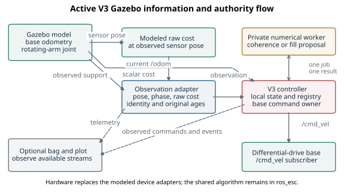
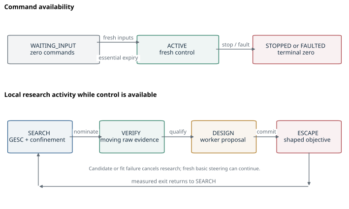
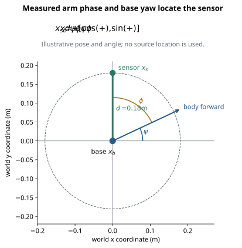
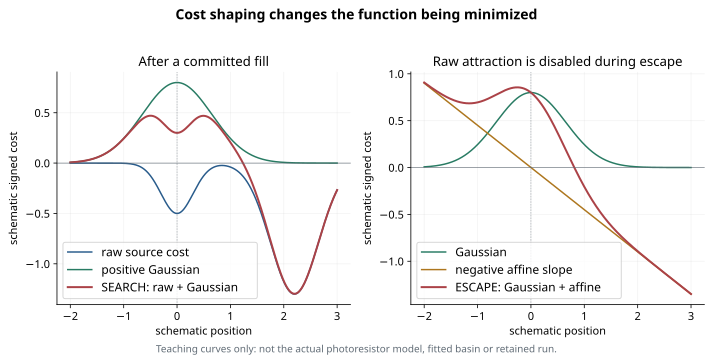
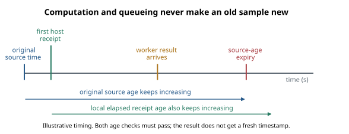
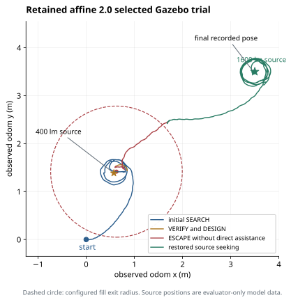
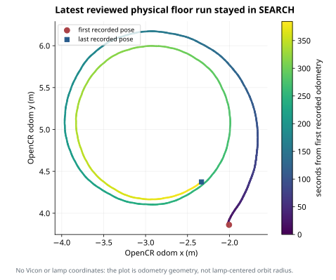

# GESC Gaussian V3 Complete Project and Learning Report

# What this report establishes

GESC Gaussian V3 is a source-seeking controller that estimates an improving
direction from a rotating sensor, recognizes repeated confined motion, collects
raw evidence while translating, places a mathematical Gaussian over a visited
basin, and temporarily follows a Gaussian-plus-affine objective to escape. It
then restores raw measured cost alongside retained Gaussian fills and continues
searching. The active
implementation concentrates these decisions in one controller. A separate
private process performs expensive calculations but cannot command the robot
or change the fill registry.

This report is written for the researcher who must understand the code well
enough to change it, defend its choices, and explain it to an advisor or another
engineer. It follows the breadth of the frozen V1 master report, while adding
worked mathematics, an observation-to-command walkthrough, explicit distinctions
between active and retained helper code, and a study route. It describes the
current implementation rather than treating the V1 report as the current design.

The user considers the simulation/Gazebo algorithm satisfactory as of October
5, 2026. The retained selected affine-2.0 Gazebo trial supports that decision:
it created a fill, completed escape without direct command assistance, resumed
source seeking, and entered the stronger source's vicinity. That is the accepted
development baseline for this report. It is not a theorem of global convergence
or a statistical robustness result over arbitrary fields. Later shared worker
and steering corrections have software and physical replay evidence but have
not been followed by a new Gazebo behavioral run in the retained records.

Physical V3 has been deployed and its selected raised-wheel stopping checks
were observed by the operator. The latest reviewed floor run lasted about
382 seconds with continued SEARCH commands and no candidate or fill. Physical
Gaussian design, escape, and two-source success therefore remain unqualified.
The proposed angular gain increase to 7.5 has not been applied. Its installed
value remains 5.0. This report does not change those settings or perform a new
hardware trial.

**Document identity.** Prepared October 5, 2026, in the user's
America/Los_Angeles time zone. Audited baseline:
`refactor/esc-v3`, commit
`2be0bad33a314f7b383d65f4bab876d401b7c888`.
The worktree was clean before report authoring. The report's own files are
subsequent documentation changes; this baseline identifies the code being
explained. The simulation checkout is `/home/mattb/dsim-lab`.
Physical sources remain outside it. No remote inspection or fresh claim about
the Pi's current process state is part of this report.

**Companions.** `FINAL_PROJECT_REPORT_V3.md` is the editable narrative;
`FINAL_PROJECT_REPORT_V3.tex` is the typesetting source;
`FINAL_PROJECT_REPORT_V3.pdf` is the reader-facing report. The file-level
coverage matrix and exact verification receipt are
`v3/report_coverage.tsv` and `v3/report_validation.md`. Small vector figures
and their generator are in `v3/report_figures/`. Raw bags, chapter drafts,
renderer logs, and page images remain outside Git under
`/home/mattb/Experiments/GESC-Gaussian/v3/report_20261005/`.

Source precedence is current code, selected configuration, interfaces and
tests; Git history; completed handoffs and retained experiment receipts;
approved plans and status; historical specifications; then memory. Memory
helped recover the desired breadth and teaching style of V1. Every material
current-state claim was checked against present source or retained evidence.
No memory-only implementation claim is used.

| Evidence term | Meaning throughout this report |
|---|---|
| Implemented | The cited active code contains this behavior. |
| Software verified | A specified test/build/replay passed within its stated scope. |
| Observed selected behavior | A named retained run contains the stated measured/event evidence. |
| Satisfactory simulation baseline | The user's project decision, supported by selected Gazebo evidence. |
| Failed or partial | The original experiment missed its criterion or ended before exercising a behavior. |
| Unavailable | A required measurement or record is absent; no value is invented. |
| Last verified physical state | The installed state documented at its dated inspection, not a current live assertion. |
| Unqualified physical behavior | Hardware evidence has not established the stated behavior. |

Sources: `AGENTS.md`; `docs/codex/gesc_gaussian/v3/refactor_plan.md`;
`docs/codex/gesc_gaussian/v3/refactor_status.md`;
`docs/codex/gesc_gaussian/v3/gazebo_status.md`;
`docs/codex/gesc_gaussian/v3/physical_fresh_chat_handoff.md`;
the current user request. File-level locations and hashes are recorded in the
coverage companion.

# How to learn the system

Read this report in three passes. On the first pass, understand the packages,
measurement geometry, objective switches, four research activities, and strongest
experimental result. On the second, work through the equations with paper and
a calculator. On the third, open the cited functions and follow one observation
through the implementation. The report deliberately separates mathematical
intent from admission rules, execution authority, and empirical evidence: these
answer different questions about why a robot behaved as it did.

The essential causal chain is:

1. The sensor moves around the base and measures a scalar field.
2. The observation adapter binds that scalar to observed pose and arm phase.
3. The controller rejects unusable observations without refreshing old input.
4. Washout and phase demodulation estimate a direction of decreasing cost.
5. Qualified cycle averaging smooths that direction; fresh instantaneous
   control remains available when averaging is unavailable.
6. The directional controller maps body-frame components into bounded linear
   and angular commands.
7. Recurrent odometry can nominate a candidate basin. Moving raw evidence must
   separately qualify it before a Gaussian is designed.
8. The worker returns an immutable fill proposal. Only the controller can
   validate its context and commit it at a new real observation.
9. ESCAPE changes the objective to Gaussian plus affine guidance. Measured
   spatial progress and exit criteria return the run to SEARCH.
10. The bag and plots observe this process. Their failure cannot supply,
    approve, or revoke a valid research command.

The distinction between **a direction**, **a candidate**, **a qualified raw
basin**, and **a committed fill** is fundamental. One can exist without the next.
A fresh, meaningful direction and pose permit basic control; a nomination is only geometric
evidence of confinement; fitting is optional numerical work; and a completed
proposal is not authoritative until the main owner accepts it.

## A vocabulary for thinking clearly

An *objective* is the scalar the controller is currently trying to minimize.
The *raw cost* is the signed sensor-derived quantity before mathematical
augmentation. A *Gaussian fill* is a positive function stored in coordinates,
not a physical object, obstacle or modification to the light. An *affine term*
is a linear spatial slope that biases the objective toward a chosen escape
direction. A *gradient estimate* uses changes in measurements and phase; it
does not reveal the source location. A *candidate* is a nominated region of
recurrent base motion. An *epoch* groups histories under a coherent search
context. A *revision* identifies an objective/registry version so stale work
cannot be applied to a different problem.

The *body frame* moves with the robot, so its first planar component is forward
and its second is sideways. The *odom frame* is the observed planar reference
used by the controller. The *sensor phase* is arm angle relative to the body;
adding base yaw gives its world orientation. A *source timestamp* identifies
the measurement's original time basis. A *receipt timestamp* identifies when
the host received it. A *monotonic clock* measures local elapsed time without
following wall-clock adjustment or a frozen simulated clock.

The controller's research activities SEARCH, VERIFY, DESIGN and ESCAPE answer
what algorithmic work is happening. Its availability states ACTIVE,
WAITING_INPUT, STOPPED and FAULTED answer whether command authority is available.
Combining those two axes gives labels such as ACTIVE/VERIFY. They are not the
old V1 eight-state supervisor.

## What V3 does and does not learn

The controller learns a local steering direction and local information about
visited basins. It does not maintain a map of all source positions, count an
unknown number of sources, infer the Gazebo light coordinates, or use Vicon as
control localization. The selected core creates at most one fill and then uses
later raw evidence to compare encountered basins. Stronger-source arrival can
be observed externally even when the internal ranking event never occurs.
No automatic GOAL_HOLD stops ordinary runs.

In the current experiments light provides the physical field. The scientific
motivation includes extremum-seeking acoustic source localization, especially
where reflective fields have unwanted extrema. No V3 acoustic hardware or
underwater success is established here. Gaussian shaping is a local, empirical
escape mechanism; it does not turn a nonconvex unknown field into a globally
solved optimization problem.

Sources: `ros2_ws/src/ros_esc/ros_esc/gesc_v3/core.py:47-85,119-220,401-442`;
`ros2_ws/src/ros_esc/ros_esc/gesc_v3/records.py:1-108`;
`docs/esc_architecture.md`;
`docs/DSIM_GESC_Gaussian_Codex_Implementation_Package/source_material/CONSOLIDATED_MEETING_DECISIONS.md`.


# Repository, ROS architecture, and operating V3

## What the repository contains

DSIM-Lab is a ROS 2 Humble simulation workspace for a mobile robot that searches for a source using only measured scalar cost, robot pose, and the measured angular position of a rotating sensor. The key design idea is to make the sensor sample different directions around the robot, infer a direction of improvement, and command the robot to move. V3 adds local-minimum recognition, moving verification, Gaussian filling, and escape to that foundation. The details of those numerical decisions are developed in the algorithm chapters; this chapter explains how the measurements and commands reach them.

The three ROS packages are **`ros_esc`**, **`ros_esc_interfaces`**, and **`turtlebot3_rotating_sensor`**. There is no active package named `ros_interfaces`. A fourth directory, `extremum-seeking`, is a separately installed Python mathematical library, not a fourth ROS package. The physical adapter package, `turtlebot3_vehicle_nodes`, is deliberately outside this simulation checkout. V1 and V2 remain historical frozen source/evidence; their former distributed Gaussian runtime is not the active V3 graph.

| Location | Responsibility | What to read first |
|---|---|---|
| `ros2_ws/src/ros_esc` | Shared controller, V3 local core, numerical helpers, simulated acquisition adapters, original ESC methods, optional observers | `setup.py`, `ros_esc/profiles.py`, `ros_esc/gesc_v3/node.py`, `core.py` |
| `ros2_ws/src/ros_esc_interfaces` | The eight custom message schemas shared by those processes | `CMakeLists.txt`, then `msg/*.msg` |
| `ros2_ws/src/turtlebot3_rotating_sensor` | Gazebo world/model/URDF, simulation launch, arm controller settings, 19 short aliases | `launch/gazebo.launch.py`, `urdf/turtlebot3_rotating_sensor.urdf` |
| `extremum-seeking` | Reusable pure Python filters, optimization flows, mathematical simulation/examples | `src/extremum_seeking/filters`, `seekers/parameter_odes.py` |
| `docs` | Current guides, authority/status/handoffs, reports, and historical evidence references | `esc_usage.md`, `esc_architecture.md`, current `codex/gesc_gaussian/v3` files |
| `~/Experiments` | Bags, plots, retained empirical receipts, archives, and report evidence | The exact external paths cited in the current status/handoff |

`ros_esc` uses `ament_python`: setuptools installs Python modules, resource JSON, and console entrypoints. `ros_esc_interfaces` uses `ament_cmake` and ROSIDL to generate language bindings from message definitions. `turtlebot3_rotating_sensor` uses `ament_cmake` chiefly to install simulation resources. Colcon builds the dependency graph: the interface package must be available before Python nodes import its generated message classes. An overlay is the shell environment that tells ROS where the chosen installed packages live. Sourcing another workspace later can change which source/install is selected; a source file visible in an editor does not by itself prove which installed executable a running ROS command uses.

The executable/package distinction matters. `ros2 run ros_esc controller_node` runs an installed entrypoint; the Python class is `CustomController` for original methods or `V3Controller` for V3. The current V3 entry is selected by `controller_node --v3`, rather than a separate `v3_controller` executable. Setup provides eleven entries: `encoder_node`, `sensor_pose_node`, `rotate_frame_node`, `cost_function_node`, `filter_node`, `controller_node`, `sensor_observation_node`, `live_plot_node`, `data_collection_node`, `record_bag`, and `analyze_bag`. `live_plot_node` and `data_collection_node` name the same optional display implementation. These eleven entries are an installed inventory, not eleven mandatory simultaneous nodes.

**Sources:** `AGENTS.md` lines 5-61; `ros2_ws/src/ros_esc/setup.py` lines 1-38; `ros2_ws/src/ros_esc/package.xml` lines 10-34; `ros2_ws/src/ros_esc_interfaces/CMakeLists.txt` lines 9-31; `ros2_ws/src/turtlebot3_rotating_sensor/CMakeLists.txt` lines 23-42; `extremum-seeking/setup.py` lines 6-25; `ros2_ws/src/ros_esc/ros_esc/controller_node/controller_node_script.py` lines 220-254.

## The ROS concepts actually used here

A **node** is a component that owns callbacks, subscriptions, publishers, parameters, and timers. A **topic** is a named stream of typed messages. A **publisher** sends messages; a **subscriber** receives them and triggers a callback. This repository mostly uses publish/subscribe rather than request/response services. A queue-depth argument such as `10` controls a bounded ROS history; it is not a ten-sample mathematical filter. ROS communication delivery and numerical history are separate mechanisms.

The callback processing machinery is an **executor**. V3 deliberately uses a `SingleThreadedExecutor`: its pose, observation, control-tick, and ownership callbacks operate on local state without concurrent callback writes. Expensive numerical work is delegated to a separate operating-system process, so a long fit does not block those callbacks. The core itself is an ordinary Python object without ROS subscriptions. This allows direct tests to feed immutable observations into the same logic without Gazebo or physical devices.

A **launch file** composes a graph: it starts executables, passes arguments and parameters, includes other launch files, and manages shutdown. A **profile** is the project-specific configuration describing an algorithm and selected JSON resources. Profile JSON is not a ROS parameter file, and a launch argument is not automatically a node parameter. Here `resolve_profile()` reads and combines named/custom algorithm settings with an environment, then launch and each relevant node consume the appropriate results.

ROS **time** is a node clock abstraction. With `use_sim_time=True`, a node follows Gazebo's `/clock`; physical V3 selects `False`. A **steady/monotonic clock** measures elapsed host time independent of `/clock`. V3 uses both: source timestamps describe when measurements belong to the algorithm timeline, while steady receipt age prevents frozen simulation time or repeated messages from keeping an old motion command alive. A **frame** is a coordinate convention such as `odom`: two positions are only comparable if they use the same frame. V3 treats a frame or time-origin change as an integrity fault rather than silently mixing data.

A `geometry_msgs/Twist` contains three linear and three angular components. The base is a planar differential-drive robot: only `linear.x` and `angular.z` are used. `nav_msgs/Odometry` supplies position and quaternion orientation. Quaternion normalization and conversion produce the planar yaw angle used by the algorithm. `sensor_msgs/JointState` carries named joint positions; the encoder selects the `rotating_frame_joint` by name rather than assuming an arbitrary array index.

**Sources:** `ros2_ws/src/ros_esc/ros_esc/gesc_v3/node.py` lines 46-100, 281-300; `ros2_ws/src/ros_esc/ros_esc/gesc_v3/records.py` lines 7-59; `ros2_ws/src/ros_esc/ros_esc/gesc_v3/observation_node.py` lines 35-47; `ros2_ws/src/ros_esc/ros_esc/encoder_node/encoder_node_script.py` lines 27-49; `ros2_ws/src/ros_esc/ros_esc/gesc_v3/clock_delivery.py` lines 17-59; `ros2_ws/src/turtlebot3_rotating_sensor/launch/gazebo.launch.py` lines 33-53, 77-142.

## The complete active Gazebo data path

The active V3 graph can be read as a measurement chain followed by one control owner:

```text
Gazebo /clock -----------------------> simulation-time nodes
Gazebo /odom ------------------------> sensor pose + observation adapter + V3 controller
Gazebo /joint_states --> encoder -----> sensor pose + observation adapter
                           |
                           +---------> arm rotation owner --> arm velocity commands
                                            |
                                            +--> Timekeeper --> observation adapter
sensor pose --> modeled cost (5 Hz) --> raw cost ------------> observation adapter
                                                                  |
                                                /gesc/observation |
                                                                  v
                                                   controller_node --v3
                                                       local V3Core
                                                            |
                                   one immutable job <----> numerical worker
                                                            |
                                              /cmd_vel ----> Gazebo base
```

The common four simulation adapters are launched for every method. `encoder_node` converts the named joint state into a stamped angle array. `rotate_frame_node` publishes arm velocity and the legacy Timekeeper origin. `sensor_pose_node` computes a sensor transform from odometry and encoder phase. `cost_function_node` evaluates a configured scalar field at that transform and adds configured noise. For V3, launch adds `sensor_observation_node` and `controller_node --v3`; it does **not** launch `filter_node`. V3 performs GESC/rolling direction work locally and publishes the canonical filter topic only as an optional diagnostic output.

For an original method, the common four adapters instead feed `filter_node`, then `controller_node` without `--v3`. That controller uses the selected original numerical object. In both graphs only one controller is intended to publish `/cmd_vel`. The rotating arm has its own actuator channel `/velocity_controller/commands`; this arm owner is not a second base-velocity owner.

The Gazebo launch also starts the server/client, robot description publisher, spawn action, arm-controller spawner, and optional light-marker spawn actions. Those infrastructure processes explain why the operating-system process list is larger than the algorithm-node list. V3 disables the ros2_control joint-state broadcaster in the launch graph, relying on the Gazebo named-joint publisher for its observed rotating phase. Original profiles retain the broadcaster selection. Neither optional live plotting nor standard rosbag recording supplies motion authority or a readiness handshake.

The launch directly owns the installed node executables rather than wrapping every node in `ros2 run`; this gives its shutdown signals a direct route to the process holding the ROS handles. Gazebo's `gzserver` and `gzclient` are likewise started directly. This is process-lifecycle plumbing, not a numerical algorithm change.

**Sources:** `ros2_ws/src/turtlebot3_rotating_sensor/launch/gazebo.launch.py` lines 26-53, 99-130; `ros2_ws/src/turtlebot3_rotating_sensor/launch/control.launch.py` lines 10-19; `ros2_ws/src/turtlebot3_rotating_sensor/launch/empty_world.launch.py` lines 11-33; `ros2_ws/src/ros_esc/ros_esc/gesc_v3/node.py` lines 82-100, 160-173.


{width=100%}

## Canonical topics and their direction of influence

The environment profile uses entity name `turtlebot3`. Topic names are generated in one place, `profiles.py`. A reader should distinguish control inputs, actuator outputs, and observer telemetry:

| Topic | Type | Producer → consumer | Meaning |
|---|---|---|---|
| `/clock` | `rosgraph_msgs/Clock` | Gazebo → simulation clock infrastructure/recorder | Simulation timeline; not a cost sample |
| `/odom` | `nav_msgs/Odometry` | Gazebo base plugin → sensor pose, observation adapter, controller, plot/bag | Observed robot pose in `odom` |
| `/joint_states` | `sensor_msgs/JointState` | Gazebo joint publisher → encoder | Observed named rotating-joint angle |
| `/turtlebot3/timekeeper_chatter` | `Timekeeper` | arm owner → legacy adapters, observation adapter, controller telemetry | Stable experiment start-time origin and clock mode |
| `/turtlebot3/encoder_chatter` | `StampedFloat64MultiArray` | encoder → arm/sensor pose/observation adapter | One arm angle, relative acquisition timestamp |
| `/turtlebot3/sensor_transform_chatter` | `StampedTransformMultiArray` | sensor pose → modeled cost | Sensor position/orientation transform(s) |
| `/turtlebot3/cost_value_chatter` | `StampedFloat64MultiArray` | modeled cost → observation adapter; original filter; observers | Raw signed cost, one channel for selected V3 |
| `/gesc/observation` | `SensorObservation` | adapter → V3 controller/bag | Single assembled raw cost, observed support geometry, phase, provenance |
| `/turtlebot3/filter_value_chatter` | `StampedFloat64MultiArray` | original filter → original controller, or V3 controller → observers | In V3 an output-only body-direction diagnostic |
| `/turtlebot3/control_value_chatter` | `StampedFloat64MultiArray` | controller → observers | Six command components as diagnostic telemetry |
| `/cmd_vel` | `geometry_msgs/Twist` | sole base controller → Gazebo base/physical external driver | Actual base command endpoint |
| `/velocity_controller/commands` | `std_msgs/Float64MultiArray` | arm owner → arm joint velocity controller | Rotating-frame angular velocity |
| `/gesc/events` | `AlgorithmEvent` | V3 controller → observers | Candidate/fill/escape/best-source/availability events |
| `/gesc/fills` | `GaussianFill` | V3 controller → observers | Committed Gaussian geometry and diagnostics |

V3 does not subscribe to its own event or fill telemetry. The registry and objective are local state, not decisions synchronized through message acknowledgments. A bag subscriber cannot authorize motion; losing a plot does not alter control. A best-source message is an event indicating a raw-evidence comparison, not a command to stop or hold a source.

**Sources:** `ros2_ws/src/ros_esc/ros_esc/profiles.py` lines 84-98; `ros2_ws/src/ros_esc/ros_esc/gesc_v3/node.py` lines 82-100, 160-173, 218-263; `ros2_ws/src/ros_esc/ros_esc/rotate_frame_node/rotate_frame_node_script.py` lines 28-37; `ros2_ws/src/ros_esc/ros_esc/run_tools/record_bag.py` lines 15-32.

## All eight custom messages, field by field

The interface package preserves five original message shapes and adds one observation contract while retaining two telemetry contracts. Not every available field is populated in the active publisher. The schema describes capacity; the publisher source defines actual values and validity flags.

### The five original contracts

`Timekeeper` has `mode: string` and `start_time: float64`. Mode is `sim time` or `real time`. The arm owner publishes the stable start time at 30 Hz. Encoder/cost/filter/control timestamps are historically relative to this origin; adding the origin recovers an absolute algorithm-clock timestamp. It does not carry a sample sequence, hardware acquisition uncertainty, or a ROS Header.

`StampedFloat64` has `header: string`, `timestamp: float64`, and `data: float64`. The header is a textual description, not `std_msgs/Header`; it has no frame identifier or ROS stamp structure. `StampedFloat64MultiArray` has the same descriptive header and timestamp but `data: float64[]`. The array's shape/meaning depends on the topic: encoder is `[phase]`, selected raw cost is `[cost]`, V3 filter diagnostic is a two-component body direction, and controller diagnostic is `[vx, vy, vz, wx, wy, wz]`. Do not identify it as a multidimensional layout-aware `std_msgs/Float64MultiArray`; this custom type has no `layout` field.

`StampedString` similarly carries `header`, relative `timestamp`, and string `data`. It is retained for compatibility even though it is not a mandatory selected V3 stream. `StampedTransformMultiArray` has `header`, `timestamp`, and `geometry_msgs/Transform[] transform_array`. Each Transform has translation and quaternion rotation for a sensor, but the wrapper itself supplies no explicit parent/child frames. The selected simulation configuration supplies the intended odometry-to-sensor geometry.

**Sources:** `ros2_ws/src/ros_esc_interfaces/msg/Timekeeper.msg` lines 1-14; `StampedFloat64.msg` lines 1-10; `StampedFloat64MultiArray.msg` lines 1-10; `StampedString.msg` lines 1-10; `StampedTransformMultiArray.msg` lines 1-13; `ros2_ws/src/ros_esc/ros_esc/rotate_frame_node/rotate_frame_node_script.py` lines 34-37, 57-61; `ros2_ws/src/ros_esc/ros_esc/gesc_v3/node.py` lines 165-171, 223-227.

### SensorObservation: the control input contract

| Fields | Meaning and actual selected behavior |
|---|---|
| Constants `DEVICE_TIME=0`, `ESTIMATED_TIME=1`, `RECEIPT_TIME=2`; `timestamp_basis` | Tell the consumer what the source timestamp represents. Gazebo adapter emits estimated; physical host acquisition uses receipt basis unless a real device clock exists. |
| `stamp`, `receipt_stamp` | ROS Time source and adapter-receipt timestamps, kept distinct. Completion of an interpolation or worker job never creates a fresh source timestamp. |
| `source_instance`, `sequence` | A UUID-like identity for one adapter lifetime and host sequence incremented for distinct accepted cost timestamps. A restart creates a new source identity. |
| `device_sequence_valid`, `device_sequence` | Optional independent device-origin sequence. The generic observation adapter sets validity false; host counts must not masquerade as an ADC count. |
| `frame_id`, `source_pose: Pose2D` | Robot pose at the cost timestamp, supported by nearby observed odometry. Pose2D contains x, y, theta/yaw. |
| `raw_cost` | Signed, unaugmented scalar sensor cost. It remains raw even when control objective changes. |
| `phase_rad` | Calibrated observed arm phase relative to the base. It is not nominal RPM multiplied by time. |
| `sensor_x_m`, `sensor_y_m` | Sensor sample position derived from base pose, yaw + measured phase, and sensor radius. |
| `pose_support_age_sec`, `phase_support_age_sec` | Age/separation of measured support actually used in interpolation/nearest support. |
| `acquisition_uncertainty_sec` | Unknown is NaN. A fabricated zero would claim a precision that was not measured. |
| `valid`, `reason` | Whether this record is usable; invalid notices communicate bounded data rejection or a terminal integrity reason. |

The producer uses bounded pose/phase queues, one pending cost record, and a default 50 ms support tolerance. Exact support is preferred; if both sides are close it interpolates. If only nearby measured support exists it uses the nearest support and reports its age. Angular interpolation uses the shortest wrapped difference, avoiding the erroneous midpoint across ±π. This produces observed/estimated geometry, not simulator truth. Its planar sensor location is `x_sensor = x_base + 0.18 cos(yaw + phase)` and `y_sensor = y_base + 0.18 sin(yaw + phase)` for the selected radius.

**Sources:** `ros2_ws/src/ros_esc_interfaces/msg/SensorObservation.msg` lines 1-23; `ros2_ws/src/ros_esc/ros_esc/gesc_v3/observation.py` lines 9-35, 58-114; `ros2_ws/src/ros_esc/ros_esc/gesc_v3/observation_node.py` lines 72-92, 237-266; `ros2_ws/src/ros_esc/ros_esc/gesc_v3/records.py` lines 20-50.

### AlgorithmEvent: what telemetry can and cannot tell you

The schema defines event constants for configuration/capability/state transition; candidate/confirmation/verification; fill created/rejected/merged/superseded/escalated/failed/low-confidence; goal reached; escape started/stalled; recenter started/completed; timeout and failsafe. They are retained telemetry labels, not proof that active V3 implements all of the historic states implied by their names.

Fields are `stamp`; optional `source_timestamp` and `source_timestamp_valid`; `event_type`; optional numeric `state`, textual `state_name`, and `state_valid`; optional `fill_id` and `fill_id_valid`; `reason_code`; human-readable `detail`; and parallel `value_names`/`values` arrays. The current publisher maps candidate → 10, fill-created → 20, best-source → 30, escape-started → 40, and other events → state-transition 3. It fills `state_name` with availability/activity, marks state valid, and emits `detail` as kind plus reason. It does not populate an authoritative numeric state enumeration, source timestamp, fill ID, reason-code catalogue, or the value arrays in this path. Analysis must therefore read the validity flags and `detail`, rather than interpret default zeros as measured facts. Event state text is constructed at publish time, so `detail` and the core event timestamp are the primary transition evidence.

**Sources:** `ros2_ws/src/ros_esc_interfaces/msg/AlgorithmEvent.msg` lines 1-38; `ros2_ws/src/ros_esc/ros_esc/gesc_v3/node.py` lines 229-243; `ros2_ws/src/ros_esc/ros_esc/gesc_v3/records.py` lines 62-67; `ros2_ws/src/ros_esc/ros_esc/run_tools/analyze_bag.py` lines 63-68.

### GaussianFill: a committed geometry record

`GaussianFill` carries publish `stamp`, valid source timestamp, and frame; identity `fill_id`, `cluster_id`, `revision`; center `center_x`, `center_y`; amplitude; covariance entries xx/xy/yy; principal widths `sigma_major`, `sigma_minor`; orientation; support and exit radii; confidence; sample count; fit residual; condition number; design escalation count; their corresponding validity flags; and active/superseded flags. The active publisher fills these from the committed fill object and marks valid geometry/diagnostics individually; the condition-number flag is copied from the fit, because a condition estimate can remain unavailable. Covariance describes Gaussian spatial shape, not the robot's localization covariance. Confidence is an implementation diagnostic, not a universal probability of escape success.

This is output-only telemetry. The control owner commits to its local registry first; publishing a `GaussianFill` neither changes a second node's objective nor asks another owner for approval. The analyst can draw ellipses only when frame and widths are valid and compatible with the recorded odometry frame.

**Sources:** `ros2_ws/src/ros_esc_interfaces/msg/GaussianFill.msg` lines 1-37; `ros2_ws/src/ros_esc/ros_esc/gesc_v3/node.py` lines 244-263; `ros2_ws/src/ros_esc/ros_esc/run_tools/analyze_bag.py` lines 266-297.

## Profiles, parameters, and the exact meaning of a run command

`resolve_profile()` first finds the selected installed `share/ros_esc/config/profiles` directory through the ament index. Pure source tests can fall back to the source resource directory. It reads `algorithms.json` and `environments.json`, deep-copies the selected algorithm, and resolves exactly five config roles: rotation, sensor, cost, filter, controller. A custom profile is a JSON file using the same structure; relative asset paths are resolved against that file's directory. It accepts only `legacy` or `gesc_v3` algorithms, and rejects missing resources. Built-in objects use importable `module` references; custom original object JSON retains `filepath` support.

The environment contributes simulation/physical mode, clock, entity, frame, plotting default, support rate, and world. The active Gazebo environment is `simulation`, true simulation time, entity `turtlebot3`, frame `odom`, plot true, 30 Hz sensor support, and `gazebo_empty.world`. The physical environment selects wall time and plot false, with no Gazebo world/support-rate setting. `gazebo.launch.py` explicitly rejects a physical environment; setting `environment:=physical` does not transform a simulated robot launch into a hardware launch.

One nuance is that resolving a profile is a pure repeatable operation, not a mutable run configuration broker. The launch resolves its graph, and the observation/controller nodes also resolve their startup settings. Gains and caps have a single effective JSON owner, so those resolutions agree without copying a second set into profile metadata. Editing a source JSON should be followed by the documented build before relying on installed resources; runs do not build or rewrite JSON.

The V3 profile declares 5 Hz modeled cost, 20 Hz command cadence, 0.5 s input expiry, 5 s fill preparation, 4000 maximum fit samples, and 0.18 m sensor radius. The controller JSON supplies `k_vx=0.5`, `k_wz=5`, Gazebo caps 0.10 m/s and 0.50 rad/s, affine magnitude 2.0, direct escape assistance false, stall window 15 s, and assistance path 0.20 m. Physical caps are separately selected as 0.05/0.30; reading generic simulation resources with environment physical is not sufficient to apply the physical selected configuration.

Some declared fields deserve precise interpretation. The Gazebo arm's actual selected commanded speed is owned by `full_rotation.json` (`spin_rpm: 20`), not by the profile's `arm_rpm` label. The profile's 54-degree encoder offset records the physical selection; Gazebo phases are already observed joint angles and the generic observation adapter deliberately applies no such offset. `coherence_expiry_sec` is declared as 0.5 in the profile, while the current core explicitly submits coherence jobs with a 0.5 s timeout rather than exposing that field through `CoreConfig`. V3 still requires a filter asset role for compatible profile structure, but does not instantiate that legacy filter JSON in the V3 graph. These distinctions prevent a metadata edit from being mistaken for an effective runtime tuning change.

**Sources:** `ros2_ws/src/ros_esc/ros_esc/profiles.py` lines 8-20, 32-98; `ros2_ws/src/ros_esc/config/profiles/environments.json` lines 1-20; `ros2_ws/src/ros_esc/config/profiles/algorithms.json` lines 178-204; `ros2_ws/src/ros_esc/config/profiles/assets/gesc_v3/controller.json` lines 1-19; `ros2_ws/src/ros_esc/ros_esc/gesc_v3/node.py` lines 49-78; `ros2_ws/src/ros_esc/ros_esc/gesc_v3/core.py` lines 447-461; `ros2_ws/src/ros_esc/ros_esc/gesc_v3/observation_node.py` lines 175-193; `docs/environment_parameters.md` lines 3-42.

## Effective startup settings versus source defaults

The table distinguishes selected startup values from fallback defaults; that distinction prevents a reader from treating a dataclass default as the active Gazebo cap. The complete leaf-level source inventory is in `v3/report_parameters.tsv`.

| Setting | Selected Gazebo V3 | Source owner / precedence |
|---|---|---|
| `profile`, `environment` | `gesc_v3`, `gazebo` | Launch arguments forwarded as ROS parameters; selected profile resolved at startup |
| `use_sim_time` | true | Environment profile; explicit override must agree or startup rejects it |
| `direct_escape_assistance_enabled` | false | Controller JSON seeds the declared ROS Boolean parameter; an explicit ROS startup override can select true |
| `k_vx`, `k_wz` | 0.5, 5.0 | Selected controller JSON gains |
| `max_vx`, `max_wz` | 0.10 m/s, 0.50 rad/s | Selected controller JSON params; CoreConfig fallback defaults are 0.05/0.30 |
| `escape_affine_magnitude` | 2.0 | Controller JSON; older omitted profiles fall back to 0.5 |
| `escape_assist_stall_window_sec`, `escape_assist_distance_m` | 15 s, 0.20 m | Controller JSON; switch false means direct assistance remains disabled |
| `input_expiry`, `control_hz` | 0.5 s, 20 Hz | Profile values copied into CoreConfig |
| `preparation_timeout`, `maximum_snapshot` | 5 s, 4000 | Profile fill budget / maximum fit sample cap |
| `sensor_radius` | 0.18 m | Profile → observation geometry and CoreConfig GESC arm length |
| `washout_omega` | 1.0 | CoreConfig default retained by node construction |
| `candidate_radius` | 0.75 m | CoreConfig default retained by node construction |
| `maximum_history` | 20000 | CoreConfig default; bounded raw evidence and pose history |
| observation `support_tolerance`, `capacity` | 0.05 s, 256 each | ObservationBuilder constructor defaults |
| clock delivery `max_lead`, `capacity` | 0.125 s, 32 per stream | ClockDelivery defaults; expiry inherited from selected input expiry |
| phase/odometry support | 30 Hz configured | Environment → joint publisher; base drive plugin publishes odometry at 30 Hz |
| raw modeled cost | at most 5 Hz | Profile → cost node CLI rate limiter on distinct transforms |
| coherence numerical-job deadline | 0.5 s | Explicit core submit call; profile metadata matches but is not separately wired |
| arm-manager update rate | 100 Hz | `joint_controller.yaml` |
| arm speed | 20 RPM nominal | Selected full_rotation JSON → constant spin-profile object |

V3 uses only three declared ROS selections in its controller shell besides the standard clock parameter: profile, environment, and direct-assistance enabled. Other numerical values are resolved JSON/profile fields or code configuration objects; they do not become arbitrary ROS parameters simply because their names appear in a report. Original controller/filter use strict `--use-sim-time` CLI arguments instead of accepting appended ROS `-p` arguments. The generic shared clock helper preserves an explicit startup override when legacy simulation adapters are constructed, rather than globally rewriting defaults according to the machine storing source.

**Sources:** `ros2_ws/src/ros_esc/ros_esc/gesc_v3/node.py` lines 49-78; `ros2_ws/src/ros_esc/ros_esc/gesc_v3/records.py` lines 70-108; `ros2_ws/src/ros_esc/ros_esc/gesc_v3/observation.py` lines 21-35; `ros2_ws/src/ros_esc/ros_esc/gesc_v3/clock_delivery.py` lines 28-33; `ros2_ws/src/ros_esc/ros_esc/gesc_v3/core.py` lines 447-461; `ros2_ws/src/ros_esc/ros_esc/clock_configuration.py` lines 6-43; `ros2_ws/src/ros_esc/ros_esc/controller_node/controller_node_script.py` lines 38-44, 220-228; `ros2_ws/src/ros_esc/ros_esc/filter_node/filter_node_script.py` lines 32-40.

## The 19 aliases and what they actually select

Every Bash wrapper is a short explicit alias for `ros2 launch turtlebot3_rotating_sensor gazebo.launch.py profile:=NAME`, forwarding additional launch arguments. Their names remain selectable for original-method continuity. They select installed resources and perform no build. The profile table below describes actual objects rather than inferring behavior from filenames.

| Profile / alias basename | Controller family | Cost | Rotation |
|---|---|---|---|
| `adagrad_bnf_rotation_acoustic` | Rotating directional + AdaGradODE | Acoustic expression | Back/forth, acoustic rotation config |
| `adagrad_bnf_rotation_resistance` | Rotating directional + AdaGradODE | Photoresistor resistance | Back/forth |
| `adagrad_bnf_rotation_voltage` | Rotating directional + AdaGradODE | Negative photoresistor voltage | Back/forth |
| `adagrad_full_rotation_acoustic` | Rotating directional + AdaGradODE | Acoustic expression | Full rotation, acoustic config |
| `adagrad_full_rotation_resistance` | Rotating directional + AdaGradODE | Photoresistor resistance | Full rotation |
| `adagrad_full_rotation_voltage` | Rotating directional + AdaGradODE | Negative photoresistor voltage | Full rotation |
| `angular_tuning` | `Angular_Velocity_Input_Controller` | Negative photoresistor voltage | No arm rotation (Constant_Full_Rotation, 0 RPM) |
| `forward_tuning` | `Forward_Velocity_Input_Controller` | Negative photoresistor voltage | No arm rotation (Constant_Full_Rotation, 0 RPM) |
| `gesc_bnf_rotation_acoustic` | Directional_Controller | Acoustic expression | Back/forth, acoustic config |
| `gesc_bnf_rotation_voltage` | Directional_Controller | Negative photoresistor voltage | Back/forth |
| `gesc_full_rotation_acoustic` | Directional_Controller | Acoustic expression | Full rotation, acoustic config |
| `gesc_v3` | V3Core + Directional_Controller | Multi-light negative voltage | Full rotation, 20 RPM |
| `hb_acoustic` | **`Forward_Velocity_Input_Controller`** | Acoustic expression | Full-rotation config |
| `hbesc_full_rotation_voltage` | Rotating directional + HeavyBallODE | Negative photoresistor voltage | Full rotation |
| `lie_bracket` | Lie_Bracket_Controller | Negative photoresistor voltage | Constant_Full_Rotation object with zero RPM in `no_rotation.json` |
| `rmsprop_bnf_rotation` | Rotating directional + RMSPropODE | Photoresistor resistance | Back/forth |
| `rmsprop_bnf_rotation_acoustic` | Rotating directional + RMSPropODE | Acoustic expression | Generic back/forth config |
| `rmsprop_full_rotation` | Rotating directional + RMSPropODE | Quadratic expression | Full rotation |
| `rmsprop_full_rotation_acoustic` | Rotating directional + RMSPropODE | Acoustic expression | Generic full-rotation config |

`hb_acoustic` is a historical alias label; it does not currently select HeavyBallODE. Likewise the acoustic RMSProp aliases reuse generic controller/rotation resources while changing the cost. This report describes the current code faithfully and does not silently rename or repair retained recipes. V3's low-rate, recurrent-verification/Gaussian method is a separate selected runtime, not an automatic upgrade applied to every original alias.

**Sources:** `ros2_ws/src/ros_esc/config/profiles/algorithms.json` lines 2-317; all nineteen files in `ros2_ws/src/turtlebot3_rotating_sensor/bash_scripts/{adaptive_methods,gradient_methods,accelerated_methods}` (lines 1-5 in each); `ros2_ws/src/ros_esc/config/profiles/assets/ros_esc/rotate_frame_node/rotate_frame_config_files/turtlebot_vehicle/no_rotation.json` lines 1-9. An exact asset/parameter inventory accompanies this report as `v3/report_parameters.tsv`.

## Robot model, kinematics, and what Gazebo simulates

The model is a TurtleBot differential-drive base with a rotating horizontal sensor arm. `base_footprint` is the planar reference, `base_link` is 0.010 m above it, the rotating joint is 0.355 m above the base link, and the sensor is 0.18 m outward with a 0.015 m vertical offset from the arm. The rotating joint is continuous about z; selected initial phase is zero. The base collision model is a simple 0.140 × 0.140 × 0.33 m box, not a exact mechanical CAD reconstruction. Wheel collision radius is 0.033 m; a low-friction fixed sphere approximates the caster. Meshes supply appearance; collisions/inertias supply physics. CAD/print files are useful mechanical assets, not runtime algorithm code.

The Gazebo differential-drive plugin consumes `/cmd_vel`, publishes `/odom` and odometry transform at 30 Hz, and uses 0.160 m wheel separation and 0.066 m diameter. The controller object's hardware-limit calculation has wheel distance 0.158 m in the selected JSON. That small distinction is explicit in source and should not be erased in an explanation. With selected cap overrides it does not set the 0.10/0.50 velocity limits; those limits come directly from JSON. Ideal planar kinematics are `x_dot = v cos(yaw)`, `y_dot = v sin(yaw)`, `yaw_dot = w`. Differential drive realizes them through left/right wheel rates. Reverse signed `v` is valid and can reduce turning requirements; the controller does not require forward-only translation.

The arm uses ros2_control's `JointGroupVelocityController`; it is distinct from the base's Gazebo differential-drive plugin. Its YAML runs the controller manager at 100 Hz and exposes the rotating joint velocity command/position/velocity state. The constant-full-rotation object converts 20 RPM to `20 * 2π/60 ≈ 2.094 rad/s`. A 3 s nominal rotation at 5 cost samples/s yields about 15 samples per turn. These are nominal settings; the algorithm uses observed phase, and bag analysis reports measured angular travel rather than assuming perfect tracking.

The general sensor-pose adapter computes a homogeneous transform `T_odom,sensor = T_odom,base T_base,joint(phase) T_joint,sensor`. Translation and quaternion orientation are encoded into `StampedTransformMultiArray`. The modeled cost therefore depends both on sensor position and facing direction. For V3's control input, the observation adapter independently assembles the measured base pose/phase at the cost source stamp and computes the planar sample position. The modeled sensor-pose path currently uses latest received odometry when an encoder callback arrives; the observation contract records nearby pose/phase support and its age, rather than claiming exact simulator ground truth at each acquisition.

The active environment world is `gazebo_empty.world`, containing the sun and ground plane. The visible selected source markers are spawned from the selected cost JSON; they are visual scene assets, not brightness measurements from a camera or ray-traced photoresistor. Historical bounded-world SDF files remain available, but the active environment does not select them automatically. Neither the robot's lidar/IMU model nor optional contact telemetry is a source-seeking input to V3. There is no obstacle navigation stack or SLAM-based global plan in this selected algorithm graph.

**Sources:** `ros2_ws/src/turtlebot3_rotating_sensor/urdf/turtlebot3_rotating_sensor.urdf` lines 11-55, 253-335, 349-418, 423-505; `ros2_ws/src/turtlebot3_rotating_sensor/controller_config/joint_controller.yaml` lines 1-19; `ros2_ws/src/ros_esc/config/profiles/assets/ros_esc/sensor_pose_node/transform_config_files/turtlebot_rotating_sensor.json` lines 1-44; `ros2_ws/src/ros_esc/ros_esc/sensor_pose_node/transform_objects/transform_objects.py` lines 63-104, 107-198; `sensor_pose_node_script.py` lines 40-65; `ros2_ws/src/ros_esc/ros_esc/rotate_frame_node/spin_profile_objects/spin_profile_objects.py` lines 65-97; `ros2_ws/src/turtlebot3_rotating_sensor/worlds/gazebo_empty.world` lines 1-12; `launch/gazebo.launch.py` lines 56-74; `ros2_ws/src/ros_esc/config/profiles/assets/gesc_v3/controller.json` lines 8-17.

## Cost models and minimization sign

Every selected method solves a minimization problem. For light-voltage seeking, a brighter measurement has larger positive physical voltage but more negative cost. The modeled voltage cost is `J = -5/(R/330 + 1)` volts. Lower resistance or brighter illumination therefore lowers J. A positive Gaussian bump added to J raises a previously attractive low region; the control still minimizes the resulting objective. This sign convention is essential when describing filling: the algorithm does not reward the old minimum with a larger negative well.

The single-light `Photoresistor_Interpolated_Map` computes radial distance r and facing error β (degrees), evaluates an empirical quadratic resistance fit `R = a r² + b β² + c rβ + d r + e β + f`, clips to [100, 337260] Ω, optionally approximates ADC quantization, and returns resistance or negative divider voltage. The coefficients are `a=8280.82113`, `b=7.90425287`, `c=442.130406`, with very small d/e/f terms. This is a directional fitted surrogate, not a universal inverse-square illumination law or hardware calibration valid for every sensor/environment.

The selected V3 `Multi_Light_Source_Cost` uses that same directional curve for each source but combines them in **conductance**, rather than adding voltages or taking a nearest-source minimum. Let `G_dark = 1/337260`. For source i, `ΔG_i = max(1/R_i - G_dark, 0) I_i/I_reference`. Then `G_total = G_dark + ΣΔG_i`, `R_total = clip(1/G_total, 100, 337260)`, and voltage mode applies the negative divider conversion. This creates a spatial/directional multi-source landscape from which local minima can arise. Intensity scales the source's incremental conductance. Zero-intensity sources contribute zero.

The current built-in scene contains a weaker source at `(0.5740251485, 1.3858192988)` with 400 lumens and a stronger source at `(3.5,3.5)` with 1600 lumens, reference 1000 lumens, scale 1, ADC false, and `No_Noise`. New source configurations also support brightness percentages through the brightness helper, while this selected asset still uses legacy lumen values. Source positions/strengths belong to modeled acquisition and visualization, not to `SensorObservation` or the control core. The core cannot ask the simulator which source is globally best.

Original acoustic/quadratic profiles use `Position_Based_Sympy_Expression`: configured expressions are converted into executable mathematical functions. Their units and interpretation belong to the selected expression and must not be equated with negative volts simply because the same topic carries both. The noise object is another configured component: no noise, uniform noise, Gaussian noise, or a configured user-defined time expression can be selected. The selected V3 cost adapter rate-limits fresh sensor transforms to at most 5 Hz; skipped or duplicate timestamps produce no synthetic cost sample.

**Sources:** `ros2_ws/src/ros_esc/ros_esc/cost_function_node/cost_function_objects/cost_function_objects.py` lines 66-109, 111-181, 230-267, 282-319, 323-404, 457-560; `ros2_ws/src/ros_esc/config/profiles/assets/gesc_v3/cost.json` lines 1-28; `ros2_ws/src/ros_esc/ros_esc/cost_function_node/cost_function_node_script.py` lines 18-65; `ros2_ws/src/ros_esc/ros_esc/cost_function_node/light_brightness.py` lines 1-76; `cost_function_objects/noise_objects.py` lines 1-226.

## How the original numerical pipeline fits together

The original configurable filter architecture is a tree of filters described by JSON. `CascadeFilter` passes one filter's output into the next; `ParallelFilter` applies each branch to the same input and concatenates outputs; explicit FunctionFilter selections route individual components inside branches. `FunctionFilter` handles algebraic expressions without a dynamic state; `WashoutFilter` removes slow/DC components through `z_dot = omega (y-z)`, output `y-z`. Low-pass, Riccati, convolution, and directional filter classes provide other reusable building blocks. The config parser recursively instantiates this tree and concatenates each block's initial state. SymPy translates symbolic expressions, and retained simple `u[...]` expressions are evaluated through the original function parser.

The full-rotation GESC filter receives `[cost, measured_phase]`, separates the cost from phase, washouts the cost, computes phase basis `[2 cos(phase)/d, 2 sin(phase)/d]` at d=0.18, and multiplies by negative washout output. Its two outputs are a descent direction in the robot frame. Back/forth rotation uses different centered basis coefficients because a semicircular perturbation does not have the same zero-mean/full-circle averages. Adaptive methods generate two gradient components plus three independent components of a symmetric gradient outer-product estimate, not only the two GESC channels.

The filter ROS node advances its ODE using the original pre-step output ordering and explicit Euler/refinement logic. An ordinary valid one-step path is retained; invalid state candidates retry subdivisions from the original state under a **64-total-derivative-evaluation budget**. Exhaustion drops the sample and resets state rather than publishing a partially integrated result or blocking indefinitely. Input cost/encoder timestamps must be finite, fresh, and increasing. A large input gap resets the dynamic filter state.

The controller API is `controller_output(time, state, input_values)` and returns six components `[vx,vy,vz,wx,wy,wz]`. `state` is `[x,y,z,roll,pitch,yaw]`. `Directional_Controller` applies `vx=k_vx*d_body_x`, `wz=k_wz*d_body_y`, then signed caps. The x component drives along the robot's heading; y does not command impossible sideways motion, but steers the heading through angular velocity. This is why a two-dimensional direction can control a nonholonomic differential-drive base.

`Rotating_Frame_Directional_Controller` adds persistent numerical optimizer state. It rotates observed gradient and gradient-product estimates from robot frame to world frame, advances the selected ODE, and rotates the resulting direction back to robot frame. RMSProp tracks smoothed squared-gradient scale; AdaGrad uses a matrix gradient outer-product state; HeavyBall tracks momentum with damping. Integrating in world coordinates avoids treating turning robot axes as fixed physical directions. The first controller sample takes dt=0 to avoid an artificial startup jump. The HeavyBall adapter's `input_gain` explicitly handles whether its incoming filter gives gradient or descent direction.

Forward tuning, angular tuning, and Lie-bracket original methods retain distinct direct control formulas. Forward tuning commands sinusoidally perturbed linear motion with constant angular speed; angular tuning fixes linear velocity and modulates turning; Lie-bracket retains its original implemented angular law. Those direct formulas should be described from source, not replaced by a textbook method that happens to share the name. The original controller adapter now consumes only the first cost component for Lie-bracket's scalar API; other/custom controllers retain vector input. Retaining these implementations lets V3 be understood against the earlier baseline without implying that all legacy profiles share V3's observation joins, numerical worker, or Gaussian logic.

**Sources:** `extremum-seeking/src/extremum_seeking/filters/base_filters.py` lines 215-284, 380-496; `filters/aggregate_filters.py` lines 20-204, 205-341; `ros2_ws/src/ros_esc/ros_esc/config_parsing.py` lines 69-235, 301-383, 433-494; `ros2_ws/src/ros_esc/ros_esc/filter_node/filter_node_script.py` lines 17-70, 93-153; selected `assets/ros_esc/filter_node/filter_config_files/turtlebot_vehicle/gradient_methods/gesc_filter_full_rotation.json` lines 1-67; `controller_objects/turtlebot_vehicle.py` lines 64-172, 178-338, 407-431, 499-527, 595-619; `controller_objects/turtlebot_ode_objects.py` lines 71-190, 192-315, 317-414; `controller_node_script.py` lines 164-179.

## V3 ownership, availability, and private worker

V3 has two different kinds of state. **Availability** answers whether control can currently use essential inputs: `ACTIVE`, recoverable `WAITING_INPUT`, or terminal `STOPPED`/`FAULTED`. **Research activity** describes what the local algorithm is doing: search, verify, design, or escape. A failed fit is a research failure, while missing fresh pose/direction is an availability problem. Treating both as a generic terminal failsafe would incorrectly turn an optional numerical failure into permanent loss of basic control.

`V3Controller` is the ROS shell; `V3Core` owns all algorithm state. The core holds the measured pose and observation, fresh receipt ages, instantaneous and rolling GESC, recurrent detector, moving evidence, registry, objective revision, candidate identity, search epoch, affine terms, and escape progress. It knows neither ROS graph metadata nor a recorder, simulator field, or device driver. The ROS shell performs conversion/transport, runs a 20 Hz steady tick, publishes commands, and emits optional diagnostics. There is one command endpoint and one registry commit authority.

Accepted pose source age, observation source age, observation ROS receipt age, and original local monotonic receipt age must each remain within 0.5 s. Admission also requires increasing pose timestamps, increasing observation sequence and timestamp, compatible frame, and pose/phase support separation at most 0.05 s. Invalid/duplicate/future/old records are rejected without renewing those ages. Changing producer identity discards temporal evidence and pending candidate work and starts a new epoch. It preserves an already committed ESCAPE fill, direction and affine term with its original age; recently retired IDs are rejected so a delayed old stream cannot reclaim ownership. A frozen `/clock` still lets the steady timer expire held commands. New fresh usable inputs can automatically return `WAITING_INPUT` to `ACTIVE`, while Ctrl+C and actual integrity/ownership/actuator faults remain terminal.

The owner starts on the first **usable** direction and fresh pose, not on a full rotation, completed fit, or recorder ready signal. The initial cost primes washout state: a single brightness level is not a measured gradient. Numerical coherence can improve direction evidence later without withholding basic control until a worker completes. During verification/design the controller commands moving approach/probing; no internal elapsed candidate deadline exists while valid geometry, translating motion, and fresh input continue. Design itself has a finite 5 s preparation budget, and failure cancels only that candidate.

The numerical worker uses multiprocessing's **spawn** context and capacity-one request/result channels. Only one job may be in flight; work does not accumulate behind it. Immutable job keys carry type and identities. A coherence key contains epoch, objective revision, and source stamp; a fill key adds candidate identity and registry generation. The main core rejects mismatched, expired, or context-stale results. Completing a fit does not grant permission to commit into a changed candidate or registry. Coherence has a 0.5 s job timeout; fill preparation uses 5 s; fit snapshot is capped at 4000 records. These finite numerical budgets differ from operator run duration or verification collection time.

The child has no ROS publisher, actuator access, or live registry authority. It returns a proposal/result or error; exceptions are data. On expiry/death the parent retires/restarts the child, polls without waiting, and continues fresh basic control. Fill/objective changes are committed at a subsequent new real observation, so old direction history is not relabeled under a new objective. The core resets relevant direction history and waits for a real sample of the new objective rather than replaying old measurements as new acquisitions.

**Sources:** `ros2_ws/src/ros_esc/ros_esc/gesc_v3/node.py` lines 46-101, 111-173, 186-216; `core.py` lines 1-6, 47-117, 119-235, 447-485, 548-580; `worker.py` lines 15-29, 39-146; `records.py` lines 70-108.

## Clock catch-up, ownership checks, and shutdown

Gazebo's independently delivered clock and sensor topics can arrive in an inconvenient order. `ClockDelivery` allows a small, bounded holding area: at most 32 records, source lead ≤125 ms, and the same 0.5 s source/steady expiry. A sample is not usable until the clock has caught up to its source/availability time. The queue never rewrites the sample timestamp. Duplicates are rejected before queuing. This solves delivery order while preserving the rule that future data cannot authorize motion; it is not a looser freshness threshold.

The ROS shell checks publisher count on `/cmd_vel` once per steady second. An observed competing publisher causes a terminal ownership fault. If graph metadata itself is unavailable, it warns rather than converting recording/plotting/subscriber availability into a motion gate. This is a periodic diagnostic, not a proof that no competing command could exist between checks. Actual actuator publish failure faults and makes a best-effort zero through the command endpoint. Optional telemetry failures only warn.

Orderly Ctrl+C/SIGTERM handling defers repeated signals through final-zero and worker/executor cleanup. `stop()` cancels the command timer, latches core `STOPPED`, publishes final zero, then closes the numerical worker and process lease. The arm owner similarly latches stopped and publishes arm neutral. The optional recorder waits a short tail before closing its own bag process, allowing final commands to reach the recording. Recorded zero is evidence of a command publication, not proof of measured floor stopping.

`process_lease.py` is shared support for the separately managed physical runtime. Gazebo normally has no lease. Physical environment variables may bind the controller/acquisition to a Pi-local guard through Unix datagram sockets; a controller tick is sent only after successful command publication. The lease tracks completed local process progress and reciprocal guard acknowledgment, not ROS sensor freshness, recorder readiness, numerical success, run duration, or SSH connectivity. Linux parent-death binding also kills an orphaned numerical child/driver when its actual parent disappears. The guard/physical driver are outside this checkout. A leased terminal controller fault exits toward the guard's critical-child stop path; `WAITING_INPUT` keeps renewing local progress while commanding zero and can recover. These software mechanisms still require physical operator evidence for actual stopping behavior.

**Sources:** `ros2_ws/src/ros_esc/ros_esc/gesc_v3/clock_delivery.py` lines 17-62; `node.py` lines 146-158, 175-216, 265-300; `process_lease.py` lines 1-7, 18-31, 34-111, 121-128; `ros2_ws/src/ros_esc/ros_esc/deferred_signal_shutdown.py` lines 1-40; `rotate_frame_node_script.py` lines 63-88; `run_tools/record_bag.py` lines 35-71.

## Optional plotting, standard recording, and honest offline analysis

Interactive Gazebo automatically opens the familiar Matplotlib layout: x position, y position, scalar-cost history, and planar trajectory. The `3D` display option uses z-history in place of planar trajectory. The display process subscribes to odometry/cost, stores bounded numerical buffers, and updates artists on the GUI thread; its subscription executor runs separately. No display on the host causes a graceful skip; plot close/import/display/subscription failures do not control motion. The GUI enable flag also governs plotting: `gui:=false` makes plotting false even if a user explicitly requests `plot:=true`. The live display is a learning/operator aid, not complete archived experiment evidence.

The optional recorder invokes ordinary `ros2 bag record` with SQLite storage. Default topics are `/odom`, encoder, raw cost, filter diagnostic, `/cmd_vel`, `/gesc/observation`, `/gesc/events`, `/gesc/fills`, plus `/clock` in simulation. The timekeeper, sensor transform, arm command, and control diagnostic are not in this compact default list; add topics explicitly if a particular analysis needs them. The recorder does not use `--use-sim-time`: it records `/clock` but retains the bag transport timestamp convention. No project-specific manifest or recorder-ready topic is required. Recorder failure prints a warning and returns without changing control.

`analyze_bag` discovers types from ordinary bag metadata, decodes supported messages, preserves bag time separately from source time, and reports unknown/missing metrics as null/unavailable. It reports cadence, duplicate/regressing source timestamps, observed displacement/path length, final recorded command zero, event counts, fill records, and measured phase travel. Angle-based RPM uses wrapped increments; it cannot infer unobserved extra revolutions between sparse samples. When the encoder topic is absent, an observation-only bag can supply RPM under explicit adjacent-compatible-pair rules. It never infers an ADC timestamp or turns requested 20 RPM into measured 20 RPM.

Offline plots use the recorded trajectory and valid same-frame Gaussian widths. Ellipses show one-sigma principal dimensions; they are not support or exit circles. Cost/control signal plots use elapsed **bag receipt** time, not falsely aligned legacy-relative and absolute source times. Optional CSV export uses URL-encoded topic filenames. Nonfinite numeric fields become JSON null. A new analysis directory is required; the tool refuses to overwrite an existing output. Missing Matplotlib permits a numeric summary with a warning. Analysis does not establish source arrival/global optimality merely from a low raw cost or a `best_source` event, and does not establish measured stopping from final zero commands.

**Sources:** `ros2_ws/src/ros_esc/ros_esc/data_collection_node/data_collection_node_script.py` lines 10-97; `live_plot_animation.py` lines 10-41, 46-138, 141-180; `run_tools/record_bag.py` lines 15-32, 35-99; `run_tools/analyze_bag.py` lines 23-113, 116-191, 203-263, 266-365; `ros2_ws/src/turtlebot3_rotating_sensor/launch/gazebo.launch.py` lines 82-85, 120-129.

## Build, run, inspect, and analyze without guessing

These commands are documented reproduction instructions; this report preparation did not launch Gazebo or hardware. Use one fresh terminal/selected overlay. Installing the numerical library is separate from colcon:

```bash
cd /home/mattb/dsim-lab
source /opt/ros/humble/setup.bash
timeout 120s python3 -m pip install --user --no-deps -e ./extremum-seeking
cd ros2_ws
timeout 300s colcon build --symlink-install \
  --packages-select ros_esc_interfaces ros_esc turtlebot3_rotating_sensor
source install/setup.bash
```

In subsequent terminals:

```bash
source /opt/ros/humble/setup.bash
source /home/mattb/dsim-lab/ros2_ws/install/setup.bash
```

A bounded interactive V3 learning run keeps both Gazebo GUI and plot:

```bash
timeout --foreground --signal=INT --kill-after=15s 300s \
  ros2 launch turtlebot3_rotating_sensor gazebo.launch.py \
  profile:=gesc_v3 gui:=true plot:=auto record:=true
```

The ordinary launch itself has no run-duration deadline and continues until Ctrl+C. The outer timeout above is an operator/testing bound, not a convergence gate. The six active launch options are `profile` (default `gesc_v3`), `environment` (`gazebo`), `gui` (`true`), `plot` (`auto`), `record` (`true`), and `output` (`~/Experiments/ESC`). For example, a bounded headless software-development run can select `gui:=false plot:=false record:=false`. A Bash alias is equivalent profile selection, such as `bash gradient_methods/gesc_v3.bash` from the package `bash_scripts` directory. Choose one algorithm graph at a time.

Read-only inspection of an already running simulation can illuminate the architecture:

```bash
timeout 10s ros2 node list
timeout 10s ros2 topic list -t
timeout 10s ros2 topic info /cmd_vel --verbose
timeout 10s ros2 param get /controller_node use_sim_time
timeout 10s ros2 interface show ros_esc_interfaces/msg/SensorObservation
timeout 10s ros2 topic echo /gesc/observation --once
```

The first four explain the graph and clock; the final two connect a schema to an actual observation. `ros2 topic info /cmd_vel --verbose` should show the intended command owner; do not start a second publisher as a demonstration while another graph is controlling the robot. To print resolved profile resources without starting nodes:

```bash
timeout 10s python3 - <<'PY'
import json
from ros_esc.profiles import resolve_profile
print(json.dumps(resolve_profile('gesc_v3', 'gazebo'), indent=2))
PY
```

After shutdown, inspect a **closed** bag and analyze it:

```bash
timeout 15s ros2 bag info '/path/to/closed_bag'
timeout 120s ros2 run ros_esc analyze_bag '/path/to/closed_bag' --csv
```

The default result is a sibling `_analysis` directory containing `summary.json`, available `trajectory.png`/`signals.png`, and CSV files if requested. An existing analysis destination requires choosing a new path with `--output`. Keep large bags/artifacts in `~/Experiments`, outside Git. Replaying a recorded `/cmd_vel` into a live command domain is not necessary for learning from the bag; offline analysis is sufficient for the report's figures and inspection.

**Sources:** `docs/esc_usage.md` lines 9-28, 30-78, 114-124; `ros2_ws/src/turtlebot3_rotating_sensor/launch/gazebo.launch.py` lines 133-142; `ros2_ws/src/ros_esc/ros_esc/run_tools/analyze_bag.py` lines 339-381; `profiles.py` lines 28-99.

## A practical reading route and configuration ownership inventory

Read by the journey of one observation, not by alphabetically opening every historical document. First read active usage/architecture/current authority and evidence, then the selected profile/controller/cost JSON. Follow `gazebo.launch.py` into encoder → sensor pose → cost. Read all eight message schemas, then observation builder/adapter. Next read V3 records, ROS shell, core, and worker. Only then read the pure numerical modules in the algorithm chapter's order. Finish with tests and retained empirical evidence to distinguish intended behavior from observed behavior. Read original filter/controller and the Python mathematical library for comparison after understanding V3's selected path.

| What you want to understand/change | Authoritative owner | Why this owner matters |
|---|---|---|
| Select algorithm/assets/start pose | `config/profiles/algorithms.json` or custom profile | One profile identifies the real recipe |
| Simulation/physical mode, clock, frame, plot default | `config/profiles/environments.json`; caller's startup override must agree | Prevents mixing environment assumptions |
| V3 gains, signed speed caps, affine magnitude, assistance switch/path/window | Selected V3 controller JSON; merged by `profiles.py` | Metadata copies do not silently override the effective JSON |
| Cost sources, strength, mode, ADC, scale/noise | Selected cost JSON and cost/noise objects | Simulator truth stays on the acquisition side |
| Arm spin/reversal law | Selected rotation JSON and spin-profile object | Profile nominal RPM alone is not actuator configuration |
| Sensor geometry/transform | Selected sensor JSON plus URDF; V3 radius setting | Model geometry and observed planar geometry must remain consistent |
| Raw modeled acquisition rate | V3 profile → cost-node `--sample-rate-hz` | Distinct from odometry/phase and control rates |
| Command cadence/freshness/fit cap/preparation budget | V3 profile → `CoreConfig` | Finite runtime/data/numerical constraints |
| Recurrent/rolling/verification/registry numerical policy | Pure numerical config defaults plus explicit core constructors | Many are code-owned values rather than launch arguments |
| Single command owner and fault response | `gesc_v3/node.py`, `core.py` | Transport and numerical state remain one authority |
| Optional bag topics/shutdown | `run_tools/record_bag.py` | Compact default bag may omit a desired diagnostic |
| Analysis derivations/availability | `run_tools/analyze_bag.py` | Observed metrics differ from requested settings |
| Physical acquisition/calibration/guard/deployment | External physical workspace and current physical plan/status/handoff | This checkout does not own hardware bringup |

The accompanying `v3/report_parameters.tsv` enumerates every leaf of every active profile/resource JSON, including arrays and symbolic filter expressions, and `v3/report_coverage.tsv` records source coverage. They are indexes for tracing and review, not additional runtime configurations. Current source takes precedence over stale prose. Specifically, the root README still contains pre-deployment statements that V3 software qualification and Gazebo work are pending and the Pi was not changed; those statements are superseded by completed refactor status, active AGENTS instructions, later simulation evidence, and the current physical handoff. The nested `ros_esc_interfaces/msg/README.md` likewise describes retired V2 interfaces that are absent from the active eight-message build. Historical sections of `environment_parameters.md` also intentionally mention retired V1 paths. Translate those only when interpreting old evidence, not when launching V3.

**Sources:** `AGENTS.md` lines 5-61, 94-149; `docs/codex/gesc_gaussian/v3/refactor_plan.md` lines 1-76; `docs/codex/gesc_gaussian/v3/refactor_status.md` lines 1-134; `README.md` lines 3-6, 44-46 (documented drift); `docs/esc_usage.md` lines 80-112; `ros2_ws/src/ros_esc/ros_esc/gesc_v3/core.py` lines 64-75, 433-460; `ros2_ws/src/ros_esc/ros_esc/gesc_v3/records.py` lines 70-108.


# V3 mathematics and local algorithm

## The algorithm as a sequence of questions

V3 uses one moving robot, one rotating sensor, a measured scalar cost, and observed odometry. Its basic control question is: **which direction presently makes the cost smaller?** Its research question is: **has the robot become confined near a repeatable local candidate, and can a positive Gaussian modification help it leave?** These questions run together, but have different evidence requirements. The robot can use a fresh instantaneous direction long before it has enough history to confirm recurrence or design a fill.

A useful verbal description is: “The sensor rotates around the robot. We correlate changes in the measured cost with the measured arm angle to estimate a downhill direction. We stabilize that direction using a recent complete revolution when its evidence is coherent. Meanwhile, observed motion is checked for settling, circling, or oscillation. A recurrent neighborhood becomes a candidate, which is verified while the robot moves. The raw observations then determine a Gaussian hill that raises the cost near that candidate. During escape, Gaussian repulsion and a directional affine slope supply the GESC objective. Once measured progress establishes exit, ordinary raw-cost searching resumes.”

This describes the active path. It does not mean the controller knows where the light sources are. Source coordinates belong to the simulation model and evaluation, not the core. Nor does “candidate” mean a mathematically proved stationary point. It means measured trajectory geometry satisfied specific tests and is now worth investigating.

*Source: `ros2_ws/src/ros_esc/ros_esc/gesc_v3/core.py:47-85,119-154,401-460,463-570`; `ros2_ws/src/ros_esc/ros_esc/gesc_v3/numerics/recurrent.py:1-5,162-213`; `docs/esc_architecture.md:1-17`.*

### Two state descriptions coexist

The **availability state** answers whether publishing a control command is presently justified. Its values are ACTIVE, WAITING_INPUT, STOPPED, and FAULTED. Missing or old essential inputs yield WAITING_INPUT and zero; fresh inputs can recover automatically. STOPPED is an operator termination and FAULTED is an integrity failure. Those two are terminal for that process.

The **research activity** answers what experiment the local core is carrying out. Its values are SEARCH, VERIFY, DESIGN, and ESCAPE. A failed fit cancels the candidate and returns to SEARCH; it does not turn otherwise fresh control into a terminal failure. In particular, a recorder, plot, or numerical-worker problem is not evidence that the measured instantaneous direction has disappeared.

These distinctions matter when explaining a bag. “VERIFY was cancelled” and “the controller stopped because its input expired” are different statements. Research activity cannot override stale essential input. Conversely, failing to identify a basin does not automatically stop ordinary GESC.

*Source: `ros2_ws/src/ros_esc/ros_esc/gesc_v3/core.py:50-54,87-117,254-303,463-490`; `ros2_ws/src/ros_esc/test/test_v3_core.py:120-149,164-210,267-288`.*


{width=100%}

## Coordinates, cost sign, and physical meaning

### Base pose and rotating sensor pose

Write the observed base position as $p_b=(x_b,y_b)$, base yaw as $\psi$, arm angle relative to the base as $\phi$, and arm radius as $d$. For the planar geometry used by the selected profile, the sensor world angle is

$$
\alpha=\psi+\phi,
$$

and the sensor position is conceptually

$$
p_s=p_b+d\begin{bmatrix}\cos\alpha\\\sin\alpha\end{bmatrix},\qquad d=0.18\;\mathrm{m}.
$$

The observation already supplies measured sensor coordinates; the objective composer uses those coordinates instead of silently reconstructing a perfect arm. The demodulator uses the body-relative measured phase $\phi$. Rolling integration rotates the demodulated vector using the yaw associated with the observation, then reprojects the resulting world vector using the current fresh yaw when commanding the robot.

The fit convention is deliberately different: the basin sample stores **base** position and measured raw cost. Thus the fitted data are $(p_b,J_{\rm raw})$, while objective modification is evaluated at $p_s$. This is inherited selected mathematics, not a claim that the two positions coincide. With a moving base and a directional sensor, a local fit is an empirical description of these observations. It should not be mistaken for an exact global map of cost at the sensor.

*Source: `ros2_ws/src/ros_esc/ros_esc/gesc_v3/core.py:203-237`; `ros2_ws/src/ros_esc/ros_esc/gesc_v3/numerics/rolling.py:28-36,264-284,470-520`; `ros2_ws/src/ros_esc/config/profiles/algorithms.json:193-202`; `ros2_ws/src/ros_esc/test/test_v3_core.py:347-352`.*


{width=90%}

### Why brighter means a smaller objective

The selected light model returns a negative divider voltage. If the positive voltage is $V$, the minimization cost is

$$
J_{\rm raw}=-V.
$$

A reading of $+2.8$ V therefore corresponds to $-2.8$ cost units. It is better under minimization than $+1.2$ V, which corresponds to $-1.2$. Comparing signed costs as if larger were better reverses the research objective.

The model's resistance-to-voltage conversion is

$$
J_{\rm raw}=-\frac{5}{R/330+1}.
$$

Here $R$ is the modeled photoresistor resistance in ohms, and 330 is the divider resistance in ohms. For $R=330\;\Omega$, this gives $J=-2.5$ V. For $R=660\;\Omega$, it gives $J\approx-1.667$ V. Lower resistance yields higher positive sensor voltage and lower signed cost.

In the multi-light model, contributions are combined as increments in conductance, not a sum of output voltages. For source $j$, its fitted resistance $R_j$ depends on distance and sensor bearing; its nonnegative conductance increment is scaled by its intensity relative to 1000 lumens. The total conductance is dark conductance plus those contributions, resistance is its reciprocal, and the divider conversion is applied once. This helps explain why overlapping sources do not produce a simple sum of two isolated voltage maps.

*Source: `ros2_ws/src/ros_esc/ros_esc/cost_function_node/cost_function_objects/cost_function_objects.py:352-353,457-479,487-527,542-560`; `ros2_ws/src/ros_esc/config/profiles/assets/gesc_v3/cost.json:2-22`.*

### Raw cost, shaped cost, and ranking must stay separate

A Gaussian is a positive cost hill. It is added because the controller minimizes: raising the objective near a previously encountered basin makes returning there less attractive. An affine term is a directional slope. These artificial terms are control aids, not stronger light measurements.

The composer implements

$$
J_{\rm aug}(p_s,t)=w_sJ_{\rm raw}+w_g\sum_iG_i(p_s)+w_aA(p_s,t).
$$

The selected activity weights are:

| Activity | $w_s$ raw | $w_g$ Gaussian | $w_a$ affine | Role |
|---|---:|---:|---:|---|
| SEARCH | 1 | 1 | 0 | Seek using the measured field while discouraging a filled basin |
| VERIFY | 1 | 1 | 0 | Keep the raw/filled objective available while moving collection steers |
| DESIGN | 1 | 1 | 0 | Continue moving collection while numerical preparation runs |
| ESCAPE | 0 | 1 | 1 | Obtain GESC direction from Gaussian plus affine repulsion |

Raw cost remains recorded and is used for candidate quality/ranking during all activities. It is simply multiplied by zero in the escape **control objective**. Calling ESCAPE “raw plus Gaussian plus affine” without specifying these selected weights is incorrect.

A voltage-based raw cost and the Gaussian amplitude have compatible cost units; covariance has square metres; affine coefficient has cost units per metre. A shaped objective can be positive even though raw voltage cost is negative. Its sign alone does not describe source quality. The normalized model `source_score` is a separate quantity and is not what this core uses to rank candidates.

*Source: `ros2_ws/src/ros_esc/ros_esc/gesc_v3/numerics/objective.py:31-50`; `ros2_ws/src/ros_esc/ros_esc/gesc_v3/core.py:203-208,229-237,428-439`; `ros2_ws/src/ros_esc/test/test_v3_core.py:355-370,478-487`.*


{width=100%}

## Measured-angle GESC from intuition to implementation

### Why rotating a sensor reveals a direction

GESC means gradient extremum-seeking control. It tries to recover a useful downhill direction from scalar observations instead of receiving the field gradient directly. A small rotating displacement acts as the exploratory perturbation.

For intuition, temporarily assume a smooth position-only field, a nearly fixed base, and a small sensor radius. Let $u(\phi)=(\cos\phi,\sin\phi)$. A first-order expansion gives

$$
J(p_b+du)\approx J(p_b)+d\nabla J(p_b)^Tu.
$$

Subtracting the slowly varying baseline leaves approximately $d\nabla J^Tu$. Multiplying by $-(2/d)u$ and averaging an ideal uniform revolution gives

$$
\left\langle-\frac{2}{d}\,[d\nabla J^Tu]u\right\rangle
=-2\left\langle uu^T\right\rangle\nabla J=-\nabla J,
$$

because the average of $\cos^2\phi$ and $\sin^2\phi$ is $1/2$, and the average of $\cos\phi\sin\phi$ is zero. This explains the factor $2/d$ and the negative sign.

This is a pedagogical derivation of the chosen demodulation structure. It is **not** a proof that every active estimate equals the true gradient. The implemented light sensor is directional, the base moves, the washout has dynamics, rotation speed is measured rather than perfectly uniform, and observations are sparse. V3 preserves the chosen full-rotation GESC calculation and evaluates it empirically; it does not replace these facts with the ideal assumptions.

*Source: implemented structure in `ros2_ws/src/ros_esc/ros_esc/gesc_v3/numerics/gesc.py:16-21,37-59`; directional field dependence in `ros2_ws/src/ros_esc/ros_esc/cost_function_node/cost_function_objects/cost_function_objects.py:487-527`. The Taylor expansion above is explanatory derivation, not an additional runtime computation.*

### Washout state and the exact discrete update

The scalar state $z$ tracks the cost baseline:

$$
\dot z=\omega(J_{\rm aug}-z),\qquad\omega=1.0\;\mathrm{s}^{-1}.
$$

The washed signal is $r=J_{\rm aug}-z$. The instantaneous descent-like body vector is

$$
q_b=-\frac{2}{d}(J_{\rm aug}-z)\begin{bmatrix}\cos\phi\\\sin\phi\end{bmatrix}.
$$

The implementation computes $q_b$ using the state **before** the Euler update, then performs

$$
z_k^+=z_k^-+\Delta t_k\omega(J_k-z_k^-).
$$

The elapsed time is the difference between actual source timestamps, not an assumed 0.2 seconds and not the command timer period. The first observation after a numerical reset has $\Delta t=0$. Repeated or decreasing source stamps are invalid. A source gap over 0.5 seconds resets history rather than inventing observations across the gap.

The magnitude of $q_b$ is $2|J-z|/d$. A large absolute cost is not automatically a large useful direction: it is the cost's difference from the washout state that supplies the modulation. The direction also changes sign when $J-z$ changes sign. Consequently a single sample is a phase-correlated instantaneous vector, not a complete Cartesian gradient measurement.

*Source: `ros2_ws/src/ros_esc/ros_esc/gesc_v3/numerics/gesc.py:23-59`; `ros2_ws/src/ros_esc/ros_esc/gesc_v3/records.py:71-80`; `ros2_ws/src/ros_esc/test/test_v3_numerics.py:115-121,261-268`.*

### A worked GESC calculation and startup priming

Suppose the core first observes $J=-2.0$ and initializes $z=-2.0$. The first direction is zero: an absolute brightness reading has not yet supplied a measured change. At the next valid observation, let $J=-2.1$, $\phi=60^\circ$, $d=0.18$ m, and $\Delta t=0.2$ s. Before updating $z$,

$$
r=-2.1-(-2.0)=-0.1,
$$

$$
q_b=\frac{0.2}{0.18}\begin{bmatrix}0.5\\0.866025\end{bmatrix}
\approx\begin{bmatrix}0.555556\\0.962250\end{bmatrix}.
$$

The derivative is $\dot z=-0.1$, so $z^+=-2.02$. The selected directional controller would request $v_x=0.5q_x\approx0.2778$ m/s and $w_z=5q_y\approx4.8113$ rad/s before saturation; the current Gazebo caps reduce those requests to 0.10 m/s and 0.50 rad/s.

Priming is a **core startup** rule. The standalone numerical helper resets its state to zero and is golden-tested that way. On first core acquisition, the core explicitly seeds state from the first real augmented cost so it does not manufacture a direction from the absolute voltage. After an in-motion objective change, the core resets numerical history but does **not** reapply startup priming. The first actual sample under the new objective is evaluated with that reset state and zero integration duration. This selected behavior avoids a planned synthetic transition stop, but also means the transition sample need not resemble the settled periodic estimate.

*Source: `ros2_ws/src/ros_esc/ros_esc/gesc_v3/core.py:66-69,209-215,272-276`; `ros2_ws/src/ros_esc/ros_esc/gesc_v3/numerics/gesc.py:33-59`; `ros2_ws/src/ros_esc/test/test_v3_core.py:87-109,396-411,618-631`; controller law in `ros2_ws/src/ros_esc/ros_esc/controller_node/controller_objects/turtlebot_vehicle.py:152-172`.*

### From a direction vector to a differential-drive command

The selected `Directional_Controller` uses the simple component rule

$$
v_x=\operatorname{clip}(k_vq_{b,x},-v_{\max},v_{\max}),\qquad
w_z=\operatorname{clip}(k_wq_{b,y},-w_{\max},w_{\max}).
$$

The selected gains are $k_v=0.5$, $k_w=5.0$. The x component requests signed translation; the y component requests yaw rotation. A vector pointing behind the robot can request reverse motion. This is not a controller that must rotate to face the vector before translating. For $q_b=(-0.04,0.02)$, the unsaturated command is $(-0.02,0.10)$: reverse at 2 cm/s while turning positively. For $q_b=(0,0.2)$, translation is zero and the angular request saturates. A valid direction therefore does not guarantee continuous translation.

The numerical API takes a six-state vector $(x,y,z,\mathrm{roll},\mathrm{pitch},\mathrm{yaw})$ and returns a six-velocity vector. V3 extracts elements 0 and 5 and clips again to its selected core caps. In gradient-estimate use, the numerical gain maps cost-per-metre to velocity; in centered tracking, the same controller receives a geometric vector. These are tuned numerical mappings, not a universal physical law giving the same dimensional interpretation to every upstream vector.

*Source: `ros2_ws/src/ros_esc/ros_esc/controller_node/controller_objects/turtlebot_vehicle.py:117-172`; `ros2_ws/src/ros_esc/ros_esc/gesc_v3/core.py:540-546,562-570`; `ros2_ws/src/ros_esc/config/profiles/assets/gesc_v3/controller.json:4-17`; `ros2_ws/src/ros_esc/test/test_v3_core.py:812-818`.*

## Rolling direction, actual revolutions, and coherence

### Why averaging must occur in a common frame

A body-frame vector means something different after the robot turns. V3 therefore rotates each sample into the world frame:

$$
q_w(t_i)=R(\psi_i)q_b(t_i),\qquad
R(\psi)=\begin{bmatrix}\cos\psi&-\sin\psi\\\sin\psi&\cos\psi\end{bmatrix}.
$$

For example, a body-forward vector $(1,0)$ observed at yaw $90^\circ$ represents world $(0,1)$. Averaging it directly with a body-forward vector from yaw $0^\circ$ would erase the distinction between world north and world east.

The phase used to count revolutions is the measured **world sensor phase** $\alpha=\psi+\phi$. A turn of the base contributes to world rotation; the arm's nominal motor RPM alone is not the cycle boundary. Consecutive phases are locally unwrapped by the shortest angular increment. A step exactly $\pi$ is ambiguous. Reversal, context changes, gaps, excessive cycle length, and capacity violations reset rolling history. There is no free extrapolation of unobserved rotations.

*Source: `ros2_ws/src/ros_esc/ros_esc/gesc_v3/numerics/rolling.py:28-50,252-333`; `ros2_ws/src/ros_esc/ros_esc/gesc_v3/core.py:216-222`.*

### The one-revolution mean is time weighted

At the latest sample time $t_1$, V3 finds the earlier measured phase crossing exactly one revolution behind. If a crossing falls between source samples, it linearly interpolates its time and vector. Between successive observed vertices the vector is represented linearly. Its one-revolution mean is

$$
\bar q_w=\frac{1}{T}\sum_j\Delta t_j\frac{q_{w,j}+q_{w,j+1}}{2},\qquad T=t_1-t_0.
$$

This is a temporal trapezoidal mean over a phase-defined window. It is not simply the arithmetic average of the last 15 observations, and it is not an angularly uniform integral. Those distinctions matter when arm speed varies or base yaw changes.

For a toy two-segment window with durations 1 s and 2 s, and endpoint vectors $(1,0)$, $(3,0)$, $(3,2)$, the mean is $[(1)(2,0)+(2)(3,1)]/3=(8/3,2/3)$. Equal weighting of its three vertices would instead give $(7/3,2/3)$. The code uses the former kind of time accounting.

Three completed anchored cycles, all with valid temporal support, provide warmup confidence. The current rolling mean still spans the latest one revolution; it is **not** the mean of three cycle means. Each cycle must last no more than 30 seconds and its original source gaps no more than 0.5 seconds. The selected 5 Hz steering policy records 12 angular sector populations for diagnostics but does not impose a sector-population gate.

*Source: `ros2_ws/src/ros_esc/ros_esc/gesc_v3/numerics/rolling.py:73-89,308-331,335-401,421-460`; `ros2_ws/src/ros_esc/ros_esc/gesc_v3/numerics/README.md:12-23`.*

### Coherence asks whether vectors reinforce or cancel

A mean can be small because every sample is weak, or because strong samples point in opposing directions. The selected coherence ratio distinguishes directional cancellation:

$$
C=\frac{\|\bar q_w\|}{\frac{1}{T}\int_{t_0}^{t_1}\|q_w(t)\|\,dt}.
$$

The numerator is the norm of the temporal vector mean; the denominator is the temporal mean of the vector norm. The triangle inequality implies $0\le C\le1$ for consistent arithmetic. Constant vector $(1,0)$ gives $C=1$. Equal-duration $(1,0)$ and $(-1,0)$ contributions can give a near-zero mean despite large individual magnitudes, so $C$ is near zero.

Because $q_w(t)$ is linearly represented between measurements, the denominator integrates the **norm of the interpolated vector**, not a trapezoid of endpoint norms. A segment from $(1,0)$ to $(-1,0)$ has average norm $1/2$ under linear interpolation; averaging the endpoint norms would give 1. This is why the worker performs bounded quadrature rather than reusing the numerator's arithmetic.

The code returns an interval, not just a point ratio. If $D$ is the denominator, $\epsilon_D$ its numerical error estimate, and $\epsilon_q=\sqrt2\epsilon_{\rm component}$ the numerator tolerance, it uses

$$
C_{\rm lower}=\frac{\max(0,\|\bar q_w\|-\epsilon_q)}{D+\epsilon_D},
$$

$$
C_{\rm upper}=\min\left(1,\frac{\|\bar q_w\|+\epsilon_q}{D-\epsilon_D}\right).
$$

Qualification requires the lower bound to be at least 0.25, adequate warmup and coverage, and a mean magnitude above $10^{-6}$. Error over $10^{-10}$, unresolved positive denominator, excessive triangle-inequality discrepancy, warnings, or exhausted quadrature budgets make coherence unavailable. These are numerical reconstruction tolerances; they are not experimentally calibrated uncertainty bounds on the physical field or source direction.

*Source: `ros2_ws/src/ros_esc/ros_esc/gesc_v3/numerics/coherence.py:14-27,67-157,192-225`; `ros2_ws/src/ros_esc/ros_esc/gesc_v3/numerics/rolling.py:177-197,380-417`.*

### Qualified blending and asynchronous continuity

A qualified mean contributes 75%; the current instantaneous vector contributes 25%:

$$
q_{w,\rm use}=0.25q_{w,\rm instant}+0.75\bar q_w.
$$

An unqualified or unavailable mean contributes zero, so meaningful fresh instantaneous control remains available. A zero instantaneous sample can be bridged by a meaningful qualified mixture. A weak or nonfinite mixture falls back, and a vector below the absolute magnitude floor cannot drive the controller.

For $q_{\rm instant}=(1,-1)$ and $\bar q=(1,0.2)$, a qualified blend is $(1,-0.1)$. Reprojection at yaw $90^\circ$ gives body $(-0.1,-1)$; the current yaw is used even if the vector snapshot was accepted earlier.

The worker result must exactly match source timestamp, reset sequence, and objective revision. A result for an old sample cannot give its confidence to the newest geometry. While a replacement job is pending, the entire previous accepted snapshot may be held within its original 0.5-second freshness, unchanged frame/objective context and history sequence. Its original vector and confidence stay together; only its body projection changes with the fresh yaw. When it expires, the owner falls back to the newest instantaneous direction. A negative replacement result revokes the old accepted snapshot.

*Source: `ros2_ws/src/ros_esc/ros_esc/gesc_v3/numerics/rolling.py:403-419,462-520`; `ros2_ws/src/ros_esc/test/test_v3_direction_handoff.py:32-125`; `ros2_ws/src/ros_esc/test/test_v3_core.py:309-331`.*

## Recognizing recurrence without knowing the source

### The detector's evidence is trajectory geometry

The active mode is `recurrent_geometry_v3`. It evaluates observed base odometry every six source seconds and considers five branches: static over 30 s, circle over 30 s, circle over 36 s, oscillation over 36 s, and oscillation over 54 s. It preserves source vertices and interpolates only bracketed support boundaries. The harmonic branch additionally uses a fixed interpolated time representation for its finite model search.

It does not read the cost, a source coordinate, or a simulator source label. Its question is whether the motion looks recurrent and confined. A stationary robot can satisfy the static geometry; an orbit can satisfy circle geometry; repeated back-and-forth motion can satisfy harmonic geometry. Each is a nomination that requires separate raw-cost verification.

All fits use temporal trapezoidal weights. For support $[t_a,t_b]$, each source segment contributes half its duration to each endpoint, normalized by total duration. The time mean is $\mu=\sum_iw_ip_i$, and confinement radius is the maximum distance from that mean over supported vertices. A gap over 0.5 s, frame/time conflict, conflicting duplicate, or capacity failure resets history.

*Source: `ros2_ws/src/ros_esc/ros_esc/gesc_v3/numerics/recurrent.py:14-15,51-75,115-128,162-167,216-341`; `ros2_ws/src/ros_esc/ros_esc/gesc_v3/core.py:145-153`; `ros2_ws/src/ros_esc/test/test_v3_core.py:908-925,962-970`.*

### Static and circular recurrence

For the static branch, the detector fits a constant plus linear drift to centered x/y motion. The drift norm must be at most 0.005 m/s and every supported vertex within 0.04 m of the mean. One eligible complete 30-second evaluation is enough to confirm this branch. “Static” is a geometric label; it does not authorize stationary verification.

For each circle branch, the support is split into equal older/newer halves. Each half is fit to a circle by weighted algebraic least squares. With centered coordinates $r_i=p_i-o$, the design fits

$$
2r_{i,x}c_x+2r_{i,y}c_y+a=\|r_i\|^2,
$$

then returns center $o+c$, radius $\sqrt{a+\|c\|^2}$, weighted radial RMS residual, and net unwrapped bearing change. Rank must be three and radius square positive.

A circle branch passes only when the entire support is confined within 0.5 m of its time mean, center drift between halves is at most 0.006 m/s, the two fitted radii differ by at most 0.08 m, and each half has radius 0.03-0.5 m, radial RMS at most 0.02 m, and at least $\pi/3$ net bearing change. Circle branches require three consecutive eligible evaluations, six seconds apart. A 30-second branch can therefore first confirm at approximately 42 seconds after complete fresh support begins, subject to evaluation alignment.

As a calculation, two half-circle centers 0.03 m apart over a 15-second half support give drift $0.03/15=0.002$ m/s, which meets the drift gate. That alone is insufficient: poor residuals, a radius change, insufficient arc, or excessive global confinement can still reject the candidate. The detector checks a conjunction of evidence, not a single score threshold.

*Source: `ros2_ws/src/ros_esc/ros_esc/gesc_v3/numerics/recurrent.py:131-146,162-191,303-337`.*

### Harmonic oscillation and persistence

The oscillation branch first checks line-like geometry. A weighted planar covariance has eigenvalues $\lambda_1\le\lambda_2$. Perpendicular RMS is $\sqrt{\lambda_1}$ and axis-variance ratio is $\lambda_1/\lambda_2$. The support must remain within 0.5 m, perpendicular RMS at most 0.02 m, and ratio at most 0.1.

It then fits both coordinates to

$$
p(t)\approx a+b\frac{t}{W}+c\cos(2\pi t/P)+s\sin(2\pi t/P),
$$

using an interpolated 0.2-second grid centered in a support of width $W$. Candidate periods range from 6 s to $\min(96,W/0.75)$ s in 0.5-second steps. The smallest weighted squared residual chooses the period. The fitted drift norm is $\|b\|/W$; the amplitude is the largest singular value of the two-dimensional sine/cosine coefficient matrix.

Acceptance requires drift at most 0.006 m/s, amplitude at least 0.05 m, weighted residual RMS at most 0.02 m, and weighted design condition number at most 50. Three consecutive passes are required. The corresponding earliest complete-support confirmations are about 48 s for the 36-second branch and 66 s for the 54-second branch, with timing subject to the epoch evaluation schedule.

The reported score is drift multiplied by 12 s, producing metres. For static, its maximum drift corresponds to 0.060 m; for circle/harmonic it corresponds to 0.072 m. The score is telemetry summarizing one condition. Replacing the branch predicates by “score below 0.072” would discard radius, shape, residual, amplitude, condition and persistence gates. Nor is this the historical two-block centroid detector, despite inherited `CentroidResult` field names.

*Source: `ros2_ws/src/ros_esc/ros_esc/gesc_v3/numerics/recurrent.py:14-15,17-47,149-159,192-213,303-337`; golden model cases in `ros2_ws/src/ros_esc/test/test_v3_numerics.py:89-107,137-138`.*

## Moving verification and three-cycle raw evidence

### Approaching a fixed candidate and circling it

A recurrent nomination freezes a candidate center $c$. VERIFY keeps the base within a 0.75 m candidate neighborhood. It first approaches that center using world vector $c-p_b$. When base distance reaches 0.08 m, collection is marked started. It then uses a tiny circular reference

$$
p_d=c+0.03\begin{bmatrix}\cos(0.3\tau)\\\sin(0.3\tau)\end{bmatrix},\qquad
\dot p_d=0.009\begin{bmatrix}-\sin(0.3\tau)\\\cos(0.3\tau)\end{bmatrix},
$$

where $\tau$ is elapsed time since the **candidate start**, including approach. The world tracking input is

$$
q_{\rm track}=p_d-p_b+\dot p_d/0.5.
$$

It is rotated into the body frame and passed to the same directional controller. Under a simplified point-integrator interpretation, a proportional gain 0.5 times this input would supply proportional error correction plus desired reference velocity. The actual differential-drive law and saturation mean exact circle tracking is not guaranteed.

The reference circle radius is 3 cm, angular rate 0.3 rad/s, period about 20.94 s, and tangent speed 0.009 m/s. It is a **base motion reference**, distinct from the sensor's nominal 20 RPM rotation, whose period is approximately 3 seconds. Entering the 8 cm collection radius does not restart the reference phase.

Valid moving approach and collection have no elapsed deadline. However, measured translation below 1 mm over a 0.5-second check interval cancels the research candidate. DESIGN inherits that moving requirement and has its separate finite preparation budget. “No candidate deadline” therefore means continue gathering valid moving evidence, not ignore stale inputs or accept a stopped base.

*Source: `ros2_ws/src/ros_esc/ros_esc/gesc_v3/numerics/verification.py:5-20`; `ros2_ws/src/ros_esc/ros_esc/gesc_v3/core.py:242-252,401-427,488-507,548-560`; `ros2_ws/src/ros_esc/test/test_v3_core.py:202-264,890-905`.*

### Steering coverage and verification coverage are different

Moving raw evidence counts actual complete sensor-world revolutions. Its cycle boundaries are phase crossings interpolated between actual observations. Each cycle must have at least one actual raw sample in each of 12 angular sectors and positive represented time in each sector. Interpolation can establish a boundary or geometric support; it cannot populate an empty cost sector with a fabricated acquisition.

The owner selects the latest three **eligible** cycles. Each cycle must be qualified, all measured/interpolated trajectory vertices lie within 0.75 m of the candidate, and its time centroid within 0.15 m of the center. For every sector, time-weighted base position centroids across the three cycles must differ by no more than 0.15 m. This sector comparability prevents treating measurements taken from substantially different base paths as equivalent rotations. Snapshot support, including real samples bracketing boundaries, must remain available and at most 4000 samples.

At ideal 5 Hz and 20 RPM, there are 15 samples per nominal revolution and a 24-degree nominal angular step. Twelve sectors span 30 degrees each, so coverage is possible but sensitive to actual phase, yaw motion, missing samples and varying speed. “Three cycles exist” is not equivalent to “three qualified comparable cycles exist.” The rolling steering policy can meanwhile use instantaneous fallback because its selected coverage does not require all sectors populated.

Pretrigger cycles are permitted: a selected cycle ending before the detector confirmation is counted as pretrigger, with later cycles counted as verification evidence. VERIFY does not blindly demand three brand-new revolutions after entering the center radius. This helps reuse genuine recent raw support but makes correct epoch and support accounting important.

*Source: `ros2_ws/src/ros_esc/ros_esc/gesc_v3/numerics/evidence.py:172-183,260-299,304-374,386-423`; `ros2_ws/src/ros_esc/ros_esc/gesc_v3/core.py:424-439`; compare `ros2_ws/src/ros_esc/ros_esc/gesc_v3/numerics/rolling.py:371-378`.*

### The candidate cost interval and the informative diagnostic

Each selected cycle contributes its minimum actual raw cost. For three minima $m_1,m_2,m_3$, the estimate is their median, the median absolute deviation is MAD, and the uncertainty is $3\,\mathrm{MAD}$:

$$
\widehat J=\operatorname{median}(m_i),\qquad
\mathrm{MAD}=\operatorname{median}(|m_i-\widehat J|),\qquad
I=[\widehat J-3\mathrm{MAD},\widehat J+3\mathrm{MAD}].
$$

For minima $(-2.10,-2.00,-2.05)$, $\widehat J=-2.05$, MAD is 0.05 and the interval is $[-2.20,-1.90]$. It summarizes rotation repeatability robustly; it is not a statistical confidence interval with a claimed coverage probability.

The evidence module also computes zero-mean sector cost profiles, their average profile RMS amplitude, and pairwise RMS disagreement. A stricter diagnostic `informative` requires amplitude greater than three times disagreement or the numerical floor, whichever is greater. The selected `recurrent_trapping_v1` readiness policy **does not require that informative flag**. It requires valid finite summaries, a negative median sector baseline and a negative upper cost bound beyond a floor $\max(10^{-6},64\max\mathrm{ulp}(J))$. The recurrent geometric nomination supplies the trapping rationale separately. This distinction is easy to lose when reading the earlier computation above the selected readiness branch.

The algorithm never substitutes the Gaussian-shaped objective for these minima. Otherwise the robot could rank its own artificial hill as if it were source evidence.

*Source: `ros2_ws/src/ros_esc/ros_esc/gesc_v3/numerics/evidence.py:15-103,419-454`; `ros2_ws/src/ros_esc/ros_esc/gesc_v3/core.py:229-237,424-439`; `ros2_ws/src/ros_esc/test/test_v3_numerics.py:141-147`.*

## Estimating the basin from immutable observations

### What data enter the fit, and what is rejected

The worker receives the verified snapshot, a detached registry snapshot and finite numerical settings. The active core requests a minimum of 20 valid samples; this overrides the estimator class's generic default of 40. The core's immutable support spans the verified rotations, so `freeze_sample_window` is called with explicit snapshot bounds. Its generic 8-second fitting window and 12-second maximum age are not allowed to trim that selected rotation support silently.

Filtering rejects nonfinite coordinates/yaw/raw cost, nonpositive algorithm state, nonincreasing timestamps and position jumps greater than 0.20 m/s times the actual sample interval. It then applies modified MAD z scores to raw costs and successive position increments. The formula is

$$
z_i^{\rm MAD}=0.67448975\frac{|v_i-\operatorname{median}(v)|}{\max(\mathrm{MAD}(v),s_{\rm floor})}.
$$

Values over 3.5 are rejected. Raw-cost scoring has no explicit denominator floor beyond machine precision handling; position-increment scoring uses $10^{-4}$ m as a floor to avoid near-zero numerical MAD rejecting encoder-scale alternation. The absolute speed-jump gate remains independent. If the MAD scale is effectively zero, the routine returns zero scores rather than dividing by zero.

These filters are not a proof that all remaining sensor readings are accurate. They define which synchronized selected observations the robust fit will use. A failed minimum count cancels preparation without stopping otherwise fresh GESC or consuming a fill identity.

*Source: `ros2_ws/src/ros_esc/ros_esc/gesc_v3/core.py:433-439`; `ros2_ws/src/ros_esc/ros_esc/gesc_v3/numerics/basin.py:24-45,123-224`; `ros2_ws/src/ros_esc/ros_esc/gesc_v3/numerics/fill.py:53-101`.*

### Low-cost spatial mean shift

The estimator normalizes cost relative to the smallest sample and its 90th-percentile span:

$$
\widetilde J_i=\operatorname{clip}\left(\frac{J_i-J_{\min}}{\max(P_{90}(J)-J_{\min},10^{-12})},0,1\right).
$$

Starting at the position with lowest raw cost, it forms normalized weights

$$
w_i\propto\exp\left[-\frac{\|p_i-c\|^2}{2h^2}-\frac{\widetilde J_i}{T_J}\right],\qquad
h=0.25\;\mathrm{m},\quad T_J=0.05,
$$

then replaces $c$ by $\sum_iw_ip_i$. It performs at most five iterations and can stop when the center moves less than 5 mm. Normalization subtracts the maximum log weight before exponentiation so tiny absolute weights do not underflow together.

The first exponent favors nearby positions; the second favors low signed cost. With otherwise equal geometry, a sample of normalized cost 0 has weight $e^{10}\approx22026$ times a sample of normalized cost 0.5. This is strong preference for the best observed cost, tempered by spatial locality and finite iterations. The result is a robust weighted center, not a Newton step or a solve of $\nabla J=0$.

*Source: `ros2_ws/src/ros_esc/ros_esc/gesc_v3/numerics/basin.py:227-253,363-396`.*

### Covariance and Hessian describe different things

The weighted sample covariance is

$$
C_p=\sum_iw_i(p_i-c)(p_i-c)^T.
$$

It has units m$^2$ and describes where useful samples were distributed. Its eigenvalues are clipped to $[0.0025,0.25]$ m$^2$, corresponding to sample standard deviations between 0.05 and 0.5 m.

Separately, a weighted regularized quadratic is fit:

$$
\widehat J(p)=a+g^T\delta+\tfrac12\delta^TH\delta,\qquad\delta=p-c.
$$

The six design columns are $1,\delta_x,\delta_y,\delta_x^2/2,\delta_x\delta_y,\delta_y^2/2$. Weighted normal equations use ridge $10^{-6}$ on all coefficients except the intercept. A finite predictor can be retained even when full fit validity fails; full validity requires rank at least six and condition number at most $10^8$. The symmetric Hessian $H$ has cost units per m$^2$. Its positive-eigenvalue part $H_+$ is used for curvature-based amplitude sizing; negative fitted curvature is not interpreted as a basin stiffness to overcome.

For example, $C_p=\operatorname{diag}(0.01,0.0025)$ says low-cost sample spread is 0.10 m along x and 0.05 m along y. A Hessian $H=\operatorname{diag}(4,8)$ instead says the fitted cost rises quadratically with greater curvature along y. These matrices may have different eigenvectors and should not be called interchangeable “shape matrices.” The fill uses sample covariance for width and positive Hessian for amplitude rationale.

*Source: `ros2_ws/src/ros_esc/ros_esc/gesc_v3/numerics/basin.py:256-277,294-360,397-402`; `ros2_ws/src/ros_esc/ros_esc/gesc_v3/numerics/fill_design.py:185-208`.*

### Depth and coverage diagnostics

Center cost is a weighted 10th percentile of raw costs. Samples outside Mahalanobis radius one under the clipped sample covariance supply the shoulder pool; if none exist, all samples become the explicit fallback pool. Shoulder cost is its 80th percentile, and basin depth is

$$
D_b=\max(J_{\rm shoulder}-J_{\rm center},0.02).
$$

Depth is positive cost difference under minimization. A center at $-2.4$ and shoulder at $-1.8$ give depth 0.6, not $-0.6$. The floor prevents a zero-depth proposal from receiving no fill rationale.

Angular coverage is the fraction of eight geometric base-position bins represented around the fitted center. Spatial coverage is the major sample standard deviation divided by 0.25 m, capped at one. These are fit confidence diagnostics. They are different from the twelve **sensor phase** sectors used for raw-cycle evidence. A nearly stationary base can have sensor-phase coverage while poor geometric spread makes a quadratic poorly conditioned.

*Source: `ros2_ws/src/ros_esc/ros_esc/gesc_v3/numerics/basin.py:280-291,403-435`.*

## Designing and storing the positive Gaussian hill

### Gaussian equation and its downhill effect

A fill with center $c$, amplitude $A>0$ and symmetric positive-definite covariance $\Sigma$ is

$$
G(p)=A\exp\left[-\tfrac12(p-c)^T\Sigma^{-1}(p-c)\right].
$$

Its gradient is

$$
\nabla G(p)=-G(p)\Sigma^{-1}(p-c),
$$

so descent $-\nabla G$ points away from the center. At the center the gradient is zero; a symmetric Gaussian alone does not choose an exit direction there. This motivates retaining an affine directional slope during escape.

For isotropic $\Sigma=0.25I$ m$^2$ and $A=2$ cost units, a point 0.5 m from the center has $G=2e^{-1/2}\approx1.2131$. At $(c_x+0.5,c_y)$, $\nabla G\approx(-2.4261,0)$ cost units/m, and downhill points in positive x. Along a major axis at $2.7\sigma$, Gaussian value is $Ae^{-2.7^2/2}\approx0.0261A$. The chosen exit radius is a practical geometric threshold, not the point where the Gaussian mathematically becomes zero. Gaussian tails remain outside the displayed support radius.

*Source: `ros2_ws/src/ros_esc/ros_esc/gesc_v3/numerics/fill_design.py:138-170,230-245`; `ros2_ws/src/ros_esc/ros_esc/gesc_v3/numerics/registry.py:326-344`.*

### Width and amplitude selection

The initial fill covariance is

$$
\Sigma_0=2.5C_p+\sigma_{\rm floor}^2I,
$$

with principal widths clipped between selected floor 0.5 m and ceiling 1.25 m. The current core overrides the generic designer floor 0.15 m. It also selects amplitude cap 6.25 and exit multiplier 2.7 rather than the generic defaults 3.0 and 2.5.

Using the covariance example above, selected initial eigenvalues are $(0.275,0.25625)$ m$^2$, so widths are approximately $(0.5244,0.5062)$ m. The geometric covariance floor is not simply “set both widths to exactly 0.5 m”: the retained sample spread is added before clipping.

Amplitude must satisfy several proposed floors:

$$
A_{\rm depth}=1.5D_b,
$$

$$
A_{\rm curvature}=1.2\lambda_{\max}(H_+)\lambda_{\max}(\Sigma),
$$

$$
A_{\rm candidate}=\min(1.25[-J_{\rm lower}],6.25),
$$

and

$$
A_0=\operatorname{clip}\bigl(\max(0.10,A_{\rm depth},A_{\rm curvature},A_{\rm candidate}),0.10,6.25\bigr).
$$

The lower raw interval is conservative for a negative cost: multiplying its magnitude raises the hill enough to account for a stronger plausible candidate. With $J_{\rm lower}=-2.20$, this floor is 2.75. If depth is 0.6, its floor is 0.9. If maximum positive curvature is 8 and covariance major eigenvalue 0.275, curvature floor is $1.2(8)(0.275)=2.64$. Candidate-informed amplitude therefore selects at least 2.75 before validation in this example.

Curvature scaling follows the local Hessian effect of a Gaussian. At its center, $\nabla^2G=-A\Sigma^{-1}$, so adding a positive hill supplies negative curvature against a positive-curvature well. Broadening a fixed-amplitude hill weakens its center curvature; width and amplitude must therefore be coupled. The implementation's maximum-eigenvalue rule is a conservative sizing heuristic followed by numerical grid validation, not a universal analytic guarantee on the actual field.

*Source: `ros2_ws/src/ros_esc/ros_esc/gesc_v3/core.py:433-439`; `ros2_ws/src/ros_esc/ros_esc/gesc_v3/numerics/fill_design.py:13-31,102-122,174-228`.*

### What fill validation establishes

The designer evaluates fitted quadratic plus Gaussian on a 41-by-41 grid spanning $\pm3$ Gaussian widths in each principal coordinate. It counts interior eight-neighbor minima within selected Mahalanobis exit support 2.7. A grid point counts as a minimum when it is no greater than all neighbors within tolerance $10^{-9}$ and strictly lower than at least one neighbor beyond that tolerance.

If residual minima remain, at most five escalation rounds are allowed. Each round first increases amplitude by factor 1.5 up to 6.25 and retests. If needed, widths increase by factor 1.25 up to 1.25 m and amplitude is also increased by $1.25^2$ up to its cap, then the grid is retested. Width expansion changes covariance and derived radii. Preparation succeeds only when the residual fitted grid-minimum count is zero. Failure retains no partially committed fill.

This establishes a bounded property of the **fitted model on that finite grid**. It is not a proof that the real light field has no minima, a proof of global convergence, or a trajectory guarantee. An invalid/ill-conditioned quadratic still contributes a finite predictor where possible, while fit confidence reflects that limitation; the core does not impose a hidden “confidence above 0.6” admission gate.

The reported confidence averages six clipped components: sample count, angular/spatial coverage, conditioning, relative residual, cap usage and grid success. It is descriptive quality evidence, not a probability of successful escape. Although the generic designer has a low-confidence threshold 0.60 field, active preparation only requires design success, and no runtime branch checks that threshold.

*Source: `ros2_ws/src/ros_esc/ros_esc/gesc_v3/numerics/fill_design.py:260-426`; `ros2_ws/src/ros_esc/ros_esc/gesc_v3/numerics/fill.py:122-144`; `ros2_ws/src/ros_esc/ros_esc/gesc_v3/numerics/basin.py:314-359`.*

### The registry prevents double counting and stale commits

Each fill has a fill ID, cluster ID and revision. The registry retains immutable versions; only the newest active version of each cluster contributes to objective value. A revision supersedes its old fill rather than adding both hills on top of one another. Gaussian arrays are copied and made read-only.

Generic association gives each cluster a normalized score proportional to $\exp[-\|c-c_i\|^2/(2h_m^2)]$, with $h_m=0.5$ m. A merge requires probability at least 0.6 **and** distance no more than twice the greater candidate/current major width. With a single cluster, its normalized probability is one even for a distant point; the hard distance gate is therefore essential. This is a relative association score, not a calibrated probability that two real sources are identical.

Preparation allocates no ID. The main owner stages a complete commit, verifies the expected registry generation and exact target revision, validates finite positive geometry and strictly ordered retained support, and only then commits atomically. Invalid or stale work changes neither registry generation nor next ID. Runtime strict mode refuses support conflicts and decimation. Generic legacy registry convenience routines can evenly decimate oversized history, but active preparation explicitly caps and rejects a merged snapshot over 4000 rather than quietly using that route.

In the selected active core there is only one fill. Once a fill exists, later verified candidates are ranked instead of sent to new fill preparation. Registry merge/revision functionality remains supported pure machinery, but it should not be described as a regularly exercised multi-fill runtime policy in this profile.

*Source: `ros2_ws/src/ros_esc/ros_esc/gesc_v3/numerics/registry.py:12-29,33-64,106-175,266-344`; `ros2_ws/src/ros_esc/ros_esc/gesc_v3/numerics/fill.py:67-144`; `ros2_ws/src/ros_esc/ros_esc/gesc_v3/core.py:347-366,428-439`; `ros2_ws/src/ros_esc/test/test_v3_core.py:415-459`.*

## Escape direction, affine guidance, and measured completion

### The direction continues the approach through the basin

After fill commitment, the core obtains a direction from observed pose history. It looks for the newest pose strictly outside the new fill's frozen escape radius and points from that anchor **toward the fill center**. Continuing that vector carries the robot through and out of the basin on the opposite side. It does not reverse the approach by default.

If no outside anchor exists, the active core enables the helper's interior fallback: select the farthest retained pose only if its displacement from the center is at least 0.5 m. If neither anchor can justify a direction, escape research is cancelled. A committed fill remains registry data; failed direction selection does not rewrite it.

The unit direction is latched using the direct open-field selector. In the active core the other-fill list is empty and no room bounds are supplied. The selector is not reading wall positions or choosing a path to a known best source. The `recent_approach` displacement over 0.5 s is retained in frozen escape geometry, but the actual latched direction comes from the longer approach-continuity anchor described above.

For center $(1,1)$ and newest outside anchor $(0,1)$, the direction is $(1,0)$, not $(-1,0)$. If all history is interior and the farthest position is $(0.4,1)$, its 0.6 m displacement may qualify the enabled fallback, again producing $(1,0)$. An anchor only 0.2 m away cannot supply that fallback.

*Source: `ros2_ws/src/ros_esc/ros_esc/gesc_v3/core.py:368-399`; `ros2_ws/src/ros_esc/ros_esc/gesc_v3/numerics/escape.py:260-388,502-546,623-653`.*

### The affine field chooses a side

For unit escape direction $u_e$, selected affine magnitude $\beta=2.0$ and fill anchor $c$, the core creates $b_0=\beta u_e$. The affine value is

$$
A(p,t)=-e^{-\lambda(t-t_e)}b_0^T(p-c),\qquad\lambda=5\times10^{-7}\;\mathrm{s}^{-1},
$$

using age clamped at zero for evaluation before creation. Its gradient is $-e^{-\lambda\Delta t}b_0$, so descent points along $u_e$. If $u_e=(1,0)$, a point 0.4 m to the right has affine value approximately $-0.8$, and a point 0.4 m to the left has $+0.8$. Lower cost favors continuing right. The Gaussian provides outward repulsion; the affine term breaks directional symmetry and biases which side to leave.

The standalone `AffineTerm` default maximum age is 30 seconds, but active escape passes `maximum_age_sec=0`, disabling that cutoff. There is also no elapsed escape-attempt deadline. The term is removed when escape completion/cancellation actually changes the objective, or terminal stop/fault cancels it. At 60 seconds its decay multiplier is $e^{-0.00003}\approx0.999970$, so the selected exponential changes very slowly. Calling it a rapidly fading kick is misleading. Its norm floor is $10^{-4}$; under ordinary trial durations it remains essentially its selected slope.

An affine slope is still applied through the measured-angle GESC washout/demodulation pipeline. It is not a direct velocity command. Increasing magnitude can change cost modulation and unsaturated steering, but the same velocity caps still apply. It does not enable the separate direct assistance option.

*Source: `ros2_ws/src/ros_esc/ros_esc/gesc_v3/numerics/objective.py:8-28`; `ros2_ws/src/ros_esc/ros_esc/gesc_v3/core.py:383-399`; `ros2_ws/src/ros_esc/config/profiles/assets/gesc_v3/controller.json:14-17`; `ros2_ws/src/ros_esc/test/test_v3_core.py:504-527,564-609`.*

### Spatial exit uses two separate time windows

The frozen escape center and exit radius define radial distance $r(t)=\|p_b(t)-c\|$. The ordinary progress tracker compares it to an interpolated radial distance exactly three seconds earlier:

$$
\Delta r_3(t)=r(t)-r(t-3\;\mathrm{s}).
$$

Exit qualification requires $r>r_{\rm exit}$, a fully observed progress window and $\Delta r_3\ge0$. These conditions must then hold for **one second** to establish stable exit. Thus the implementation has a three-second progress window and a one-second exit hold; it does not require “three seconds continuously outside” as a single hold condition. The exit radius is $2.7\sigma_{\rm major}$ in selected fill design, a conservative circular envelope based on the widest Gaussian axis.

A tracker also calls progress stalled when the full window exists, exit is not qualified, and outward radial gain is below 0.05 m. Stalling does not end escape automatically. With direct assistance disabled, fresh Gaussian-plus-affine GESC keeps operating until measured exit, interruption or terminal stop/fault.

When stable exit is seen on a command tick, the core marks a pending return to SEARCH but keeps the current objective briefly. The next actual valid source observation removes affine guidance and resets objective history. It then evaluates the new objective on that real observation. An old direction is not relabeled as a sample of the new objective, and history is not replayed. The continuation is still bounded by essential input freshness.

*Source: `ros2_ws/src/ros_esc/ros_esc/gesc_v3/numerics/escape.py:391-499`; `ros2_ws/src/ros_esc/ros_esc/gesc_v3/core.py:190-208,254-276,508-538`; `ros2_ws/src/ros_esc/test/test_v3_core.py:564-643`.*

### Direct assistance is available but currently off

The current selected JSON has `direct_escape_assistance_enabled: false`. This allows the experiment to study escape through the shaped GESC objective. The optional fallback remains implemented: a separate tracker uses a 15-second observed radial-progress window. If gain is below 5 cm, exit is unqualified and assistance has not already been consumed, it triggers one pulse along the latched world direction.

The pulse uses the **normal signed directional controller** after rotating the unit direction into the current body frame. It ends when newly accepted odometry increments sum to 0.20 m of measured path. This is path length, not net outward displacement. Forward 8 cm, reverse 8 cm and forward 4 cm consume 20 cm while leaving only 4 cm net displacement. The threshold is checked at odometry arrivals, so actual cutoff has sampling resolution. Control ticks without new odometry do not accumulate invented motion.

It is allowed once per escape. If a data interruption ends an active pulse, that pulse remains consumed. If an interruption happens before pulse initiation, the full 15-second observed window must be accumulated again. The ordinary 3-second progress/1-second exit tracker is independent from the 15-second assistance trigger.

The active pulse does not call the retained `recenter_command`, impose its center tolerance or rotate-in-place alignment state. A unit direction with a negative body x component requests reverse translation. A zero body x component can still request angular-only control. The feature is an alternate steering input within the same command owner, not a second publisher.

*Source: `ros2_ws/src/ros_esc/ros_esc/gesc_v3/core.py:136-142,278-310,391-398,517-537`; `ros2_ws/src/ros_esc/test/test_v3_core.py:691-704,774-860`; `ros2_ws/src/ros_esc/config/profiles/assets/gesc_v3/controller.json:14-17`.*

## What happens after the first filled basin

### The selected experiment has one fill and event-only ranking

When a distinct candidate is verified after one fill exists, the core compares its raw-cost interval with the lower raw bound saved for the filled candidate. It declares a `best_source` event only when

$$
J_{\rm new,upper}<J_{\rm filled,lower}
$$

for every stored filled bound. It then cancels that candidate and continues SEARCH, whether or not the strict ranking succeeded. It does not build another fill, enter GOAL_HOLD or stop an ordinary run.

For an old interval $[-2.20,-1.90]$, a new interval $[-3.10,-2.70]$ qualifies because even the new interval's worst signed bound is below the old interval's best signed bound. A new interval $[-2.40,-2.10]$ overlaps the old and does not qualify, despite its median being lower. Strict interval separation is deliberately more demanding than comparing medians.

A candidate whose center lies within the greater support/exit radius of an existing active fill is cancelled before ranking. A new orbit inside the mathematical fill should not be counted as a newly identified distinct source. The center-based exclusion is a selected geometric heuristic, not a perfect physical source identity test.

The present profile is therefore a retained two-source, one-fill development experiment. General unknown source count, repeated filling of arbitrarily many basins, guaranteed best-source discovery and automatic terminal convergence should not be inferred from the existence of a reusable registry or a `best_source` message.

*Source: `ros2_ws/src/ros_esc/ros_esc/gesc_v3/core.py:409-412,428-439,359-366`; `ros2_ws/src/ros_esc/test/test_v3_core.py:645-678`; `docs/esc_architecture.md`, selected numerical baseline discussion.*

## Temporal integrity, finite work, and objective revisions

### Freshness belongs to original observations

Essential pose and observation must satisfy both their source/receipt time bounds and local monotonic receipt age within 0.5 s. The observation's supporting pose and phase ages must each be no more than 0.05 s. Invalid, future, old, duplicate or regressing observations are rejected without renewing freshness. A newer callback receipt for the same measurement cannot buy another half-second of control authority.

A useful example: a valid observation arrives at source time 10.0 and receipt time 10.0. A duplicate arrives at 10.4. It is rejected. At 10.51 the original direction is expired even though the duplicate just arrived. Likewise, if Gazebo source time freezes at 10.0 while the steady clock advances by 0.51 seconds, the local receipt watchdog expires it and returns zero. Clock delivery handling does not authorize extending original age.

Ordinary gaps discard rolling direction, pending numerical work and temporal detector/evidence history. An already committed ESCAPE retains its fill, frozen direction and affine object with original creation time. Its progress trackers restart; unknown disconnected motion cannot count as path, outward progress or exit hold. Fresh observations resume the committed escape. Terminal operator stop/fault cancels research and cannot auto-resume.

*Source: `ros2_ws/src/ros_esc/ros_esc/gesc_v3/core.py:119-201,278-327,463-485`; `ros2_ws/src/ros_esc/test/test_v3_core.py:120-190,720-771,863-875,917-959`.*


{width=100%}

### Numerical work proposes; the main owner decides

Coherence quadrature and fill design run in one private numerical process. Runtime has one in-flight immutable job and no growing FIFO. Coherence budget is 0.5 s; fill computation budget is 5 s; fitting support is at most 4000 samples. A fill's overall design timeout starts when DESIGN starts, so waiting for the busy/unavailable worker does not extend that research budget.

Coherence work is keyed by search epoch, objective revision and source stamp, with rolling's reset sequence also checked. Fill work additionally matches candidate identity and registry generation. The worker returns a proposal; it owns no mutable runtime registry, command publisher or source acquisition authority. The main core accepts only a still-relevant result and applies fill/objective changes on a **new actual observation** while current pose and observation geometry remain inside the candidate neighborhood.

Quadrature has finite per-segment evaluation budgets of 2048 and current-window budget 20000. Harmonic search uses fixed finite periods and cached designs; fill escalation has a five-round cap and 41-by-41 grids. Failing expensive research computation leaves fresh basic control available. These design choices control callback responsiveness and bound numerical work; they do not establish Raspberry Pi performance or hardware stopping by themselves.

*Source: `ros2_ws/src/ros_esc/ros_esc/gesc_v3/core.py:194-201,329-366,447-461,548-560`; `ros2_ws/src/ros_esc/ros_esc/gesc_v3/numerics/rolling.py:177-197,403-419`; `ros2_ws/src/ros_esc/ros_esc/gesc_v3/numerics/coherence.py:20-27,52-65`; `ros2_ws/src/ros_esc/test/test_v3_core.py:267-288,335-344,396-459,877-887`.*

## Active settings and retained helper functionality

### Read the selected owner, not a plausible default

The current Gazebo controller JSON owns gains, velocity caps, assistance choice and affine magnitude. Profile resolution reads that JSON and copies its actual values into the node's `CoreConfig`. Thus inspecting `CoreConfig()` alone gives an incorrect description of the selected Gazebo run.

| Quantity | Generic helper/core default | Active Gazebo choice |
|---|---:|---:|
| Forward cap | 0.05 m/s | 0.10 m/s |
| Angular cap | 0.30 rad/s | 0.50 rad/s |
| Affine magnitude | 0.5 | 2.0 |
| Forward/yaw gains | 0.5 / 5.0 | 0.5 / 5.0 |
| Direct assistance | false | false |
| Assistance window/path | 15 s / 0.20 m | 15 s / 0.20 m |
| Estimator minimum sample count | 40 | 20 |
| Gaussian width floor | 0.15 m | 0.50 m |
| Gaussian amplitude cap | 3.0 | 6.25 |
| Gaussian exit multiplier | 2.5 | 2.7 |
| Affine maximum age | 30 s in standalone term | Disabled for active escape |

The selected profile also supplies 5 Hz acquisition, nominal 20 RPM arm rate, 0.18 m sensor radius, 20 Hz command cadence, 0.5 s essential input expiry and 4000-sample fit maximum. The 54-degree calibration is a physical acquisition contract; an already calibrated observation or a Gazebo joint must not receive that offset a second time. The physical V3 selected caps are separately 0.05/0.30, as recorded by the environment/physical documents. Simulation selection does not authorize changing hardware settings.

*Source: `ros2_ws/src/ros_esc/config/profiles/assets/gesc_v3/controller.json:4-17`; `ros2_ws/src/ros_esc/config/profiles/algorithms.json:178-203`; `ros2_ws/src/ros_esc/ros_esc/profiles.py:70-83`; `ros2_ws/src/ros_esc/ros_esc/gesc_v3/node.py:65-78`; `ros2_ws/src/ros_esc/ros_esc/gesc_v3/records.py:71-108`; `ros2_ws/src/ros_esc/ros_esc/gesc_v3/core.py:383-387,433-439`; `docs/environment_parameters.md`, active V3 table and calibration paragraph.*

### Existence in a module is not active runtime selection

| Mechanism | Active V3 behavior | Retained capability or caution |
|---|---|---|
| Instantaneous GESC | Called on each accepted source observation | Helper golden fixture alone does not include core startup priming |
| Rolling/coherence | Current one-revolution mean, three-cycle warmup, 75% qualified blend | Sector counters are telemetry, not selected steering density gates |
| Recurrent detector | Static, two circle supports and two harmonic supports | Historical centroid field names do not mean the two-block detector is active |
| Moving evidence | Three raw qualified/comparable cycles and signed quality checks | `informative` amplitude check is diagnostic under selected readiness policy |
| Gaussian registry | Main-thread staged immutable commit, one active fill selected | Generic association/revision tools can do more than current profile requests |
| Approach continuity | Newest outside anchor; enabled sufficiently displaced interior fallback | `preferred_escape_direction` opposite-approach/bounds helper is not selected |
| Escape steering | Shaped-cost GESC; optional signed normal-controller pulse | `recenter_command` is not called by active core |
| Bounds/corridor geometry | Verification/design sweep checks prior mathematical fills | Active escape receives no room bounds and no other-fill list |
| Confidence threshold | Quality telemetry | Generic 0.60 threshold is not an active commit gate |
| End of ordinary run | Operator interruption | A best-source event does not hold or stop the robot |

Two comments in retained code can otherwise mislead a reader. `escape.py`'s introductory language and numerical README still describe a heading-based inherited command law; that refers to the retained `recenter_command` helper, while current direct assistance explicitly uses signed translation through `Directional_Controller`. `evidence.py` refers to separate “supervisor/fill owners” in its policy comment; current active ownership is the single local core. The function bodies and their actual call sites resolve these differences.

*Source: `ros2_ws/src/ros_esc/ros_esc/gesc_v3/numerics/README.md:46-60`; `ros2_ws/src/ros_esc/ros_esc/gesc_v3/numerics/escape.py:1-5,536-546,593-653,744-795`; `ros2_ws/src/ros_esc/ros_esc/gesc_v3/numerics/evidence.py:439-451`; active call sites `ros2_ws/src/ros_esc/ros_esc/gesc_v3/core.py:368-399,493-537`; `ros2_ws/src/ros_esc/test/test_v3_core.py:812-818`.*

## Executable mental model and questions to rehearse

### Pseudocode for the active core

The following is explanatory pseudocode; exception/telemetry details are abbreviated. It preserves the important separation between source observation arrival, odometry arrival and command timer.

```text
ON FRESH ODOMETRY:
    reject invalid, old, duplicate or incompatible frame data
    count assisted path only across observed uninterrupted odometry
    append observed base pose
    if SEARCH and essential input is fresh:
        update recurrent detector at actual odometry rate
        on confirmed geometry: freeze a candidate; activity = VERIFY

ON ACCEPTED NEW SENSOR OBSERVATION:
    reject invalid age, support, frame, source or sequence data
    handle gap/reconnect without extending any original age
    if escape completion was pending: remove affine; return to SEARCH
    if a relevant fill proposal is ready and current/source poses qualify:
        stage and commit fill locally; reset objective history; begin ESCAPE
    compose objective at observed sensor position and original source time
    on startup only: prime baseline from first observed cost
    demodulate with measured body phase; update world rolling history
    add raw-cost evidence and base-position basin sample separately

ON 20 HZ STEADY-CLOCK COMMAND TICK:
    terminal state -> zero
    essential input expired -> recoverable WAITING_INPUT and zero
    poll optional worker; never let an old result renew source age
    evaluate fresh usable direction with current fresh yaw
    if direction unavailable -> WAITING_INPUT and zero
    if VERIFY: test neighborhood, measured translation and raw evidence
    if DESIGN: test finite design budget, neighborhood and translation
    submit one relevant numerical job when worker can accept it
    VERIFY/DESIGN -> moving centered tracking, with mathematical fill sweep
    ESCAPE -> measured radial progress, optional one-shot assist, shaped GESC
    SEARCH -> ordinary raw-plus-fill GESC
    reject nonfinite controller output; clip signed velocity; publish
```

*Source: `ros2_ws/src/ros_esc/ros_esc/gesc_v3/core.py:119-240,329-570`; `ros2_ws/src/ros_esc/ros_esc/gesc_v3/node.py:94`, steady-clock timer construction.*

### An explanatory walk through one candidate

Initially there is no fill. The first valid brightness reading establishes the washout baseline. A changing fresh reading supplies instantaneous GESC motion. After three actual world-angle revolutions, a coherent mean can stabilize steering; it was not required for startup.

Suppose observed odometry then circles a stable center. The circle branch needs complete support and consecutive passing fits before nominating. The candidate is not yet a declared source. The core approaches within 8 cm and follows its 3 cm base reference while obtaining raw cycles. A fit job is created only when three sector-covered comparable cycles and a valid negative raw interval are available. The base keeps moving during DESIGN; numerical preparation does not own commands.

The worker filters support, finds a low-cost weighted center, measures sample spread, fits a quadratic, builds a positive hill, and checks its fitted grid for residual minima. A successful result waits for a new actual observation. Main-thread commit verifies still-matching context, current/source neighborhood and registry generation. Then Gaussian-plus-affine escape uses a direction justified by observed approach history.

The robot must show observed radial exit and hold. Completion is applied at a subsequent real source observation; raw-plus-Gaussian searching resumes with a new objective revision. A later distinct verified candidate can yield a best-source event by strict raw interval comparison. The ordinary run still continues until interrupted.

At each step, explain what is measured, what is inferred and what is artificial: **measured** cost/pose/phase; **inferred** direction, recurrence, weighted basin model and ranking; **artificial** Gaussian and affine cost. This vocabulary prevents a listener from mistaking fitted geometry for known source truth.

*Source: `ros2_ws/src/ros_esc/ros_esc/gesc_v3/core.py:119-240,347-460,508-538`; `ros2_ws/src/ros_esc/ros_esc/gesc_v3/numerics/fill.py:81-144`.*

### Checks for genuine understanding

A reader should be able to explain why a positive Gaussian assists minimization; why the affine dot product has a negative sign; why a first absolute voltage reading is not a measured gradient; why averaging body vectors during yaw changes is wrong; why current rolling mean and three-cycle raw evidence serve different purposes; why poor fit confidence and loss of fresh control are different conditions; and why a best-source event does not prove global convergence.

For debugging, identify which boundary failed before changing a gain. No motion can come from a zero demodulated direction, stale input, expired worker context, tracking geometry, controller component projection or terminal integrity state. No fill can come from incomplete raw phase sectors, incomparable base trajectories, raw sign/quality failure, insufficient filtered support, a residual fitted grid minimum, stale generation or departure during DESIGN. These mechanisms have explicit event reasons and focused tests. A plot of raw cost alone cannot tell them apart.

The golden numerical fixtures compare selected helper calculations with retained pre-refactor values. Focused tests add startup priming, candidate cancellation, stale result rejection, objective transition, selected raw-off escape, assist consumption and continuous fresh input recovery. They establish specified software behavior under constructed inputs. Whether an actual Gazebo or physical trajectory exercises those paths is a separate evidence question covered by the run chapters of this report.

*Source: `ros2_ws/src/ros_esc/test/test_v3_numerics.py:1-5,115-279`; `ros2_ws/src/ros_esc/test/test_v3_core.py:1-5,87-288,396-459,478-527,564-771,794-1005`; `ros2_ws/src/ros_esc/test/test_v3_direction_handoff.py:32-125`.*


# Evidence, development history, simulation results and physical continuation

## Report identity and how to interpret its claims

This report describes the active GESC + Gaussian **V3 algorithm** in the clean `refactor/esc-v3` checkout, with runtime commit `34927997ab33c3fd483e6d461e9470e961ba7bbc` and documentation commit/current HEAD `2be0bad33a314f7b383d65f4bab876d401b7c888`. The published closeout on 2026-10-01 local time records equality of local, upstream and remote branch hashes, zero ahead/behind counts, and a clean tree. Those remote/publication observations belong to the retained closeout; the report also inspected the present local Git tree, which was clean before authoring. This report does not make a fresh remote-Pi-state claim. [ES01, ES02]

The user's decision on 2026-10-05 is that the **simulation/Gazebo algorithm is satisfactory**. That is the current project decision: this report teaches and documents the working simulation result instead of treating an unfinished statistical qualification programme as an instruction to resume it. It preserves the narrower scientific descriptions of the actual records. Selected Gazebo trials demonstrate Gaussian filling, local escape without direct heading assistance, resumed SEARCH and stronger-source vicinity. They do not establish universal convergence, a calibrated Arduino/servo observation model, statistical repeatability, or physical Gaussian escape. The selected affine-2.0 Gazebo run predates the subsequent worker-initialization, accepted-direction handoff and initial-filter-priming corrections; those corrections have software and Pi recorded-input replay evidence, plus later SEARCH-only physical observation, but no subsequent recorded Gazebo trial is identified by the current authority documents. [ES03, ES04, ES13, ES22, ES23]

Four different questions must be kept separate when explaining a result:

| Question | What counts as evidence | An example of an invalid shortcut |
|---|---|---|
| Did the source/software behave as specified? | Tests, installed import/resource checks, source hashes, actual isolated ROS checks | Calling 311 passing software checks proof of physical convergence |
| Did the simulated research behavior occur? | Closed-bag commands, pose, fill and event chronology under pinned configuration | Calling a fill proposal an activated fill, or calling source vicinity autonomous source identification |
| Is the recording usable/complete? | Required topics and honest availability, closure, source identity, original validator result where applicable | Relabeling a V2 completeness-FAIL run because its trajectory looks successful |
| Did the physical robot do it? | Operator observation plus appropriate physical data, timing and geometry | Calling raised-wheel odometry translation, or GPIO neutral a measured stationary interval |

The historical phrase “Phase 08 v3”, or “v3B/v3D” in the V1 report, names versions of that **older experiment suite**. It is not the active V3 refactor introduced in September 2026. Frozen V1 and V2 reports describe their original architectures and evidence. Their supervisor/recorder/ACK mechanisms must not be read as current V3 runtime components. [ES05, ES06]

## Why V3 followed V1 and V2

V1 established a typed Gaussian-assistance architecture and selected two-basin feasibility. Its strongest recorded simulation results were 11/11 formal passes in the fixed primary layout, 6/6 in a fixed secondary layout and 14/14 formal predicates in the selected visible case. A varied case remained 13/14 because measured exit alignment was below its declared threshold, with three seeds withheld. The retained earlier physical success exercised fill, escape and reacquisition but did not establish second-source confirmation or GOAL_HOLD and remained 61/62 complete. V1 is therefore a selected-case foundation, preserved at `1af67c6`, not broad validation. [ES05, ES06]

V2 retained measured-angle rolling GESC and moving raw-cost verification and investigated alternative detectors. The user accepted Test D simulation at frozen `d1779b6`; GOAL_HOLD stayed implemented but was not required for arrival acceptance. A later 5 Hz/20 RPM selected experiment, preserved separately at `e726774`, demonstrated one fill, assisted escape and global-region arrival at 185.327 simulated seconds. Its unchanged original strict completeness was **FAIL**, and its successful fill used established invalid-quadratic handling because a condition number near 1.560e8 exceeded the 1e8 limit. Arrival and numerical quality were explicitly separate conclusions. Physical V2 acquisition remained 0/3 qualified and was paused. These facts motivated V3; they are not retroactively successful V3 tests. [ES07, ES08]

The initial V3 fault inventory found that a generic terminal FAILSAFE label combined very different events: deliberate stopping, temporarily unavailable input, synchronization errors, research fitting problems, recorder failures and some strategy timeouts. Historical synchronization/filter recovery could still lead to a terminal integrated supervisor latch. V3 addressed both computational and ownership complexity: one authoritative observation, one controller-owned algorithm core, one optional bounded numerical worker, local objective/registry transactions, optional independent recording and simpler recoverable data behavior. The inventory was a planning/source audit, not evidence that every listed historical fault occurred in one run. [ES09, ES10]

The retained physical evidence also explained why merely increasing sampling rate or adding orchestration was inadequate. Healthy restored V1 measured about 4.978 Hz and 17.176 RPM despite nominal 20 RPM. At 5 Hz/20 RPM, a nominal revolution contains 15 samples; at 17.2 RPM it contains about 17.4. Sparse angular evidence has to be evaluated honestly. In historical live V2 records, support geometry, callback delays, recording/CPU load and source/install selection were distinct problems. The fixed approximately 5 Hz UNO application was a firmware/application choice, not proof that the ADC was intrinsically incapable of faster conversion. V3 preserves unknown acquisition timing instead of inventing device timestamps. [ES09, ES10]

## Refactor and preservation checkpoint

The accepted refactor plan of 2026-09-28 superseded the earlier planning topology. It explicitly retained the original ESC methods, interactive Gazebo Matplotlib plots and external physical adapters. It removed the distributed Gaussian supervisor/composer/detector/fill ROS choreography from the active V3 path while preserving the underlying selected numerical ideas. Ordinary simulation aliases resolve installed profiles and launch without rebuilding or editing JSON. Physical commissioning later received a distinct authorized build/source/launch rule. [ES11]

The software refactor's preservation evidence includes 2,930 pre-refactor entries archived with verified contents, modes and symlinks; 523 obsolete active files retained externally with destination hashes; 1,437 generated tracked entries removed; unchanged frozen references; a fresh three-package symlink workspace build; and an installed suite of **196 passed, no skips, 9.04 seconds**. Exactly eight simulation interfaces, nineteen aliases and eleven intended console entries were inventoried at that checkpoint. Original-profile numerical comparisons and isolated real ROS subprocess/expiry/recovery/SIGINT checks were part of the software evidence. These counts belong to that checkpoint and are not the current test total or physical interface inventory. [ES12]

The audit corrected several implementation issues before closure: selected gain and centered phase, repulse-to-assist ordering, known-fill suppression, both current-pose and incoming-observation neighborhood checks at commit, detector boundary timestamps and full-rate odometry detector input. Compatibility repairs included intended scalar Lie-bracket input, finite recoverable legacy filter reset and proper unknown rotation-direction initialization. Golden traces supported selected numerical equivalence; no universal trajectory equivalence was claimed. Intermediate failing checks were retained. [ES12]

## Gazebo development ledger: failed pilots remain informative

The first pilot used approximately 5 Hz modeled cost, nominal 20 RPM and initially physical-target caps 0.05 m/s and 0.30 rad/s. ADC matching was disabled and there was no noise. This was an idealized integration baseline, not a calibrated physical simulator. Runs were isolated on localhost with finite outer wall deadlines, one live graph at a time; GUI/live Matplotlib was retained for interactive cases. No physical operation accompanied the Gazebo work. [ES13]

| Retained case | Configuration and direct outcome | Interpretation |
|---|---|---|
| Run01, `run01_visible_baseline` | Shell nounset error in ROS setup before graph startup | Prelaunch infrastructure failure; no algorithm observation |
| Run02, `run02_visible_baseline` | 3,228 commands, all zero; only 2 valid observations and 9,972 invalid notices, mostly future pose/phase; no ACTIVE | Integrated clock-delivery failure. Gazebo /clock was 10 Hz while odometry was about 30 Hz. The 0.0522 m drift was not commanded motion. Clock was absent from the bag due to precreated recorder QoS, and launch-wrapper children required identity-scoped cleanup |
| Run03, `run03_visible_clock_correction` | 1,744 valid observations at 4.902 Hz, 19.996 RPM, RTF 0.9953, 8.706 m path; no candidate/fill/escape; local closest 4.9 mm, global closest 3.315 m | Motion worked, Gaussian/global outcome failed within the fixed 360 s case. Detector circle models achieved at most 2 consecutive passes of 3. Further repeated-SIGINT/Gazebo-child shutdown findings were retained |
| Run04, `run04_cost_pause_recovery` | Exactly one 2.0015 s suspension of the verified cost process; first WAITING/zero 0.361 s after marker; fresh observation 1.61 ms and nonzero command 9.34 ms after resume; 1.650 s zero interval; clean closure | Selected simulated software/data-outage stop and automatic recovery. Marker-to-bag-receipt latencies, not callback/actuator latency; not Arduino timing qualification |
| Run05, `run05_measured_mean_arm_speed` | Custom constant 17.2 RPM case, measured 17.194 RPM; candidate/VERIFY at 144.3 s, cancelled at 152.3 s by then-active eight-second approach timeout; 0.285 m measured VERIFY path, all 163 mapped commands nonzero | Moving verification approach occurred; no full verification/design/fill/escape/global success. Radius declined from about 186 to 109 mm and never reached 80 mm. Fixed six-minute behavioral failure remains |

Run04's zero interval contained 1.325 mm odometry travel including deceleration, and only 0.369 mm in its final second; the next second after resume moved 39.51 mm. It supports a selected simulated interruption/restart. It does not satisfy uninterrupted continuous-motion research behavior during an outage: the protective stop is deliberately recorded as an interruption. Run05 demonstrated translation rather than spin-only acquisition: all fifteen half-second offline movement screens exceeded 1 mm. Those offline anchors approximate runtime callbacks, rather than replaying their exact subset. [ES13]

The bounded integration fixes preserved original freshness. Simulation-leading source records wait for actual /clock delivery within 125 ms and finite 32-record per-stream storage, carrying their original stamps and first receipt. Physical future rejection and the 0.5 s core limit were unchanged. Recorder discovery preceded QoS selection. Direct installed CLI executables, explicit gzserver/gzclient ownership, deferred repeated-signal cleanup and current-monotonic evaluation of deferred data repaired distinct integration defects. They were verified before later versioned cases rather than rewriting failed Run02/03 outcomes. The installed suite grew through 213, 215, 222 and ultimately 228 passing checks at successive checkpoints; these overlap and must not be summed as unique tests. [ES13]

The user then selected simulation caps 0.10/0.50 to match archived full-rotation light GESC limits, retaining V3 gains 0.5/5 rather than the baseline's linear gain 1.0. Arbitrary approach, total-verification and coverage elapsed cancellations were removed, preserving the 8 cm entry radius, neighborhood, motion, freshness and finite worker checks. Visible light markers were restored from the selected cost JSON, with no second coordinate source and no source truth supplied to control. Run06 began under those changes. [ES14]

## Run06: first V3 fill, assisted escape and stronger-source vicinity

Run06, retained under `gazebo_speed_lights_20260928T231502Z/run06_baseline_caps_no_verification_deadline`, was stopped after approximately one minute near the stronger source, before its 600 s outer bound. It was an observation stop, not predeclared statistical convergence. Candidate/VERIFY began at 78.7 simulated seconds; DESIGN at 89.8; fill 1 committed and ESCAPE began at 90.0; stalled progress invoked the then-selected direct assistance at 93.9; measured `escape_complete` occurred at 108.8; a real observation applied SEARCH at 109.0. Final SIGINT/STOPPED/zero occurred at 349.4. [ES14]

The fill's center was about 9.37 cm from the configured local source, amplitude 0.1, principal widths about 0.5062 m and exit radius about 1.3668 m. VERIFY measured 0.366 m path over 11.1 s, with all 21 half-second screens above 1 mm. DESIGN translated 3.25 mm over its short 0.17 s recorded segment; its 0.2 s state duration cannot establish a full half-second movement screen. ESCAPE completed in 18.8 s, before the then-active 35 s cutoff, with assistance. Closest stronger-source distance was about 0.865 mm, final distance 146.4 mm. No best_source event occurred. [ES14]

The source review after Run06 removed the remaining 35 s ESCAPE return-to-SEARCH transition and coupled affine age cutoff. The mathematical affine decay and generic helper defaults remained. Later regressions demonstrated long-lived escape and later measured spatial exit, with stale inputs and integrity faults still inhibiting motion. Run06 finished before either removed cutoff, so it remains evidence under its original source, not a test of the later policy. The final installed suite for this development checkpoint was 240 passed, no skips. [ES14]

## Unassisted escape, affine comparison and the selected 2.0 result

The direct-assistance-disabled pilot retained nominal 5 Hz/20 RPM, gains 0.5/5, caps 0.10/0.50, field/start and affine 0.5. Its bag `20260929T005716.079166Z-47151` recorded VERIFY at 78.5 s, DESIGN 94.1, fill/ESCAPE 94.3, escape_complete 116.1 and SEARCH 116.3, then observation stop at 236.9. All 444 clock-mapped escape commands, or 442 under the event-receipt boundary method, translated; zero direct-assistance events were recorded. Measured escape path was 2.001 m and completion took 21.8 s. All 43 half-second measured escape screens exceeded 1 mm, minimum 6.45 mm. Final global distance was 22.38 mm. A short progress-stall flag could occur without requiring direct assistance: continued Gaussian-plus-affine GESC still completed escape. [ES15]

The user requested a single tenfold affine comparison, 5.0 versus 0.5, with assistance still off. Bag `20260929T011459.310299Z-50159` recorded candidate 276.4 s, DESIGN 279.3, fill 279.6, completion/SEARCH 300.0 and observation stop 413.1. Escape took 20.4 s and 1.880 m measured path. Linear/angular saturation increased to 96.11%/95.62%, with 27 signed linear-command reversals, versus 84.16%/64.71% and 25 at 0.5. Final global distance was 84.55 mm. The longer initial circling occurred before affine activation, so it cannot be explained as the escape coefficient already steering SEARCH. Different candidate histories/fill centers prevent a clean isolated causal estimate of the coefficient's benefit. [ES16]

The user then selected affine **2.0**, retaining assistance off and all other settings, and authorized exactly one final evening run. The preserved source checkpoint was `a702cd2`, bag `20260929T013734.407314Z-52815`, at evidence root `affine_2_20260929T013558Z`. Its manifest pins 215 runtime files and six external configuration files; cleanup/source-pin checks report no changed pins, clean process exits and finalized recording. [ES17, ES18]

| Simulated time | Selected affine-2.0 chronology |
|---:|---|
| 144.7 s | Recurrent candidate confirmed; moving VERIFY |
| 149.9 s | DESIGN begins with 46 evidence samples |
| 150.2 s | One Gaussian fill committed; ESCAPE begins |
| 171.647 s | Recorded odometry first crosses exit radius |
| 172.667 s | Offline spatial replay reaches stable exit |
| 172.8 s | Runtime escape_complete |
| 173.0 s | Next real observation applies SEARCH |
| 204.389 s | First within 0.5 m of stronger source, staying inside afterward |
| 293.1-306.2 s | Moving candidate verification/ranking near stronger source, then SEARCH |
| 297.991 s | First within 0.10 m, staying inside afterward |
| 319.3 s | Agent observation stop; STOPPED/final zero |

The committed fill had center `(0.628620133983457, 1.4156102850203167)` m, amplitude 0.1, equal principal widths 0.5062114183 m, support radius 1.5186342548 m and exit radius 1.3667708294 m. Forty samples remained in the fitted record; confidence was about 0.7411, fit residual about 0.000200709 and reported condition number about 4.433e6. These are actual published numerical diagnostics, not a universal fitting-quality guarantee. [ES18, ES19]

ESCAPE took **22.6 s to the completion event** and 22.8 s until SEARCH applied. Measured path was 2.096957 m and net displacement 1.439257 m. All 458 event-bounded escape commands had nonzero translation, with no turn-only samples or assistance events; all 44 half-second recorded-pose screens exceeded 1 mm, minimum 4.487 mm. There were 32 signed command reversals; they are direction changes in GESC commands, not measured stops. VERIFY and the short DESIGN segment also translated. Offline recorded geometry corroborated the runtime stable-exit transition; it samples all recorded odometry rather than the exact runtime callback subset. [ES19]

The final stronger-source distance was **0.023327 m**, with the final **21.352 s inside 0.10 m**. A live probe had shown an orbit roughly 0.21-0.33 m away, but the closed record showed a later inward movement; the final report uses the closed data. The user's 20-30 cm acceptable-vicinity preference was met before that inward movement. No best_source event was recorded, so this is observed stronger-source approach/vicinity, not verified autonomous ranking or automatic goal hold. There was final zero and clean process closure; only one odometry receipt followed zero, about 9.67 ms later, which is insufficient to establish a measured stationary stopping interval. [ES17-ES19]

| Metric | Affine 0.5 | Selected 2.0 | Affine 5.0 |
|---|---:|---:|---:|
| Escape completion elapsed | 21.8 s | 22.6 s | 20.4 s |
| Escape measured path | 2.001 m | 2.097 m | 1.880 m |
| Linear commands at cap | 84.16% | 92.79% | 96.11% |
| Angular commands at cap | 64.71% | 91.27% | 95.62% |
| Signed linear-command reversals | 25 | 32 | 27 |
| First candidate time | 78.5 s | 144.7 s | 276.4 s |

This is a three-case development comparison, each with one execution and different pre-escape histories. It does not show monotonic performance improvement or prove one magnitude generally optimal. Affine activation follows the candidate/fill, so candidate-time variability remains a separate SEARCH/detector issue. The user selected 2.0 and considers the simulation algorithm satisfactory; the recorded evidence supplies the concrete demonstration behind that decision. [ES17-ES19]


{width=90%}

## What simulation has and has not established

The successful cases establish selected two-source/one-fill functionality, cost-shaped unassisted escape, moving verification/design/escape, recovery from one selected simulated input interruption, recorded final-zero emission and eventual clean isolated launch closure. Selected rates were around 4.902 Hz, with nominal/observed simulated arm near 20 RPM and near-real-time factor about 0.994-0.995. They do not identify a physical acquisition-delay distribution, reproduce actual nonuniform servo loading, calibrate photoresistor optics, show broad seeds/layouts/noise/backlog/resource robustness, qualify Pi full-graph headroom or quantify actuator stopping. The inherited optional ADC matcher was explicitly disabled and not a faithful validated UNO model. [ES12-ES19]

A sampled host CPU record from failed Run03 estimated controller+worker about 0.153 core, adapters 0.402, recorder 0.0566 and liveplot 1.009 during the sampled coverage. It excludes startup/exit tails and is not Pi instruction-level capacity evidence. Removing the large plot from physical runs is architecturally useful, but those numbers must not be presented as a physical CPU qualification. [ES13]

## Physical architecture and installed settings

Physical V3 was separately authorized on 2026-09-29. It uses the existing Pi `/home/pi/ros2_ws` with ordinary copied installations, not a sibling workspace. Physical acquisition/rotation/bringup is in external `turtlebot3_vehicle_nodes`; shared algorithm code remains `ros_esc`, and OpenCR supplies control `/odom`. Vicon is independent optional evaluation. The report reads retained/offline source and artifacts; it does not contact, mount or operate the Pi. [ES20, ES21]

The explicit operator command is:

```bash
bash ~/ros2_ws/src/turtlebot3_vehicle_nodes/bash_scripts/light_esc_experiments/voltage_cost_values/gesc_gaussian_v3_voltage.bash
```

That physical wrapper sources underlays, performs a bounded ordinary copied build, sources its install, then launches. `--check-only` performs build/source/configuration inspection without opening devices or launching hardware. `--assist`, `--no-record`, `--no-vicon`, `--output`, serial-device and OpenCR-device overrides are available. The operator-run itself has no elapsed termination deadline; Ctrl+C owns termination. The generic Gaussian command has not been silently promoted to V3, and the old V1-only build wrapper is preserved in backup. [ES21, ES24]

| Selected setting | Gazebo | Last verified physical/offline source |
|---|---|---|
| Forward/angular gain | 0.5 / 5.0 | 0.5 / 5.0 |
| Linear/angular cap | 0.10 m/s / 0.50 rad/s | **0.05 m/s / 0.30 rad/s**, reduced after first floor review |
| Affine magnitude | 2.0 | 2.0 |
| Direct escape assistance | Off | Off; optional one 20 cm measured-path pulse after <5 cm outward progress in 15 s |
| Acquisition | Modeled nominal 5 Hz; observed about 4.902 Hz in selected run | Original fixed approximately 5 Hz UNO application, 9600 baud |
| Arm | Nominal 20 RPM; simulated observation about 19.98 RPM | Nominal 20 RPM; latest actual observed about 17.07 RPM |
| Calibration | Gazebo joint angle, no physical offset added | 54 degrees applied once in acquisition |
| Clock and pose | ROS simulated time, observed /odom | System time, OpenCR /odom |
| Vicon | Not required | Optional evaluation only |
| Plot/recording | Interactive Matplotlib; optional standard bag | No physical plot; optional standard bag and Vicon |

There is **no SSH-loss/session/network monitor**, no recorder-readiness gate, no research supervisor and no timer to end normal approach, verification, escape or the overall operator run. This does not remove essential input age or local process/actuator stopping checks. [ES20, ES21]

The physical observation adapter reads serial without writing firmware or issuing sampling-rate commands. It assigns complete-line **host receipt time**, never an ADC acquisition time or invented device sequence. Cost is `-voltage`. Genuine feedback edges on GPIO23 supply calibrated phase; cached angle does not renew edge freshness. The shared ObservationBuilder assembles observed pose/phase/cost with 0.18 m sensor radius, 0.5 s expiry and 0.05 s support tolerance. Nonblocking serial work has finite buffer/partial-line/polling bounds and recoverable reopen. Pending-support notices can precede a later valid assembled observation: their count is not automatically a lost-sensor-sample count. [ES25-ES27]

The small physical process owner uses a local authenticated Unix socket to observe completed controller/acquisition loops, Linux parent-death binding to actual child executables, a single GPIO18 command owner and a pigpiod-resident servo expiry script. The current physical lease is **1.0 s**, distinct from archived V45 values. Expiry writes 1500 microseconds neutral and HALTs; it does not rearm after tick wrap. Optional recorder/Vicon failures report and continue. Ordinary missing data requests recoverable zero/arm neutral while completed acquisition/control execution can remain alive; a stopped critical execution loop is a different fault. Emergency shutdown stops the driver first; normal Ctrl+C allows final-zero publication before driver shutdown. These are software mechanisms with selected test evidence, not proof of pigpiod/OS/electrical robustness. [ES28]

## Deployment, raised-wheel stopping and preservation

Before V3 replacement, all 347 V46 source files matched the live Pi. Complete prior source/build/install was archived and independently hash-verified on host, with original numerical dependency separately preserved. The V1 workspace archive SHA256 is `9b2297fdaeaef9958f7f6fa99cc15098ebc6979e8fa8f0a771ed79dee3985691`, under `~/mbuck_backups/gesc_v3_deployment_20260929T210229Z`, with whole-workspace restoration guidance. Firmware was left unchanged; its identity is inherited from V46, not a new flash readback. [ES24, ES29]

Deployment covered 393 physical source files and a fresh ordinary three-package build. Pi-native validation recorded 222 retained legacy tests, 170 V3 tests, then 5 terminal-fault and 17 real ROS/control/bag tests after review. Final shared suite at that stage recorded 297 passed. All 26 legacy Bash methods remained byte-identical, original numerical/configuration probes matched pre-deployment and 117 installed Python runtime files/12 physical interfaces resolved correctly. These are separate overlapping suites, not a sum of unique physical tests. An ownership-stop gap was found and corrected: physical terminal FAULTED no longer keeps renewing process authorization. WAITING_INPUT remains recoverable. [ES29]

Raised-wheel check `normal_ctrlc_01` failed before hardware startup because the executable path was wrong; it remains a failed startup. Corrected `normal_ctrlc_02` measured 46 valid observations at 4.9724 Hz and actual arm about 17.95 RPM, 9.136 s consecutive nonzero commands, then final-zero/STOPPED and closed bag. The operator confirmed wheels and arm stopped promptly. Raised-wheel odometry is not translation and precise stopping latency was not instrumented. [ES30]

| Operator-observed check | Injected fault | Observed driver process exit | Wheels and arm stopped |
|---|---|---:|---|
| Normal Ctrl+C | Harness SIGINT after bounded check | Normal closure | Yes |
| Controller crash | Exact controller SIGKILL | About 0.05 s | Yes |
| Controller freeze | Exact controller SIGSTOP | About 1.03 s | Yes |
| Acquisition freeze | Exact acquisition SIGSTOP | About 1.01 s | Yes |
| Guard crash | Exact local guard SIGKILL | About 0.05 s | Yes |
| Guard freeze | Exact local guard SIGSTOP | About 1.01 s | Yes |

The exit times measure observer detection/process termination, **not wheel or arm stopping latency**. Acquisition freeze first emitted zero at about 0.45 s, then local protection stopped the driver. Every selected process-fault case had separate operator confirmation and neutral/process checks before harness cleanup. Kernel, pigpiod, electrical faults, collision protection and measured physical stop latency remain unqualified. Finite commissioning harness bounds were not added to ordinary V3 runtime. [ES30]

Independent Vicon was restored later without changing its legacy wire protocol or control pose. A stationary Vicon-only check observed 123 finite poses around 9.499 Hz, with 124 in the closed bag, and no base/arm/controller launch. The client converts wire millimeters to meters and uses host receipt time. Its retained one-greeting/one-client server behavior requires restarting the UDP server between runs; server absence and process failure cannot gate V3 control. Initial floor bags without Vicon cannot gain retrospective tracking. [ES31]

## Floor-run diagnosis and corrections

The first reviewed mobile floor run, `20260929T203345_844703Z-3962`, had 47.75 s nonzero commands and SEARCH only, no Gaussian fill or escape. Vicon recorded about 4.12 m path and 3.22 m net displacement; 238 valid observations were sequential at 4.979 Hz. Initial physical caps were still 0.10/0.50, with high command saturation. The operator stopped for clearance in a cramped room and reported passing the local light; unrecorded lamp coordinates prevent quantifying that pass. The user then explicitly authorized physical caps 0.05/0.30, preserving gains and all other settings. Gazebo remains 0.10/0.50. [ES32]

Seven evening bags all remained SEARCH with no fills, no recorded expiry/fault event, no internal zero-command interval and operator_stop/final zero. Lower-cap runs lasted 58.60/101.42/92.95 s, with broad partial arcs and descriptive fits around 1.7-2.3 m. Their valid observations remained consecutive. Offline recurrent-detector replay found no candidates, with complete circle windows violating at least the 0.5 m radius criterion. The evidence exposed a concrete Pi numerical-worker problem rather than justifying forced filling or arbitrary gain/calibration changes. [ES33]

**Correction 1: numerical worker initialization.** Three cold Pi coherence jobs repeatedly exceeded their production 0.5 s allowance because lazy SciPy import occurred after readiness/job timing began. A diagnostic-only longer budget let the cold job complete around 0.655 s; warm compute was about 6-8 ms. The corrected worker binds parent-death cleanup and imports dependencies before ready. Control stays nonblocking and can use fresh instantaneous input during worker initialization; coherence 0.5 s/fill 5 s budgets and original age limits were not extended. Host focused 133 and Pi installed 101 checks passed. Fixed-input actual-Pi replay changed zero completed jobs/12 deadline errors/zero blended ticks into 46 jobs/no errors/136 blended ticks in 400 command ticks. This demonstrated restored averaging participation, not changed physical trajectory. [ES22]

An incremental build initially reported success while retaining old installed worker after a backward Pi clock change left generated-cache mtimes in the future. The regression caught this as 1 failed/100 passed. Previous generated trees were preserved; a fresh ordinary package build and imported-byte/hash checks repaired source/install parity. Build exit alone was therefore insufficient evidence. The user changed the clock; the agent did not. Pi UTC-labelled run directory times need their recorded provenance and are not automatically synchronized host UTC. [ES22]

**Correction 2: accepted-direction handoff and initial filter priming.** Two post-worker-fix one-light runs, `20260930T203848_419838Z-1257` and `20260930T204014_854018Z-1510`, showed averaging but a new discontinuity: an incoming observation made a pending unqualified coherence snapshot, briefly switching to instantaneous control before the worker result. Distinguishable early commands favored instantaneous steering, later commands blended steering. The initial zero washout also made the first direction depend on absolute brightness/phase. The correction retains one complete accepted snapshot only within original 0.5 s source/receipt age and unchanged context, reprojecting with fresh current yaw; expired/rejected/reset results cannot remain accepted. It primes initial washout from first cost without inventing direction, sleep or a full-cycle wait, and does not reprime moving objective transitions. [ES23, ES34]

Host 305 and Pi-native 114 checks passed. Actual installed fixed-input Pi replay reduced post-15 s instantaneous/blended switches 150→0, with 95 jobs/no errors and accepted ages at most about 0.351 s. Initial command became zero and the next measured cost change started control about 0.2 s later. These corrections preserve the original standalone GESC helper and all tuning. Deterministic variants and delayed-worker replay support their distinct mechanisms, but do not predict a corrected real trajectory. Exactly two of 393 physical source files changed, with fresh copied-build/imported parity and mirror hashes verified. [ES23]

## Latest post-correction physical run: what we actually left off with

The latest retained run is **`20260930T211613_989126Z-3555`**, reviewed read-only on the host on 2026-10-01. Its Pi-labelled directory clock is not synchronized host UTC. It supersedes the earlier deployment statement that no post-fix floor run exists. It was a one-light run in constrained space; Vicon and lamp coordinates were unavailable. [ES03, ES35]

| Recorded property | Latest run |
|---|---:|
| Bag coverage | 387.96 s |
| Nonzero command span | 382.409 s (6 min 22 s) |
| Valid sensor observations | 1,913; all 1,912 sequence steps exactly +1 |
| Valid observed rate / maximum gap | 4.9798166 Hz / 0.250304 s |
| Actual measured arm phase speed | 17.0669 RPM; no reverse phase steps |
| Maximum observation bag-receipt delay | 0.05704 s |
| Largest command publication gap | 0.1008 s |
| Internal zero commands after first motion | 0 |
| OpenCR positional path / net displacement | 12.8813 m / 0.6081 m |
| Whole-path descriptive fitted radius | 1.0851 m; radial RMS 0.1581 m |
| Candidates / fills / escape / best_source | 0 / 0 / none / none |
| Final state/command | STOPPED/SEARCH, operator_stop, zero |

There were 1,359 missing-pose-support and 3 encoder-unavailable/stale notices, but valid sequences were complete. These are pending/support notices, not 1,362 lost valid samples. No mid-run input-expiry event or terminal fault was recorded. Continued averaged steering is supported by recorded-command predictions, not direct worker telemetry. The broad circuits are odometry geometry; unknown lamp coordinates and absent Vicon prohibit reporting a lamp-centered orbit radius or independent lamp-distance convergence. [ES35, ES36]

The early mean command was about 1.79 cm/s during 15-80 s versus 4.80 cm/s in the preceding shorter recording; late commands reached about 4.82 cm/s. Sensor variation was substantially weaker, with many 4.9 mV readings. An old-handoff replay on the same fixed inputs also predicted about 1.78 cm/s: the correction did not secretly add a speed limiter. Priming waited through eight identical readings, then began control on the ninth cost change, about 1.64 s after first valid input. That was evidence-dependent startup, not a configured sleep. The camping light was battery powered and the user reported fading brightness. Fading is a plausible confounder, not an isolated measured explanation of the route. [ES35]

The recurrent-detector replay reconstructs why no fill was reached. All **117 full circle evaluations** violated both a half-window radius ceiling of **0.5 m** and at least **60 degrees of angular coverage in each half**. Seventy-six also violated center drift and eighty radius consistency; none violated radial-fit residual. At the final representative 36 s branch, fitted radii were about 0.934/0.966 m with only 48.9/45.3 degree arcs. Thirty- and thirty-six-second supports are split into 15/18 s halves and need three qualifying evaluations. The live event record establishes zero candidate; these detailed gate counts are reconstructed offline, because internal detector telemetry was not bagged. [ES35, ES37]

A single light does **not** disable the first-fill logic. Candidate detection comes before raw verification and fill design, and lamp count/coordinates are not supplied to that decision. Simply letting a broad orbit run longer does not increase angular progress inside a fixed short observation window. Raising only radius leaves the angular-coverage failure intact. Conversely, the 0.5 m detector threshold does not steer the base: source-seeking control must first make a trajectory whose recurrence evidence can qualify. This is the central unresolved physical behavior at the report date. [ES35, ES37]


{width=85%}

## Current physical boundary and proposed continuation

Physical deployment, native software/source/install/mirror checks and six selected operator-observed raised-wheel stop tests are complete. Physical **Gaussian fill, local escape and stronger-source approach remain unqualified**. Full-graph loaded Pi headroom, deliberate recoverable physical sensor interruption, quantified stopping latency and OS/daemon/electrical faults are not established. Existing software checks and selected continuous SEARCH do not close those boundaries. [ES03, ES20-ES23, ES30, ES35]

The user's latest continuation preference is physical-led, simple and reliable refinement; further Gazebo studies are not prerequisite work. A reasonable controlled one-light comparison needs steady illumination, repeatable start position/heading, known lamp position/height/orientation and independent Vicon geometry before a two-light escape test in adequate space. Proposed angular gain **5.0→7.5** and longer existing detector observation windows remain **unapproved, undeployed and untested**. Current physical angular gain is 5.0, caps 0.05/0.30. Raising angular cap alone affected little of the latest run, which saturated angular command only around 3%. The “escape should not take ten minutes” concern is a performance preference, not a new automatic timeout. [ES03, ES35]

Preserve the complete V1 backup, older failed V2 source/firmware/records, all run artifacts and the explicit V3 commissioning entrypoint. Do not promote V3 to the generic physical Gaussian default or discard V1-specific dependency closure before physical acceptance. Do not infer live Pi online/idle status from an offline mirror or historical audit. The next physical trial remains operator-controlled; this report itself authorizes no connection, deployment, devices or motion. [ES03, ES20, ES21, ES24]

## Software validation receipts and reproduction without rerunning experiments

| Checkpoint | Recorded passing checks | What it validates |
|---|---:|---|
| Refactor installed entrypoint suite | 196, no skips, 9.04 s | Active runtime/installed profiles/interfaces, original numerics, isolated ROS behavior |
| Initial Gazebo integration closeout | 228, no skips, 16.35 s | Clock delivery, admission, signal and recorder fixes through that checkpoint |
| Speed/lights/no-escape-deadline checkpoint | 240, no skips, 17.00 s | Selected policy changes, late spatial completion, stale/stop integrity behavior |
| Direct-assistance-disabled installed checkpoint | 249, no skips, 17.40 s | Boolean selection plus prior active regressions |
| Affine-2.0 focused checks | 126, no skips, 2.51 s | Coefficient/configuration plumbing and selected expectations; three packages built |
| Physical deployment shared final suite | 297, 18.18 s | Shared physical support/fault boundary/analysis at that stage |
| Worker correction | Host133 / Pi101 | Cold-import reproduction/fix and installed actual-worker behavior |
| Steering correction | Host305 / Pi114 | Handoff freshness/context/reset, priming and actual installed replay |
| Published Git closeout | 311, 21.23 s | Selected V3 regressions plus deferred shutdown/light-marker checks at the published checkpoint |
| Report-date complete installed suite | **311, 21.81 s**, 372 warnings | Fresh current software verification on 2026-10-05; no Gazebo/Pi/hardware run |

Counts overlap and belong to distinct sources. They are not summed as unique tests. Many inherited original NumPy matrix warnings, typically 372 at complete shared checkpoints, were reported; warnings were not hidden or treated as research qualification. Report authoring did not rerun expensive Gazebo/physical experiments merely to recover context. The complete current installed software suite was rerun on 2026-10-05: **311 passed, 372 inherited NumPy matrix warnings, 21.81 s**, with finite timeout and localhost-only ROS tests, retained at `report_20261005/current_software_tests.log`. This fresh source/software verification launched no Gazebo or physical hardware. [ES41] Read manifests, original bags, existing decoded CSV, retained summaries/geometry/reviews and exact source snapshots first. [ES12-ES19, ES22, ES23, ES29, ES38]

The exact retained final Git-checkpoint command, after ROS Humble and the workspace overlay, was:

```bash
ROS_LOCALHOST_ONLY=1 PYTHONDONTWRITEBYTECODE=1 timeout --signal=INT --kill-after=5s 150s python3 -m pytest -q -p no:cacheprovider ros2_ws/src/ros_esc/test/test_v3*.py ros2_ws/src/ros_esc/test/test_deferred_signal_shutdown.py ros2_ws/src/ros_esc/test/test_gazebo_light_markers.py
```

The report-date complete-suite verification used the following exact command from the repository root (stdout/stderr retained in `current_software_tests.log`):

```bash
timeout 90s bash -c 'source /opt/ros/humble/setup.bash; source ros2_ws/install/setup.bash; export ROS_LOCALHOST_ONLY=1; python3 -m pytest -q ros2_ws/src/ros_esc/test --basetemp=/home/mattb/Experiments/GESC-Gaussian/v3/report_20261005/software_test_artifacts' > /home/mattb/Experiments/GESC-Gaussian/v3/report_20261005/current_software_tests.log 2>&1
```

This command records a software result, not a new Gazebo run. Physical bag analysis can use the ordinary shared analyzer on a **closed** bag; output topics absent from that bag remain unavailable. Do not inspect an actively written SQLite bag and do not reuse consumed one-use historical experiment launchers. Successful standard recording is a durable observation source, not an automatic behavioral PASS. [ES21, ES35, ES38]

For exact selected simulation figures, use `affine_2_20260929T013558Z/analysis/csv/%2Fodom.csv`, `%2Fgesc%2Fevents.csv` and `%2Fgesc%2Ffills.csv`, with evaluator-only source coordinates from its captured `cost.json`. For physical figures use `physical_runs/20260930T211613_989126Z-3555/analysis/csv/%2Fodom.csv` and `%2Fgesc%2Fobservation.csv`, explicitly labeling them OpenCR odometry and host-receipt observations, with no lamp-distance or Vicon claim. [ES18, ES19, ES35-ES37]

## Source references for these chapters

- **ES01**: [final_receipt.json](/home/mattb/Experiments/GESC-Gaussian/v3/git_closeout_20261002T041241Z/final_receipt.json:1), lines 1-47. Current committed and published checkpoint; frozen refs; 311 software checks.
- **ES02**: [AGENTS.md](/home/mattb/dsim-lab/AGENTS.md:5), lines 5-38. Active V3 authority and latest physical handoff priority.
- **ES03**: [physical_fresh_chat_handoff.md](/home/mattb/dsim-lab/docs/codex/gesc_gaussian/v3/physical_fresh_chat_handoff.md:1), lines 1-194. Latest physical continuation, installed tuning, post-correction run, unapproved proposals.
- **ES04**: [gazebo_status.md](/home/mattb/dsim-lab/docs/codex/gesc_gaussian/v3/gazebo_status.md:622), lines 622-718. Latest selected affine 2.0 simulation case and limits.
- **ES05**: [FINAL_PROJECT_REPORT_V1.md](/home/mattb/dsim-lab/docs/codex/gesc_gaussian/FINAL_PROJECT_REPORT_V1.md:57), lines 57-104. Frozen V1 selected-case results and physical limit.
- **ES06**: [FINAL_PROJECT_REPORT_V1.md](/home/mattb/dsim-lab/docs/codex/gesc_gaussian/FINAL_PROJECT_REPORT_V1.md:681), lines 681-745. Historic phase08 v3B/v3D suite naming and terminal selected V1 cases.
- **ES07**: [fresh_chat_handoff.md](/home/mattb/dsim-lab/docs/codex/gesc_gaussian/v2/fresh_chat_handoff.md:14), lines 14-92. Accepted TestD simulation and deferred historical bugs; later state annotated.
- **ES08**: [low_rate_5hz_handoff.md](/home/mattb/dsim-lab/docs/codex/gesc_gaussian/v2/low_rate_5hz_handoff.md:1), lines 1-68. Selected V2 lowrate success with strict completenessFAIL and illconditioned fit.
- **ES09**: [plan.md](/home/mattb/dsim-lab/docs/codex/gesc_gaussian/v3/plan.md:1), lines 1-112. Initial V3 motivation and hardware timing facts; historical plan superseded.
- **ES10**: [fault_inventory.md](/home/mattb/dsim-lab/docs/codex/gesc_gaussian/v3/fault_inventory.md:1), lines 1-74. Source-audit scope; unlike terminal faults; proposed simplification.
- **ES11**: [refactor_plan.md](/home/mattb/dsim-lab/docs/codex/gesc_gaussian/v3/refactor_plan.md:1), lines 1-85. Accepted refactor topology, semantics and milestone authority.
- **ES12**: [refactor_completion_audit.md](/home/mattb/dsim-lab/docs/codex/gesc_gaussian/v3/refactor_completion_audit.md:1), lines 1-69. All nine refactor requirements; 196 tests; preserved archives and limits.
- **ES13**: [gazebo_status.md](/home/mattb/dsim-lab/docs/codex/gesc_gaussian/v3/gazebo_status.md:1), lines 1-277. Runs01-05 outcomes; clock/signal/recorder corrections; software suites and model limits.
- **ES14**: [gazebo_status.md](/home/mattb/dsim-lab/docs/codex/gesc_gaussian/v3/gazebo_status.md:278), lines 278-429. Speed/deadline/lights amendment; Run06 assisted success; final elapsed escape cutoff removal.
- **ES15**: [gazebo_status.md](/home/mattb/dsim-lab/docs/codex/gesc_gaussian/v3/gazebo_status.md:431), lines 431-517. No-direct-assist selected pilot with affine0.5.
- **ES16**: [gazebo_status.md](/home/mattb/dsim-lab/docs/codex/gesc_gaussian/v3/gazebo_status.md:519), lines 519-620. Tenfold affine5 experiment; source causal and saturation limits.
- **ES17**: [gazebo_status.md](/home/mattb/dsim-lab/docs/codex/gesc_gaussian/v3/gazebo_status.md:622), lines 622-718. Selected affine2; actual chronology and comparison.
- **ES18**: [pilot_analysis.json](/home/mattb/Experiments/GESC-Gaussian/v3/affine_2_20260929T013558Z/pilot_analysis.json:1), lines 1-1290. Exact selected bag decode, events, motion, source vicinity and fill diagnostics.
- **ES19**: [outcome_geometry.json](/home/mattb/Experiments/GESC-Gaussian/v3/affine_2_20260929T013558Z/outcome_geometry.json:1), lines 1-1298. Independent recorded-odometry stableexit support, commands and descriptive proximity.
- **ES20**: [physical_deployment_plan.md](/home/mattb/dsim-lab/docs/codex/gesc_gaussian/v3/physical_deployment_plan.md:1), lines 1-148. Accepted physical milestone and amendments; next proposals unapproved.
- **ES21**: [esc_physical_v3.md](/home/mattb/dsim-lab/docs/esc_physical_v3.md:1), lines 1-135. Operator command, recovery, Vicon protocol, selected current settings and promotion boundary.
- **ES22**: [REVIEW.md](/home/mattb/Experiments/GESC-Gaussian/v3/worker_init_20260930T215232Z/REVIEW.md:1), lines 1-98. Cold import defect reproduction, installed correction, actual Pi replay, cache failure.
- **ES23**: [REVIEW.md](/home/mattb/Experiments/GESC-Gaussian/v3/steering_handoff_20261001T040328Z/REVIEW.md:1), lines 1-127. Accepted-snapshot handoff and initial priming mechanisms, tests, installed replay.
- **ES24**: [physical_deployment_handoff.md](/home/mattb/dsim-lab/docs/codex/gesc_gaussian/v3/physical_deployment_handoff.md:1), lines 1-182. Deployment archive hashes, ordinary workspace and preserved V1; dated state superseded.
- **ES25**: [v3_acquisition.py](/home/mattb/physical_TB3_files_snapshot/pi/ros2_ws/src/turtlebot3_vehicle_nodes/turtlebot3_vehicle_nodes/v3_acquisition.py:1), lines 1-233. External offline source: physical acquisition, loop/pulse ownership and observation validity.
- **ES26**: [v3_acquisition_io.py](/home/mattb/physical_TB3_files_snapshot/pi/ros2_ws/src/turtlebot3_vehicle_nodes/turtlebot3_vehicle_nodes/v3_acquisition_io.py:1), lines 1-228. External offline source: negative voltage, fixed serial rate, finite framing, genuine edge age,54deg calibration.
- **ES27**: [v3_acquisition_observation.py](/home/mattb/physical_TB3_files_snapshot/pi/ros2_ws/src/turtlebot3_vehicle_nodes/turtlebot3_vehicle_nodes/v3_acquisition_observation.py:1), lines 1-46. External offline source: shared assembler radius/expiry/tolerance and unknown ADC uncertainty.
- **ES28**: [v3_runtime.py](/home/mattb/physical_TB3_files_snapshot/pi/ros2_ws/src/turtlebot3_vehicle_nodes/turtlebot3_vehicle_nodes/v3_runtime.py:1), lines 1-340. External offline source:1s completed-loop and daemon lease; optional observers; local shutdown.
- **ES29**: [physical_deployment_status.md](/home/mattb/dsim-lab/docs/codex/gesc_gaussian/v3/physical_deployment_status.md:1), lines 1-121. Complete preservation, native deployment/legacy compatibility and ownership-stop review.
- **ES30**: [physical_deployment_status.md](/home/mattb/dsim-lab/docs/codex/gesc_gaussian/v3/physical_deployment_status.md:123), lines 123-194. Six raised-wheel checks; process exit measurements versus unmeasured stopping latency.
- **ES31**: [physical_deployment_status.md](/home/mattb/dsim-lab/docs/codex/gesc_gaussian/v3/physical_deployment_status.md:196), lines 196-247. Independent optional Vicon restoration and stationary proof.
- **ES32**: [physical_deployment_status.md](/home/mattb/dsim-lab/docs/codex/gesc_gaussian/v3/physical_deployment_status.md:249), lines 249-305. First mobile floor partial observation and authorized physical cap reduction.
- **ES33**: [REVIEW.md](/home/mattb/Experiments/GESC-Gaussian/v3/physical_runs/night_20260929_review/REVIEW.md:1), lines 1-194. Seven closed evening runs; SEARCHonly arcs, no detector candidates, reproduced cold-worker problem.
- **ES34**: [REVIEW.md](/home/mattb/Experiments/GESC-Gaussian/v3/physical_runs/single_light_review_20261001T035033Z/REVIEW.md:1), lines 1-144. Post-worker one-light recordings and distinct within-observation steering discontinuity.
- **ES35**: [REVIEW.md](/home/mattb/Experiments/GESC-Gaussian/v3/physical_runs/post_steering_review_20261001T215339Z/REVIEW.md:1), lines 1-142. Latest run detailed explanation, signal comparison, geometry gates and clock provenance.
- **ES36**: [metrics.json](/home/mattb/Experiments/GESC-Gaussian/v3/physical_runs/post_steering_review_20261001T215339Z/metrics.json:1), lines 1-107. Exact latest physical run metric values and event list.
- **ES37**: [detector_gate_counts.json](/home/mattb/Experiments/GESC-Gaussian/v3/physical_runs/post_steering_review_20261001T215339Z/detector_gate_counts.json:1), lines 1-9. Exact117 circle evaluations: both radius/coverage failed; no radial residual failures.
- **ES38**: [physical_deployment_status.md](/home/mattb/dsim-lab/docs/codex/gesc_gaussian/v3/physical_deployment_status.md:531), lines 531-558. Published source/doc closeout and exact311-check command; tuning unchanged.
- **ES39**: [controller.json](/home/mattb/physical_TB3_files_snapshot/pi/ros2_ws/src/ros_esc/config/profiles/assets/gesc_v3/controller.json:1), lines 1-19. Actual offline physical selected profile gains/caps/affine/optional assistance.
- **ES40**: [environment_parameters.md](/home/mattb/dsim-lab/docs/environment_parameters.md:1), lines 1-45. Current V3 environment split; historical tables below are not active configuration.

- **ES41**: [current_software_tests.log](/home/mattb/Experiments/GESC-Gaussian/v3/report_20261005/current_software_tests.log:13), line 13. Fresh report-date complete installed software suite: 311 passed, 372 warnings, 21.81 seconds; no Gazebo/Pi/hardware.


# Following one observation through the code

This walkthrough joins the earlier equations to their actual owners. Its
numerical values are an illustrative valid input, not a sample from a retained
trial. Suppose a new observation carries source time 10.000 s, host receipt
10.020 s, a monotonically increasing host sequence, base position (1.0, 2.0) m,
yaw 30 degrees, relative arm phase 60 degrees, and raw cost -1.20 V. The observed
sensor position is (1.0, 2.18) m because yaw plus phase is 90 degrees and the arm
length is 0.18 m. The raw voltage is positive 1.20 V; the minimization cost is
negative. The controller receives the independent current odometry as well as
the observation's associated pose.

At a control evaluation time of 10.040 s, source age is 0.040 s and ROS receipt
age is 0.020 s. The original local monotonic receipt age must independently be
within 0.5 s. Support ages must be no greater than 0.05 s. A duplicate sequence,
older source time, frame conflict, or unusable support changes the admission
outcome; simply receiving a message is not sufficient. A duplicate does not
refresh the accepted reading's age.

Assume SEARCH is active, no fill exists, this is not the first accepted reading,
and the washout state before this sample is -1.18 V. The augmented objective is
therefore -1.20 V and the washed signal is -0.02 V. At phase 60 degrees, the
instantaneous direction is

$$
q_b=-(-0.02)\frac{2}{0.18}
\begin{bmatrix}\cos60^\circ\\\sin60^\circ\end{bmatrix}
\approx\begin{bmatrix}0.1111\\0.1925\end{bmatrix}.
$$

If the source interval is 0.20 s and washout gain is 1 per second, the next
filter state becomes -1.184 V. The output above used -1.18 V, the state before
that update. Swapping that order changes the controller and would no longer
match the selected filter. The first sample of a new core is handled differently:
it seeds the washout state with the cost and invents no initial gradient.

Rotate the body vector by the observation's yaw to obtain a world vector. A
qualified accepted rolling snapshot combines 75 percent cycle mean with 25
percent instantaneous direction in its recorded context. The current tick
reprojects that world result with the current fresh yaw. If no qualified mean
is available, the fresh instantaneous direction is the fallback. Completion
of a coherence calculation retains the original observation time; it does not
make the result a new sample.

Using this example's instantaneous body vector alone, the ordinary directional
controller computes unsaturated commands

$$
v_x=0.5(0.1111)\approx0.0556\ \mathrm{m/s},\qquad
\omega_z=5(0.1925)\approx0.9623\ \mathrm{rad/s}.
$$

The Gazebo caps produce approximately (0.0556 m/s, 0.50 rad/s). The physical
caps produce (0.05 m/s, 0.30 rad/s). Both selected environments use the same
gain pair in V3. Saturating the angular component does not proportionally
rescale the linear component. A negative forward component can produce
reverse translation; the controller does not normalize this estimate into a
unit heading or replace it with an atan2 heading-error law.

Now imagine the independent odometry history qualifies recurrent confinement.
The detector nominates a center and the core starts VERIFY. This does not
immediately create a fill. The moving tracking law approaches and samples
around the candidate, while checking neighborhood, actual displacement, input
freshness, and actual raw-sample angular coverage. Three comparable cycles
can qualify raw evidence. The candidate's sign/interval and the registry's
existing fill count determine whether to request a fill or compare sources.

In DESIGN, the controller freezes the sample and registry snapshots and submits
an immutable job to the worker. It continues the moving tracking command while
the proposal is computed. The result must match the current candidate, epoch,
objective and registry context. The main controller applies an accepted change
at a new actual source observation, not by replaying this reading under a new
objective. A job timeout or failed residual-minimum test cancels the research
attempt. It does not make valid basic GESC control a terminal failure.

After the first fill is committed, ESCAPE evaluates the Gaussian and affine
functions at the measured sensor position and gives raw cost zero weight.
The same washout, direction and ordinary controller machinery responds to
that shaped objective. With direct assistance disabled, there is no direct
escape-heading pulse. Escape completion is measured geometrically. The raw
sensor objective is restored at a subsequent actual observation, and the
Gaussian remains to reduce attraction to the visited basin.

The ROS node publishes `/cmd_vel` and output telemetry; the optional recorder
can retain them with observations and odometry. An analyst can compare command,
measured motion, events and fill geometry after the bag is closed. Command
publication alone does not establish that the robot moved or stopped.

Sources: `ros2_ws/src/ros_esc/ros_esc/gesc_v3/core.py:119-242,329-442,463-570`;
`ros2_ws/src/ros_esc/ros_esc/gesc_v3/numerics/gesc.py:37-59`;
`ros2_ws/src/ros_esc/ros_esc/controller_node/controller_objects/turtlebot_vehicle.py:94-172`;
`ros2_ws/src/ros_esc/config/profiles/assets/gesc_v3/controller.json`.

# Explaining V3 to other people

## A short description for a general audience

Our robot searches for a stronger signal without knowing where the sources are.
A rotating sensor lets it compare signal changes around its body and choose a
direction. If the robot keeps revisiting a small region, it checks the evidence
while still moving. It can then add a mathematical hill over that region and
temporarily change its steering objective so it leaves. After it gets out, it
uses the measured signal again. The selected simulation works satisfactorily;
the physical version is still being tested.

## A technical description for an advisor

V3 combines measured-phase gradient-descent extremum seeking with a causal
recurrent-motion detector, moving raw-cost verification, robust local basin
estimation and Gaussian cost shaping. Source-time washout/demodulation produces
instantaneous body-frame descent estimates. Qualified rolling coherence blends
a full-cycle world-frame mean with instantaneous response. A local hybrid core
coordinates SEARCH, VERIFY, DESIGN and ESCAPE separately from command
availability. Gaussian preparation is computed in an isolated worker and
committed only in matching current context. During escape, raw attraction is
disabled and Gaussian plus affine guidance is minimized. Spatial progress and
exit evidence restore search. The current selected implementation is a
two-source, one-fill study, with a successful unassisted Gazebo demonstration
and physical SEARCH-only floor evidence.

## A software description for a new collaborator

The three ROS packages separate algorithm code, generated message contracts,
and Gazebo robot integration. `ros_esc` owns profiles, adapters, controllers,
the V3 core and analysis tools. `ros_esc_interfaces` defines eight messages.
`turtlebot3_rotating_sensor` owns the simulation launch, model, controllers and
short method aliases. The original configurable filter/controller path remains
selectable. V3 uses the existing controller entrypoint with `--v3`, one command
owner and one private numerical worker. Physical acquisition and process
stopping adapters live in the separate physical package, not in this checkout.
Runtime commands resolve installed profiles; they do not silently rebuild the
simulation workspace or rewrite configuration.

These descriptions deliberately keep measured success and intended mechanism
separate. If asked whether the robot knows which source is global, explain the
raw-interval comparison and the two-source assumption. If asked whether the
Gaussian changes the environment, explain that it changes only the scalar
function evaluated inside the controller.

# Questions you should be able to answer

**Why use a rotating sensor instead of one fixed sensor?** A scalar reading at
one point gives intensity, not a planar gradient. Known spatial perturbation
and measured phase make directional estimation possible. The robot's moving
base and nonuniform sampling make the approximation imperfect; averaging and
coherence assess usable evidence rather than eliminating that limitation.

**Why is the voltage negated?** The selected controller minimizes cost. A
stronger light raises voltage, so negative voltage falls as illumination rises.
Changing that sign would steer the same estimator toward lower illumination.
Raw cost, augmented cost and source-ranking evidence must keep their meanings.

**Why does demodulation contain 2 divided by arm length?** A first-order spatial
expansion has a directional signal proportional to arm length. Averaging the
outer product of a full circular unit direction gives one half of the identity.
The factor two compensates that half, and dividing by length compensates the
perturbation scale. Measured sparse moving data only approximate the ideal
derivation; it is an explanation of the estimator, not an exact live gradient.

**Why wash out the absolute cost?** A constant brightness level supplies no
direction. The washout state tracks a slow baseline so the modulated difference
contains more of the directional variation. Initial priming prevents one
absolute reading from producing an invented startup direction.

**Why can the robot reverse?** The forward command is proportional to a signed
body-frame direction component. The original numerical controller preserves
negative velocity. Reverse motion is allowed within the selected caps; it is
not automatically a failure. Actual motion still has to satisfy the experiment.

**Why average in world coordinates?** Body coordinates turn with the robot.
Averaging body components across changing yaw can combine different physical
directions. Each vector is rotated to the observed common frame before
source-time integration; the final vector is reprojected for current control.

**Does a full revolution mean the raw fill evidence is ready?** No. Steering
and basin evidence have distinct contracts. Raw evidence requires actual
sector samples and multiple geometrically comparable cycles. Interpolating a
curve does not invent measured sectors or new costs.

**Does a circle prove a light source is there?** No. The detector recognizes
confined observed geometry. A robot can circle because of its control law,
space constraints or poor signal. Verification and source comparison provide
additional evidence, and the latest physical broad orbit did not pass the
selected detector's radius and angular-coverage conditions.

**Why fit a quadratic if the final fill is a Gaussian?** The local quadratic
estimates gradient, curvature and model quality around the basin. Kernel
mean shift estimates the center, and spatial covariance estimates observed
spread. Together these inform Gaussian width, amplitude and validation.
The quadratic and covariance have different roles and
units; neither is a global field map.

**Why must amplitude and width be considered together?** At the Gaussian center,
curvature is proportional to negative amplitude times inverse covariance.
Increasing width at fixed amplitude lowers that magnitude. A broad fill can
cover more of a basin yet be too weak to remove a modeled minimum. The designer
tests the local augmented model and can escalate width and amplitude together.

**Why add an affine term?** Gaussian repulsion is symmetric, has zero gradient
exactly at its center and decays away from it. A negative linear slope supplies
a consistent preferred escape direction. The negative sign means minimization
pushes along its vector. Its magnitude is a cost slope, not a commanded speed.

**Is direct assistance the same as affine guidance?** No. Affine guidance
changes the cost seen by GESC. Direct assistance substitutes a latched
direction for the ordinary steering estimate for one measured-path pulse.
The selected profile disables that pulse and still uses Gaussian plus affine
shaping during ESCAPE.

**Why use a worker?** Coherence quadrature and basin/fill preparation can be
expensive. Running them inside a control callback risks delaying commands and
freshness checks. A private process isolates numerical work, limits one
in-flight job, and returns data without actuator or registry authority.

**Why can an old job finish successfully and still be rejected?** It may answer
a different candidate, objective revision, epoch or registry generation, or
have expired original data. Numerical success says the calculation completed;
context checks say whether its answer still belongs to the live problem.

**Why not stop whenever recording fails?** A recorder is an observer, not a
control-input owner. Failure reduces retained evidence and may make evaluation
unavailable. It does not invalidate an otherwise fresh direction and pose.
The operator remains responsible for the practical experiment.

**Why check a steady clock as well as simulated time?** A paused or stalled
Gazebo clock can freeze source-age arithmetic. Local monotonic elapsed time
continues, so unchanged input expires and the controller commands zero.
System/daemon/actuator failure is a different physical question.

**Why not relax the detector radius to solve the physical orbit?** A detector
threshold observes motion; it does not change steering. The latest replay also
failed angular coverage, so a radius-only change would not qualify its circles.
First obtain controlled source-seeking evidence and then evaluate detector
recognition. The proposed angular gain comparison remains undeployed.

**What exactly is accepted today?** The user accepts the simulation/Gazebo
development baseline. Software tests pass, and selected Gazebo behavior supports
unassisted escape and stronger-source approach. Physical process-stop checks
were observed under their stated conditions, but physical fill and escape have
not been established. These are separate claims with separate evidence.

Sources: the mathematics, architecture and evidence chapters above and their
file-level citations. These answers summarize those checked mechanisms; they
do not introduce additional experimental claims.

# Study exercises with worked answers

1. **Cost sign.** A voltage changes from 0.40 to 1.10 V. Raw cost changes from
   -0.40 to -1.10 V, a decrease of 0.70 V. This is improvement for minimization.
   It does not by itself identify the global source.
2. **Body command.** A final body direction is (-0.08, 0.02). With gains 0.5/5,
   the command before caps is (-0.04 m/s, 0.10 rad/s). Both selected environments
   admit it. A negative first component commands reverse translation.
3. **Angular sampling.** Nominal 20 RPM is one revolution per 3 s. At 5 Hz,
   one revolution has about 15 samples and phase steps around 24 degrees.
   Actual 17.07 RPM gives a period near 3.515 s and about 17.5 samples per turn.
   Neither count guarantees a real sample in every selected sector when
   phase speed and delivery are nonuniform.
4. **Freshness.** A source reading is 0.60 s old but its worker result arrived
   0.01 s ago. It is expired against the 0.5 s source limit. Result receipt does
   not renew it. A repeated old observation also fails to renew freshness.
5. **Gaussian value.** For amplitude 0.1 and isotropic sigma 0.5 m, the value at
   radius 0.5 m is about 0.06065, at 1.0 m about 0.01353, and at 1.5 m about
   0.00111, in the objective's cost units. A declared support circle is a
   geometric convention; the Gaussian has an infinite mathematical tail.
6. **Affine sign.** Let the anchor be (0,0), direction (1,0), and magnitude 2.
   At (0.3,0), affine cost is approximately -0.6 at activation; at (-0.3,0),
   it is +0.6. Minimizing this term favors positive x. The magnitude 2 does
   not mean 2 m/s and remains subject to the ordinary controller caps.
7. **Circle evidence.** Two fitted arc radii 0.85 and 0.90 m fail the 0.5 m
   ceiling even if their centers barely drift. Radii 0.30 and 0.32 m can still
   fail when either half covers only 40 degrees, below the 60-degree minimum.
   Passing one gate is insufficient for a circular nomination.
8. **Spatial exit.** For sigma 0.506211 m, support factor 3 yields 1.518633 m
   and exit factor 2.7 yields 1.366770 m. The selected run values match those
   relationships. Being outside once is not the complete stable-exit predicate;
   progress history and exit hold still matter.
9. **Outcome versus event.** A retained trajectory is 0.0233 m from the modeled
   stronger source at its final pose, but contains no `best_source` event.
   The correct statement is observed stronger-source vicinity without internal
   best-source confirmation. Do not rewrite either record to make them agree.
10. **Physical evidence.** A 382 s SEARCH-only run with a final zero exercises
    acquisition, steering and operator shutdown. It does not exercise Gaussian
    preparation or escape. Long duration cannot substitute for a missing
    state transition or an independent lamp-position measurement.

These exercises use the selected equations and constants. The walkthrough
values are illustrative; the Gazebo and physical values are identified as
retained measurements in the evidence chapters.


# Evidence and source audit appendices

## File coverage and what complete means here

The companion `v3/report_coverage.tsv` contains 391 source/evidence
attributions across 285 distinct files. Each row records its role,
review mode, relevant line bounds, report section and SHA-256. The architecture
audit includes 232 distinct files; 141 were substantively reviewed and 91 are
explicitly inventory-only assets, examples, or supporting modules. The
mathematics audit adds 108 targeted function/test attributions; the empirical
audit adds 41 pinned records. Overlap is deliberate: one file can support
several claims. Counts are coverage accounting, not numbers of independent
experiments or tests.

The core, every active numerical module, selected profiles and JSON resources,
message schemas, launch/control/observation/worker owners, relevant original
method implementations and focused tests were inspected for their substantive
claims. CAD, meshes, example programs, and historical duplicate experiments
were inventoried when their detailed contents were not needed to explain the
active system. No claim is made that every historical audio recording, binary
CAD payload, archived implementation or raw bag was reread byte by byte. Their
preserved locations and original report boundaries remain available. This
report is complete for the active V3 teaching and evidence scope, rather than a
new audit of every earlier experiment.

`v3/report_parameters.tsv` contains 839 attributed resource leaves and
runtime/default declarations. JSON-pointer keys identify nested arrays and
objects without collapsing symbolic filter expressions into guessed numbers.
Declared defaults, profile metadata, original-method configurations, and
actually consumed V3 settings are different categories. The selected owner
tables in the main text explain their runtime effect. The TSV is a reference
index, not a loader or additional configuration source.

No algorithm source or physical tuning was changed for this report. The fresh
311-test receipt verifies the audited local source/install on this host. The
prior Gazebo trial and latest physical trial keep their own source snapshots,
dates and limitations. Build and snapshot parity are not hardware behavior.

## A compact file reading map

| Question | Start at this active owner |
|---|---|
| What does a run select? | `ros_esc/profiles.py`, `config/profiles/algorithms.json`, `environments.json`, selected controller/cost JSON |
| Which processes exist? | `turtlebot3_rotating_sensor/launch/gazebo.launch.py`, `ros_esc/setup.py` |
| What exactly is measured? | Eight `ros_esc_interfaces/msg/*.msg` schemas; `gesc_v3/observation.py`, `observation_node.py`, `records.py` |
| Who may issue a base command? | `gesc_v3/node.py`, `core.py`, `controller_node/controller_objects/turtlebot_vehicle.py` |
| What can run off-thread? | `gesc_v3/worker.py`, immutable job keys, `numerics/fill.py` |
| Why does steering work this way? | `numerics/gesc.py`, `rolling.py`, `coherence.py` |
| Why was a candidate recognized or rejected? | `numerics/recurrent.py`, `evidence.py`, `verification.py`, `core.py` |
| What makes a Gaussian? | `numerics/basin.py`, `fill_design.py`, `registry.py`, `fill.py` |
| What is the escape objective and exit rule? | `numerics/objective.py`, `escape.py`, actual core call sites |
| What can the recording establish? | `run_tools/record_bag.py`, `analyze_bag.py`, closed run records and source pins |
| Where did physical work stop? | `physical_fresh_chat_handoff.md`, latest run REVIEW/metrics, `esc_physical_v3.md` |

Paths in this table are relative to the appropriate package root described
earlier; coverage rows give full paths. A function's presence in a module is
not evidence that the active core calls it. Follow the call site, selected
configuration, test and retained run before describing a capability.

## Documentation drift discovered during the audit

The root README's pre-deployment prose, the old nested message README,
historical environment tables, the superseded V3 planning status, and
retained helper comments are all dated descriptions. The main text explains
which statements are superseded and what current source does instead. This
report does not rewrite their historical outcomes. It also does not promote
the `hb_acoustic` alias into Heavy-Ball merely because of its label: the
selected configuration is what determines execution.

The V1 report set remains frozen. Its original links referring to removed
root shortcuts require the documented relocation mapping. Historical Phase 08
v3A-D names are versions of a V1 experiment suite, not the September V3
algorithm. Gaussian V1/V2 source remains on frozen refs and in external
archives. The original methods remain active and selectable.

## Rebuilding the report and checking its evidence

The typeset source is reproducible from Markdown using
`v3/report_support/build_report.sh`, Pandoc 3.8.2.1 and Tectonic 0.17.0. The
vector figure generator is `v3/report_figures/generate_figures.py`; its two
trajectory figures require the exact retained closed CSV exports named in
the validation receipt. The other figures are explicitly explanatory
schematics. Neither script starts ROS, Gazebo, the Pi, or a physical device.

The final source/path, parameter, text, PDF structure, rendered-page and Git
checks are recorded in `v3/report_validation.md`. Large renderer intermediates
and test products stay in external experiment storage. The report is a new
documentation artifact and does not constitute a new empirical milestone,
new physical acceptance or approval of undeployed gain/detector changes.
