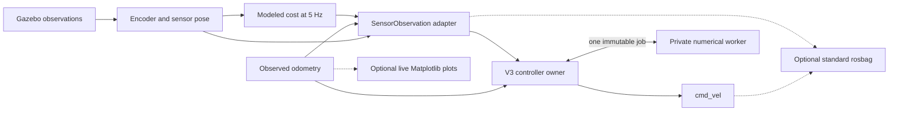

# Active ESC architecture

The original methods keep the familiar configurable filter/controller path.
V3 selects the existing `controller_node` entrypoint with `--v3`, and owns its
algorithm state locally. Both paths have one `/cmd_vel` publisher. There is no
V3 supervisor, separate objective composer, fill service, acknowledgment
protocol, recorder-readiness topic or full-cycle startup gate.

The diagram is the Gazebo route. On hardware, external acquisition/rotation/
bringup adapters replace the modeled devices. They remain in the physical
workspace. No physical adapter package is copied into `dsim-lab`.

## Availability and research activity

| Condition | Control response | Recovery |
| --- | --- | --- |
| First finite usable direction and fresh pose | ACTIVE immediately | No rotations, fit, plot or bag readiness required |
| Missing/expired pose or direction | WAITING_INPUT; publish zero | Automatically resumes with coherent fresh input |
| Duplicate, old, future or invalid sample | Reject without renewing freshness | A subsequent valid sample can recover |
| Incomplete coverage with valid moving input | Keep the candidate and continue collecting evidence | Qualifies when adequate evidence arrives; no candidate deadline |
| Failed fit, expired numerical job, candidate leaves its neighborhood | Cancel affected research work; continue fresh basic control | Another candidate can be evaluated later |
| Optional plot, recorder, report or telemetry failure | Warn; control remains independent | Observer may be restarted separately |
| Frame/time integrity conflict, competing command publisher, invalid actuator output | FAULTED; zero | Explicit process restart after correction |
| Ctrl+C/SIGTERM | STOPPED; final zero while ROS context is live | Never automatically resumes |

The controller checks both original ROS source/receipt ages and local monotonic
receipt age. Its 20 Hz timer uses a steady clock, so a frozen Gazebo clock does
not keep the last command fresh. The initial input expiry is 0.5 s. A command
published at shutdown is software evidence, not proof of measured wheel stop
or protection against a frozen OS, process kill, failed transport or actuator.

Gazebo sensor messages and `/clock` arrive independently. The two simulation
input boundaries retain at most32 records per stream with at most125ms clock
lead, releasing them only after the actual clock catches up. Source stamps and
first receipt times remain unchanged; waiting cannot renew the0.5s expiry.
Physical future timestamps retain immediate rejection. This handles simulation
clock delivery order; it is not an Arduino transport or uncertainty model.

Research activity is local SEARCH, VERIFY, DESIGN and ESCAPE. Candidate failure
has no authority to latch the entire run into failure. Best-source ranking is
an informational event, never automatic goal hold.

Ordinary data expiry, gaps and same-frame source reconnects retain a committed
escape's fill, direction, affine field and original decay age. They discard
stale direction/progress evidence and pending numerical work. Fresh observations
resume ESCAPE automatically; interrupted verification/design may be retried.

## Selected numerical baseline

The first V3 profile retains the selected 5 Hz V2 mathematics: measured-angle
washout/demodulation, rolling cycle coherence, recurrent geometry, centered
moving verification, raw three-cycle evidence, robust basin/fill design and
Gaussian/affine escape. Portable golden fixtures compare these calculations
with the frozen pre-refactor source. These are selected-case numerical
comparisons, not proof of equivalent complete trajectories.

The private numerical child imports its coherence and fill dependencies before
announcing ready. Until then, fresh instantaneous control remains available;
the control thread does not wait for imports. The existing 0.5-second coherence
and 5-second fill budgets begin on job submission, and original source/result
ages remain enforced. Startup work cannot consume a job budget and repeatedly
restart a cold worker.

At initial acquisition, V3 seeds the washout state from the first valid cost:
one absolute brightness reading supplies no gradient. A subsequent usable
change can start control immediately, without a sleep or rotation gate. This
priming applies only when a core starts; it does not insert a zero at in-motion
objective changes. The original standalone numerical helper is unchanged.

While replacement coherence is pending, steering may retain the entire last
accepted snapshot within its original 0.5-second source/receipt freshness and
unchanged frame/objective/history context. It reprojects that vector using the
current fresh yaw; it never assigns old confidence to new geometry. Rejection,
invalid geometry or a context reset discards the snapshot. Expiry falls back to
the current fresh instantaneous direction, and stale live inputs still command
zero. New observations continue submitting replacement work normally.

The recurrent detector consumes observed odometry at its actual rate; raw cost
evidence remains at acquisition cadence. Raw cost and augmented objective stay
separate. Basin fitting retains the selected base-position convention; the
objective is evaluated at the measured sensor position. No source location or
simulator ground truth enters the controller.

SEARCH/VERIFY/DESIGN use raw plus Gaussian cost. ESCAPE uses Gaussian plus
affine GESC repulsion. The controller JSON selects
`direct_escape_assistance_enabled`; the current development profile sets it
false to evaluate escape through GESC alone. When enabled, less than 5 cm of
outward progress over a separate 15-second window permits one nominal 20 cm
measured-path pulse per escape, then ordinary GESC resumes. An interrupted pulse
is consumed; missing odometry never contributes an inferred path segment.
The existing 3-second stable-exit window is independent of this assist window.
Neither selection imposes an elapsed escape deadline or V3 affine-guidance age cutoff. Effective
objective changes apply at a new source observation; old directions/history are
not silently relabeled or replayed. The current profile is the retained
**two-source, one-fill** experiment, not a general unknown-source-count solver.

The selected forward gain remains 0.5. The user-authorized development profile
now matches the archived full-rotation light GESC caps: 0.10 m/s and 0.50 rad/s.
The initial pilots used 0.05/0.30; their evidence remains tied to those settings.
The baseline light controller's linear gain is 1.0, so matching caps does not
claim complete controller parity. The separately authorized physical V3 deployment
now uses 0.05/0.30 after the first floor-run review; original V1 source/configuration
remain in its complete backup.
The selected field is run05's local 400-lumen source at
(0.5740251485476348, 1.38581929876693) and 1600-lumen source at (3.5, 3.5).

## Finite work and continuous motion

One spawned worker process handles expensive coherence integration and fill
preparation. It owns no ROS handles, command publisher or mutable registry.
There is one in-flight job and no accumulating FIFO. Coherence expires after
0.5 s; fill work after 5 s. A proposal may commit only with matching candidate,
epoch, objective and registry context while new valid input remains available.
Fitting is capped at 4000 samples. Numerical failure leaves fresh instantaneous
GESC available. Original legacy filter refinement is capped at 64 derivative
evaluations per observation; exhaustion drops/reset that sample recoverably.

VERIFY/DESIGN never switch to stationary collection. They retain the selected
moving tracking law and cancel research when measured translation is absent
(less than 1 mm over a 0.5 s check window), essential input expires or the
candidate neighborhood is left. Approach and verification have no elapsed-time
deadline; the 8 cm entry radius remains a spatial evidence criterion.
The retained fill-sweep predicate rejects a
tracking route through a prior mathematical fill; cancellation returns to
fresh GESC rather than stationary verification. A fill is not a physical
obstacle, and this predicate is not collision detection.

These checks do not certify continuous translation. Actual trajectories and
interruptions must be measured in subsequent Gazebo/physical evaluations.
Protective zeros and inherited escape turn-in-place behavior count honestly as
interruptions; a nonzero angular command is not base translation.

## Observation and recording contracts

`SensorObservation` carries source and receipt time, source instance, host
sequence, optional device sequence, observed base pose/phase, raw cost, sensor
position, support ages and acquisition uncertainty. The original Arduino sends
neither acquisition timestamps nor sequence numbers. Receipt/estimated times
are labeled, device sequence remains unavailable, and unknown uncertainty is
NaN. The adapter accepts nearby observed support within 0.05 s; interpolation
or nearest support retains its measured age rather than claiming exact truth.

The eight generated interfaces are the five original messages plus
`SensorObservation`, `AlgorithmEvent` and `GaussianFill`. The latter two are
output-only telemetry. Optional standard bags include compact observed/control
topics and `/clock` in simulation; the recorder's own clock is independent.
Analysis accepts an ordinary bag path and reports absent metrics as unavailable.
CSV is an optional post-run export, not duplicate live recording.

Gazebo timing/noise/load sweeps remain subsequent work. In particular, the
inherited optional ADC model has a nearest-match defect; V3 currently selects
`apply_adc=false`. It must not be described as a faithful Arduino quantizer.

Physical V3 also starts the retained Vicon client as an optional evaluation
process and records `/gesc_gaussian/evaluation/vicon_odom`. It cannot provide
control pose, renew a process lease or gate startup/motion. Its absence or exit
is isolated from the controller, acquisition and OpenCR driver. The physical
usage guide describes the inherited one-shot UDP connection procedure.
