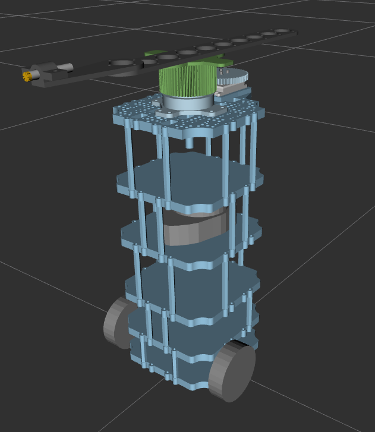

# Turtlebot3 Rotating Sensor

## GESC + Gaussian V1 simulation route (current)

Start with
[FINAL_PROJECT_REPORT_V1.pdf](../../../docs/codex/gesc_gaussian/FINAL_PROJECT_REPORT_V1.pdf)
for the final architecture, frozen parameters, complete Phase 00-10 chronology,
selected evidence, failed experiments, and limitations. The older installation,
example-launch, and troubleshooting material below remains useful historical
package documentation, but it is not a V1 acceptance recipe.
The [LaTeX source](../../../docs/codex/gesc_gaussian/FINAL_PROJECT_REPORT_V1.tex)
and [Markdown audit companion](../../../docs/codex/gesc_gaussian/FINAL_PROJECT_REPORT_V1.md)
are retained beside the PDF.

`launch/gazebo.launch.xml` deliberately defaults to
`algorithm_profile:=legacy`. A GESC + Gaussian V1 launch must explicitly select
`algorithm_profile:=robust_gaussian_v1`; audited runs additionally use the
observability, recording-ready, and stop interlocks documented in the current
[recording guide](../../../docs/codex/gesc_gaussian/recording_runs.md). Prefer
the existing `ros2 run ros_esc record_run ...` or bounded
`ros2 run ros_esc run_scenario ...` path so the launch is paired with metadata,
deterministic scenario inputs, completeness checks, and final-zero evidence.
Validate with `ros2 run ros_esc validate_run <run_directory>` and analyze
retained products with `analyze_run`/`summarize_matrix`.

In the robust graph, the supervisor owns algorithm state and `controller_node`
owns the final `/cmd_vel`; this simulation package supplies the robot, rotating
sensor, Gazebo environment, and launch wiring. The six robust typed interfaces
are `AlgorithmState`, `AlgorithmEvent`, `GaussianFill`, `CostBreakdown`,
`GescDiagnostics`, and `ControlDiagnostics`.

Heavy-Ball scripts and paths, including material under
`paper_recreations/heavy_ball_PDE_ESC`, are preserved historical/archive or
compatibility inputs. They are not the active V1 algorithm profile. The V1
evidence supports selected two-basin demonstrations only: broad simulation
robustness failed, and physical evidence remained narrow and short of a formal
second-extremum acceptance run.

This package contains the URDF file that describes a Turtlebot Burger with a top mounted rotating sensor frame. In addition, this package provides several launch files that enable a user to utilize this URDF model either in RVIZ or Gazebo simulation. The URDF model makes use of Gazebo ROS2 Control in order to command the angular velocity of the rotating sensor  frame. To enable this, a configuration yaml file is included in the config folder, where two controllers related to Gazebo ROS2 Control are specified. This package is intended to be used with the ros_esc, ros_esc_interfaces, and extremum-seeking packages from the DSIM Lab Gitlab.



## Author Information

Nicholas Calkins

Dynamic Systems and Intelligent Machines (DSIM)

San Diego State University (SDSU)

email: ncalkins8746@sdsu.edu

## Installation Instructions

The following commands assume the user is downloading this package into a ROS workspace named "ros2_ws" under their home directory "~". If the user is downloading this package elsewhere, please update the terminal commands shown here accordingly.


This package can either be downloaded via git using 

```
user@machine:~$ cd ~/dsim-lab/ros2_ws/src
user@machine:~$ git clone https://gitlab.com/dsim-lab/robots/turtlebot-3/turtlebot3_rotating_sensor.git
```

for those who have access to the DSIM Lab Gitlab group. Otherwise one will need to download the package directly via some compressed file.

This package is designed to be used with
- Gazebo, RVIZ, and ROS2 Humble
```
user@machine:~$ cd ~
user@machine:~$ sudo apt install ros-humble-gazebo-ros-pkgs
user@machine:~$ sudo apt-get install ros-humble-rviz
```

This package has several dependencies that need to be installed prior to use 
- gazebo_ros2_control: can be downloaded by following the instructions at 
[this link](https://control.ros.org/rolling/doc/getting_started/getting_started.html).
- The extremum-seeking package from the DSIM Lab Gitlab, can be downloaded and installed via git using

```
user@machine:~$ cd ~
user@machine:~$ git clone https://gitlab.com/dsim-lab/extremum-seeking/extremum-seeking.git
user@machine:~$ cd extremum-seeking
user@machine:~$ ~/extremum-seeking$ pip install -e .
```

- The ros_esc package from the DSIM Lab Gitlab, can be downloaded via git using
```
user@machine:~$ cd ~/dsim-lab/ros2_ws/src
user@machine:~$ git clone https://gitlab.com/dsim-lab/ros-packages/ros-esc.git
user@machine:~$ cd ros-esc
user@machine:~$ ~/dsim-lab/ros2_ws/src/ros_esc$ pip install -e .
```

- The ros_esc_interfaces package from the DSIM Lab Gitlab, can be downloaded via git using
```
user@machine:~$ cd ~/dsim-lab/ros2_ws/src
user@machine:~$ git clone https://gitlab.com/dsim-lab/ros-packages/ros_esc_interfaces.git
```

## Copy Robot Models to the Gazebo Models Directory

In order for the robot to appear in simulation, the user must copy and paste certain files within this package in the appropriate .gazebo/models directory. This is the location where Gazebo will look for meshes described in the robot's URDF file. Use the following commands to perform this action.

Please note that some of the following commands are written for a generic ROS workspace named "ros2_ws". If the user wants to work with this package in a workspace not named "ros2_ws", they will have to rewrite the commands accordingly.


```
user@machine:~$ cd ~
user@machine:~$ mkdir -p ~/.gazebo/models/turtlebot3_rotating_sensor
user@machine:~$ cp ~/dsim-lab/ros2_ws/src/turtlebot3_rotating_sensor/models/model.config ~/.gazebo/models/turtlebot3_rotating_sensor/
user@machine:~$ mkdir -p ~/.gazebo/models/turtlebot3_rotating_sensor/meshes
user@machine:~$ cp -r ~/dsim-lab/ros2_ws/src/turtlebot3_rotating_sensor/meshes ~/.gazebo/models/turtlebot3_rotating_sensor/meshes
```

## Instructions for Use

This package provides a [Gazebo launch xml file](launch/gazebo.launch.xml) which setup an extremum seeking Gazebo experiment. This launch file handles all the ROS2 communication between nodes in the ros_esc package. It will automatically execute the commands needed to launch the required nodes.

The user has the ability to set and alter the following parameters before starting a Gazebo simulation. These can be passed in as additional command line arguments when launching the Gazebo launch xml file. Launch command examples written as bash scripts can be found in the [bash scripts](bash_scripts) directory.

- Initial position (x, y, z) and (roll,  pitch, yaw) of the vehicle.
- The filepath to a rotate frame configuration file to use. This configuration file describes how the rotating frames on the vehicle spin in their environment. This gets parsed by the rotate frame node, see the ros_esc package for more information.
- The filepath to a transform configuraion file to use. This configuration file describes the transformation matrices needed to determine the sensor's position in the environment. This gets parsed by the sensor pose node, see the ros_esc package for more information.
- The filepath to a cost function configuration file to use. This configuration file describes a custom cost function to use in simulation. This gets parsed by the cost function node, see the ros_esc package for more information.
- The filepath to a filter configuration file to use. This configuration file describes a custom filter built by the user. This gets parsed by the filter node, see the ros_esc package for more information.
- The filepath to a controller configuration file to use. This configuration file describes a custom controller built by the user. This gets parsed by the controller node, see the ros_esc package for more information.
- The filepath where test folders documenting the Gazebo simulation will be saved on the local machine.
- Whether to spawn up to five optional Gazebo light source models at manually
  configured positions. When a compatible cost config is selected, those same
  launch arguments can define the simulated light-source cost map.

Please note that if the user wants to set the initial angular position of the rotating sensor frame, this is accomplished in the robot's URDF file, under the rotating frame velocity controller section.

## Launching a Gazebo Simulation

This package contains launch files which start a gazebo simulation for this turtlebot. These following steps are all handled by the [Gazebo launch xml file](launch/gazebo.launch.xml) within this package. The launch procedure goes as follows:

1. Launch an empty gazebo world
2. Publish the robot's description
3. Launch the gazebo ros2 controllers (these are the two controllers used to
   control the velocity of the rotating frame)
4. Launch the remaining ros2 nodes that are necessary for simulation

Use the following commands to launch a gazebo simulation.

Please note that some of the following commands are written for a generic ROS workspace named "ros2_ws". If the user wants to work with this package in a workspace not named "ros2_ws", they will have to rewrite the commands accordingly.


```
user@machine:~$ cd ~/dsim-lab/ros2_ws
user@machine:~$ colcon build --packages-select turtlebot3_rotating_sensor ros_esc ros_esc_interfaces
user@machine:~$ source install/setup.bash
user@machine:~$ ros2 launch turtlebot3_rotating_sensor gazebo.launch.xml
```

For new light-source simulations, set `number_of_lights` from 0 to 5 and
configure each source with `light_N_x`, `light_N_y`, and
`light_N_brightness_percent` (0–100). The nominal mapping is 100% = 1600 lumens;
25% = 400 and 50% = 800. The surface plot labels percentage-configured sources
with `%`.

The following example configures the existing multi-light cost model. It is
an input example, not a validated GESC/Gaussian acceptance run; select the
controller/profile appropriate to your experiment separately.

```bash
timeout --signal=INT --kill-after=10s 180s ros2 launch turtlebot3_rotating_sensor gazebo.launch.xml \
  cost_function_config_filepath:=~/dsim-lab/ros2_ws/src/ros_esc/paper_recreations/heavy_ball_PDE_ESC/cost_function/multi_light_source_photoresistor.json \
  number_of_lights:=2 \
  light_1_x:=1.0 light_1_y:=0.5 light_1_brightness_percent:=25.0 \
  light_2_x:=3.5 light_2_y:=3.5 light_2_brightness_percent:=100.0
```

The compatible cost JSON lives under the historical Heavy-Ball recreation
path but its `Multi_Light_Source_Cost` owner is shared by simulation methods.
The visible models are position markers with disabled collisions; their SDF
point lights do not generate ROS sensor readings. Brightness affects the
Python photoresistor cost model.

For complete scenario/JSON examples, input validation, and recording details,
see the [percentage brightness guide](../../../docs/simulation_brightness.md).
The linear mapping is a simulation assumption, not a measured Hue dimming
calibration. The fitted `reference_intensity_lumens` normalization and cost
sign/units remain unchanged. Legacy `light_N_intensity_lumens` inputs/defaults
and old wrappers are retained for reproducibility; a percentage overrides the
legacy setting for that source. Set every enabled source's percentage in new
Hue-style runs. The older `Photoresistor_Interpolated_Map` remains available.

The older unnumbered manual-light launch arguments have been deprecated. New
runs should use `number_of_lights` and `light_1_*` through `light_5_*`.

## Launching a RVIZ Simulation:

This package contains launch files which start a RVIZ simulation for this turtlebot.
These following steps are all handled by the [RVIZ xml launch file](launch/rviz.launch.xml)
within this package. The launch procedure goes as follows:

1. Publish the robot's description
2. Launch the RVIZ simulation

Please use the following commands to view the URDF model in an RVIZ simulation.

Please note that some of the following commands are written for a generic ROS workspace named "ros2_ws". If the user wants to work with this package in a workspace not named "ros2_ws", they will have to rewrite the commands accordingly.


```
user@machine:~$ cd ~/dsim-lab/ros2_ws
user@machine:~$ colcon build --packages-select turtlebot3_rotating_sensor
user@machine:~$ source install/setup.bash
user@machine:~$ ros2 launch turtlebot3_rotating_sensor rviz.launch.xml
```

To view the model in an RVIZ simulation with the joint state publisher gui (which allows
a user to test the movement of the robot's joints), use the following commands in a few
separate terminals. Note this package contains a RVIZ configuration file in the rviz folder.

Terminal 1:
```
user@machine:~$ cd ~/dsim-lab/ros2_ws
user@machine:~$ source install/setup.bash
user@machine:~$ rviz2
```

Terminal 2:
```
user@machine:~$ cd ~/dsim-lab/ros2_ws
user@machine:~$ colcon build --packages-select turtlebot3_rotating_sensor
user@machine:~$ source install/setup.bash
user@machine:~$ ros2 launch turtlebot3_rotating_sensor robot_description.launch.py
```

After launching the commands in TERMINAL 2, in the RVIZ window go to File -> Open Config,
and then navigate to the urdf_viz.rviz file found within this package.

Terminal 3:
```
user@machine:~$ cd ~/dsim-lab/ros2_ws
user@machine:~$ source install/setup.bash
user@machine:~$ ros2 run joint_state_publisher_gui joint_state_publisher_gui
```

## Miscellaneous Commands:

To view a list of all topics that the ros_esc nodes are publishing to, use the following command.
```
user@machine:~$ ros2 topic list
```

To view the data being published to a particular topic of interest, use the following command.
```
user@machine:~$ ros2 topic echo {topic_of_interest}
```

To view the publishing rate of a particular topic of interest, use the following command.
```
user@machine:~$ ros2 topic hz {topic_of_interest}
```

To view the active controllers which move the rotating sensor frames in gazebo simulation, use the following command.
```
user@machine:~$ ros2 control list_controllers
```

## Troubleshooting

For users with plugin errors, they may be coming from outdated versions of the above ROS and Gazebo packages. Consider reinstalling these packages, they may be broken or in need of an update.
```
user@machine:~$ sudo rm -rf /var/lib/apt/lists*
user@machine:~$ sudo apt update
user@machine:~$ sudo apt upgrade --fix-missing
user@machine:~$ sudo apt install --reinstall ros-humble-gazebo-ros-pkgs
user@machine:~$ sudo apt install --reinstall ros-humble-gazebo-ros2-control
```

For users that encounter a Gazebo process running error and are unable to start the server, use the following commands to kill all Gazebo processes running in the background. The user should then restart the experiment. The following commands finds all of the instances of Gazebo running in the background:
```
ps faux | grep gazebo
```
The user should look for the process with the libgazebo name and note the process ID. Knowing this process ID, the following command will kill the process. The user should then try and restart the simulation.
```
kill -9 {process_code_here}
```
